## «Customer Retention Decision Framework for Pharmacy Retail»
Revenue Dynamics, Churn Modeling and Retention Investment Optimization.

## Contents

- [1. Executive Summary](#1-executive-summary)
- [2. Business Background](#2-business-background)
- [3. Project Architecture](#3-project-architecture)
- [4. Business Objectives](#4-business-objectives)
- [5. Dataset Overview](#5-dataset-overview)
- [6. Analytical Framework](#6-analytical-framework)
  - [7. Layer 1. Lifecycle Transition Analytics](#7-layer-1-lifecycle-transition-analytics)
	- [7.1 Business Objective](#71-business-objective)
	- [7.2 Analytical Approach](#72-analytical-approach)
	- [7.3 Lifecycle Transition Framework](#73-lifecycle-transition-framework)
	- [7.4 Customer Migration Dynamics](#74-customer-migration-dynamics)
	- [7.5 Revenue Transition Analysis](#75-revenue-transition-analysis)
  	- [7.6 Revenue Driver Framework](#76-revenue-driver-framework)
    - [7.7 Retained Customer Economics](#77-retained-customer-economics)
    - [7.8 Key Findings & Business Implications](#78-key-findings--business-implications)
  - [8. Layer 2. Cohort Retention & Customer Value Dynamics](#8-layer-2-cohort-retention--customer-value-dynamics)
  	- [8.1 Business Objective](#81-business-objective)
    - [8.2 Analytical Approach](#82-analytical-approach)
    - [8.3 Cohort Retention Analysis](#83-cohort-retention-analysis)
    - [8.4 Retention Decay Analysis](#84-retention-decay-analysis)
    - [8.5 Revenue Retention Analysis](#85-revenue-retention-analysis)
    - [8.6 Customer Value Evolution (RPRU)](#86-customer-value-evolution-rpru)
    - [8.7 Retention vs Monetization Dynamics](#87-retention-vs-monetization-dynamics)
    - [8.8 Cohort LTV Dynamics](#88-cohort-ltv-dynamics)
    - [8.9 Cohort Variability Analysis](#89-cohort-variability-analysis)
    - [8.10 Key Findings & Business Implications](#810-key-findings--business-implications)
  - [9. Layer 3. Predictive Customer Analytics](#9-layer-3-predictive-customer-analytics)
  	- [9.1 Business Objective](#91-business-objective)
   	- [9.2 Analytical Approach](#92-analytical-approach)
  	- [9.3 Feature Engineering](#93-feature-engineering)
    - [9.4 Model Development](#94-model-development)
    - [9.5 Model Performance](#95-model-performance)
    - [9.6 SHAP Analysis](#96-shap-analysis)
    - [9.7 Risk Segmentation](#97-risk-segmentation)
    - [9.8 Customer Value & Risk Matrix](#98-customer-value--risk-matrix)
    - [9.9 Recovery Modeling & Retention Prioritization](#99-recovery-modeling--retention-prioritization)
    - [9.10 Retention Prioritization Score](#910-retention-prioritization-score)
    - [9.11 Saveability Matrix](#911-saveability-matrix)
    - [9.12 Key Findings & Business Implications](#912-key-findings--business-implications)
  - [10. Layer 4. Lifecycle KPI Framework & Customer Health Monitoring](#10-layer-4-lifecycle-kpi-framework--customer-health-monitoring)
  	- [10.1 Business Objective](#101-business-objective)
   	- [10.2 Framework Architecture](#102-framework-architecture)
    - [10.3 KPI Dashboard](#103-kpi-dashboard)
    - [10.4 Lifecycle Stability Analysis](#104-lifecycle-stability-analysis)
    - [10.5 Revenue Concentration](#105-revenue-concentration)
    - [10.6 Revenue-at-Risk](#106-revenue-at-risk)
    - [10.7 Retention Prioritization](#107-retention-prioritization)
    - [10.8 Retention Strategy Matrix](#108-retention-strategy-matrix)
    - [10.9 Key Findings & Business Implications](#109-key-findings--business-implications)
- [11. Executive Metrics Overview](#11-executive-metrics-overview)
- [12. Integrated Business Insights](#12-integrated-business-insights)
- [13. Strategic Recommendations](#13-strategic-recommendations)
- [14. Limitations & Future Work](#14-limitations--future-work)
- [15. Technical Stack](#15-technical-stack)

---

# 1. Executive Summary

## 1.1 Business Challenge

Для большинства компаний рост клиентской базы сам по себе не гарантирует устойчивого увеличения выручки. Значительная часть экономического результата определяется способностью бизнеса удерживать существующих клиентов, своевременно выявлять признаки снижения активности и эффективно распределять ресурсы на retention-программы.

В рассматриваемой аптечной сети клиенты существенно различаются по уровню вовлеченности, покупательскому поведению и долгосрочной ценности. В этих условиях использование единых CRM-коммуникаций для всей клиентской базы приводит к снижению эффективности маркетинговых инвестиций и затрудняет управление рисками потери выручки.

Основная бизнес-задача проекта заключается в построении комплексной системы клиентской аналитики, позволяющей:

* понимать механизмы формирования клиентской ценности;
* выявлять ключевые источники потерь выручки;
* анализировать динамику удержания клиентов;
* прогнозировать риск оттока;
* оценивать потенциальный объем revenue-at-risk;
* определять приоритетные сегменты для retention-интервенций.

Проект охватывает полный цикл Customer Analytics: от анализа жизненного цикла клиентов и когортной динамики до предиктивного моделирования и разработки системы приоритизации retention-инвестиций.

#

## 1.2 Analytical Approach

Для решения поставленной задачи была разработана многоуровневая аналитическая архитектура, объединяющая четыре взаимосвязанных слоя анализа.

### Layer 1. Lifecycle Transition Analytics

Исследуются переходы клиентов между стадиями жизненного цикла и влияние этих переходов на динамику выручки.

Основной вопрос:

> Как изменение структуры клиентской базы формирует рост или потерю выручки?

В рамках слоя анализируются:

* lifecycle transitions;
* миграция клиентов между сегментами;
* драйверы роста и снижения выручки;
* экономика удержанных клиентов.

#

### Layer 2. Cohort Retention & Customer Value Dynamics

Исследуются долгосрочные закономерности удержания и формирования клиентской ценности.

Основной вопрос:

> Как меняются retention и customer value по мере развития клиентских когорт?

В рамках слоя анализируются:

* user retention;
* revenue retention;
* retention decay;
* customer lifetime value;
* динамика Revenue per Retained User;
* межкогортная вариативность поведения.

#

### Layer 3. Predictive Customer Analytics

Разрабатывается система прогнозирования пользовательского поведения и оценки экономических рисков.

Основной вопрос:

> Какие клиенты наиболее вероятно будут потеряны и какие из них являются наиболее значимыми для бизнеса?

В рамках слоя реализованы:

* churn prediction;
* SHAP-анализ факторов риска;
* revenue-at-risk framework;
* recovery modeling;
* retention prioritization framework.

Для прогнозирования риска оттока использовалась модель Random Forest с временным разделением выборки (time-based split), что позволяет приблизить анализ к реальному бизнес-сценарию использования модели.

#

### Layer 4. Lifecycle KPI Framework & Customer Health Monitoring

Формируется система мониторинга состояния клиентской базы и раннего выявления угроз для выручки.

Основной вопрос:

> Какие показатели необходимо отслеживать для оперативного управления retention-рисками?

В рамках слоя разработан набор KPI, объединяющий показатели удержания, стабильности клиентской базы, концентрации выручки и потенциальных потерь дохода.


## 1.3 Key Findings

### Retention Dynamics

Анализ когорт показал наличие выраженного раннего оттока клиентов.

Средний User Retention снижается до приблизительно 26% уже ко второму месяцу после первой покупки, после чего скорость снижения резко замедляется.

Точка стабилизации retention-кривой формируется около второго месяца жизненного цикла клиента, а долгосрочный уровень удержания остается относительно стабильным в диапазоне 20–24%.

Одновременно Revenue Retention систематически превышает User Retention, что свидетельствует о более высокой экономической ценности удержанных клиентов.

#

### Revenue Drivers

Основным источником роста выручки выступает Expansion внутри существующей клиентской базы.

| Revenue Driver | Revenue Change |
| -------------- | -------------: |
| Expansion      |      +2.74 млн |
| Reactivation   |      +0.36 млн |
| Acquisition    |      +0.05 млн |
| Contraction    |      −1.69 млн |
| Churn          |      −1.51 млн |

Наиболее существенный положительный вклад в динамику выручки обеспечивают клиенты, сохраняющие активность внутри сегмента Loyal.

Ключевым источником потерь выступает переход клиентов из сегмента At Risk в Churn.

#

### Customer Value Evolution

Несмотря на сокращение числа удержанных клиентов, средняя ценность оставшейся аудитории постепенно возрастает.

Revenue per Retained User демонстрирует рост до 43% относительно ранних этапов жизненного цикла, а зрелые когорты формируют средний LTV на уровне 6.3–6.8 тыс. рублей.

Полученные результаты свидетельствуют о возрастающей концентрации долгосрочной выручки среди наиболее лояльных клиентов.

#

### Churn Prediction

Разработанная модель прогнозирования оттока продемонстрировала высокое качество классификации.

| Metric    | Value |
| --------- | ----: |
| ROC-AUC   |  0.89 |
| Precision |  0.76 |
| Recall    |  0.95 |
| F1 Score  |  0.84 |
| Accuracy  |  0.82 |

Наиболее значимыми факторами риска оттока стали:

* Frequency;
* Monetary Growth;
* Monetary Delta;
* Frequency Growth;
* Avg Days Between Purchases.

Результаты подтверждают, что ухудшение покупательской динамики является одним из наиболее ранних индикаторов потенциального ухода клиента.

#

### Revenue Risk & Retention Prioritization

Анализ показал, что высокий риск оттока сам по себе не является достаточным основанием для retention-инвестиций.

Для поддержки управленческих решений был разработан интегральный Retention Priority Score, объединяющий:

* вероятность оттока;
* ожидаемую будущую ценность клиента;
* вероятность восстановления активности.

Такой подход позволяет перейти от массовых retention-кампаний к приоритизации клиентов по ожидаемому бизнес-эффекту и более эффективно распределять CRM-бюджет.

#

### Business Outcome

Результатом проекта стала комплексная аналитическая система, позволяющая:

* понимать механизмы формирования клиентской ценности;
* выявлять структурные источники потерь выручки;
* прогнозировать churn-risk;
* оценивать revenue-at-risk;
* приоритизировать retention-инвестиции;
* организовать непрерывный мониторинг состояния клиентской базы.

Проект демонстрирует полный цикл Customer & Product Analytics: от описательного анализа и когортной аналитики до предиктивного моделирования и формирования бизнес-ориентированных рекомендаций для принятия решений.

## 1.4 Business Impact

Проведенный анализ показал, что ключевые риски клиентской базы сосредоточены не в полном оттоке пользователей, а в постепенном ухудшении покупательской активности на ранних стадиях жизненного цикла.

Когортный анализ выявил резкое снижение удержания сразу после первой покупки: средний User Retention сокращается примерно до 26% уже ко второму месяцу жизни когорты. При этом после второго месяца скорость оттока существенно замедляется, формируя устойчивое retention plateau. Данный результат указывает на критическую важность первых месяцев взаимодействия с клиентом для долгосрочного удержания.

Анализ миграции клиентов между lifecycle-сегментами показал, что основная часть потерь формируется за счет накопления пользователей в сегменте At Risk. Наиболее значимый источник отрицательной динамики выручки связан с переходом клиентов из At Risk в Churn, тогда как крупнейшим драйвером роста выступает расширение потребления внутри уже удержанной клиентской базы.

Предиктивное моделирование подтвердило возможность раннего выявления клиентов с повышенным риском ухода. Построенная churn-модель продемонстрировала высокий уровень качества (ROC-AUC = 0.89, Recall = 0.95), что позволяет использовать прогнозные оценки для приоритизации retention-активностей и оценки потенциального объема revenue-at-risk.

Дополнительный анализ показал, что не все клиенты с высоким риском оттока обладают одинаковой коммерческой значимостью. Интеграция churn-risk, ожидаемой будущей выручки и вероятности восстановления активности позволила сформировать систему приоритизации retention-инвестиций и выделить клиентов с максимальным ожидаемым эффектом от удержания.

В совокупности результаты исследования формируют основу для перехода от реактивного управления оттоком к системной data-driven retention-стратегии, ориентированной на сохранение наиболее ценных и наиболее «спасаемых» клиентов.


## 1.5 Strategic Priorities

На основании проведенного анализа можно выделить пять ключевых направлений развития retention-стратегии.

### Priority 1. Reduce Early Lifecycle Churn

Наиболее значительная потеря клиентов происходит в первые месяцы после первой покупки.

Приоритетом должно стать повышение раннего удержания через:

* welcome-программы;
* персонализированные onboarding-коммуникации;
* стимулирование второй и третьей покупки;
* сокращение интервалов между первыми транзакциями.

Даже небольшое улучшение раннего retention способно оказать существенное влияние на долгосрочную клиентскую базу и будущую выручку.

#

### Priority 2. Prevent Transition to At Risk Segment

Анализ жизненного цикла показал, что сегмент At Risk выступает основным источником последующего churn.

Для данной группы необходимо внедрять систему раннего предупреждения, основанную на мониторинге:

* снижения частоты покупок;
* ухудшения Monetary Dynamics;
* увеличения интервалов между покупками;
* роста прогнозируемого churn-risk.

Основная задача заключается в предотвращении накопления клиентов в зоне повышенного риска.

#

### Priority 3. Protect High-Value Customer Segments

Несмотря на относительно небольшую численность, сегмент Loyal формирует более половины совокупной выручки клиентской базы.

Для данных клиентов рекомендуется развитие отдельных программ удержания:

* персонализированные предложения;
* программы лояльности;
* VIP-коммуникации;
* механики увеличения частоты покупок.

Сохранение даже небольшой доли высокоценных клиентов способно обеспечить непропорционально высокий экономический эффект.

#

### Priority 4. Prioritize Retention Investments Using Predictive Scoring

Результаты исследования показывают, что высокий риск оттока сам по себе не является достаточным основанием для запуска retention-интервенций.

Приоритизация должна учитывать одновременно:

* вероятность оттока;
* ожидаемую будущую выручку;
* вероятность успешной реактивации клиента.

Использование Retention Priority Score позволяет концентрировать ресурсы на клиентах с максимальным ожидаемым возвратом инвестиций в удержание.

#

### Priority 5. Build Continuous Customer Health Monitoring

Для обеспечения устойчивого контроля клиентской базы рекомендуется внедрение регулярного мониторинга ключевых lifecycle-метрик:

* Retention Rate;
* Churn Rate;
* Reactivation Rate;
* Revenue Retention;
* Revenue-at-Risk;
* Lifecycle Stability Index.

Такой подход позволит своевременно выявлять ухудшение состояния клиентской базы и оценивать эффективность принимаемых retention-решений.

# 2. Business Background

Данный проект основан на данных региональной аптечной сети, объединяющей восемь аптек, расположенных в различных районах города. Компания работает на высококонкурентном рынке розничной фармацевтики, где значительная часть выручки формируется за счет повторных покупок постоянных клиентов.

Несмотря на стабильный поток новых покупателей, руководство сети столкнулось с постепенным снижением повторной активности части клиентской базы. Отсутствие системного понимания жизненного цикла клиентов, факторов оттока и потенциальной ценности отдельных сегментов затрудняло принятие решений о распределении маркетингового бюджета и приоритизации retention-инициатив.

В ответ на данный бизнес-запрос был разработан комплексный аналитический framework, объединяющий анализ жизненного цикла клиентов, когортную аналитику, прогнозирование оттока и систему приоритизации retention-инвестиций для поддержки data-driven управленческих решений.

**Примечание.** Проект выполнен в образовательных целях на обезличенных транзакционных данных. Описание компании и бизнес-контекст являются реалистичным сценарием, созданным для демонстрации применения методов продуктовой и клиентской аналитики.

# 3. Project Architecture

## 3.1 Architecture Overview

### Почему проект построен как многоуровневая аналитическая система

Большинство retention-анализов ограничиваются изучением отдельных метрик: churn rate, retention rate, RFM-сегментации или прогнозированием оттока. Такой подход позволяет выявлять локальные закономерности, однако не формирует целостного понимания жизненного цикла клиента и механизмов изменения выручки.

Для принятия управленческих решений бизнесу необходимо одновременно понимать:

* как изменяется структура клиентской базы;
* какие механизмы формируют удержание и отток клиентов;
* каким образом меняется ценность клиентов во времени;
* какие пользователи представляют наибольший риск для бизнеса;
* где необходимо концентрировать retention-инвестиции;
* какие показатели должны использоваться для постоянного мониторинга клиентского здоровья.

Для решения этой задачи проект построен в формате многоуровневой аналитической архитектуры (Multi-Layer Analytics Framework), где каждый аналитический слой отвечает на отдельный класс бизнес-вопросов и последовательно развивает результаты предыдущего этапа.

Логика исследования построена по принципу постепенного перехода:

							описание поведения клиентов
										↓
							объяснение механизмов удержания
										↓
							прогнозирование будущего поведения 
										↓
							построение системы принятия решений.

#

### Архитектура исследования

#### *Figure 1. Общая архитектура проекта и взаимосвязь аналитических слоев.*

*Project Architecture Diagram*

```text
Transactional Data
        ↓

Lifecycle Snapshots
        ↓

Layer 1
Lifecycle Transition Analytics
        ↓

Layer 2
Cohort Retention & Customer Value Dynamics
        ↓

Layer 3
Predictive Customer Analytics
        ↓

Layer 4
Lifecycle KPI Framework &
Customer Health Monitoring
        ↓

Executive Insights &
Strategic Recommendations
```

#

Каждый следующий слой использует результаты предыдущего уровня анализа и переводит их в более прикладную бизнес-форму.

В результате формируется единая система аналитики, охватывающая весь цикл принятия решений: от анализа исторического поведения клиентов до формирования приоритетов для retention-стратегии и управления рисками потери выручки.


# 3.2 Multi-Layer Analytics Framework

### Layer 1. Lifecycle Transition Analytics

**Ключевой вопрос:**

> Как изменяется клиентская база во времени?

Первый слой исследования посвящен анализу динамики жизненного цикла клиентов.

Вместо статического рассмотрения сегментов анализируется процесс миграции пользователей между различными lifecycle-состояниями:

* New
* Active
* Loyal
* At Risk
* Churn

На данном этапе исследуются:

* transition probabilities;
* стабильность lifecycle-сегментов;
* механики удержания и деградации клиентов;
* переходы, формирующие рост и потери выручки;
* вклад retention, expansion, contraction и churn в изменение revenue.

Результатом анализа становится понимание того, каким образом эволюционирует клиентская база и какие процессы формируют бизнес-результат.

#

### Layer 2. Cohort Retention & Customer Value Dynamics

**Ключевой вопрос:**

> Как удержание и клиентская ценность изменяются по мере развития жизненного цикла?

После изучения общей динамики клиентской базы анализ смещается на уровень когорт.

На данном этапе исследуются:

* user retention;
* revenue retention;
* retention decay;
* cohort lifetime value dynamics;
* изменение customer value среди удержанных клиентов.

Особое внимание уделяется сравнению поведения различных когорт и выявлению точек стабилизации жизненного цикла.

Результаты данного слоя позволяют понять:

* когда происходит основной churn;
* как формируется долгосрочная ценность клиента;
* насколько устойчивыми являются паттерны удержания между когортами.

#

### Layer 3. Predictive Customer Analytics

**Ключевой вопрос:**

> Какие клиенты наиболее вероятно покинут компанию в ближайшем будущем?

После анализа исторического поведения исследование переходит к прогнозированию.

На данном этапе строится система предиктивной аналитики, включающая:

* churn prediction;
* SHAP-интерпретацию факторов риска;
* customer value assessment;
* revenue-at-risk estimation;
* recovery potential analysis;
* retention prioritization.

Дополнительно рассчитывается интегральный показатель:

**Retention Priority Score**

который объединяет:

* вероятность оттока;
* ожидаемую будущую ценность клиента;
* вероятность восстановления активности.

Результатом данного слоя становится система выявления клиентов, представляющих наибольший риск и одновременно обладающих максимальным потенциалом для удержания.

#

### Layer 4. Lifecycle KPI Framework & Customer Health Monitoring

**Ключевой вопрос:**

> Как бизнес должен постоянно отслеживать состояние клиентской базы и эффективность retention-стратегии?

Финальный аналитический слой переводит результаты предыдущих этапов в систему управленческого мониторинга.

На основе выявленных закономерностей формируется набор ключевых показателей:

* lifecycle stability;
* retention performance;
* revenue concentration;
* revenue-at-risk;
* churn-risk distribution;
* retention prioritization metrics.

Дополнительно разрабатываются:

* KPI framework;
* customer health monitoring system;
* retention strategy matrix;
* executive dashboard structure.

Данный слой обеспечивает переход от разового аналитического исследования к постоянному управлению клиентской базой на основе данных.

#

### Интеграция аналитических слоев

Каждый аналитический уровень отвечает на собственный класс бизнес-вопросов, однако наибольшая ценность возникает при их совместном использовании.

#### *Figure 2. Взаимосвязь аналитических слоев и последовательное развитие бизнес-инсайтов.*

*Multi-Layer Analytics Framework*

```text
Layer 1
What is happening?
Lifecycle Dynamics

↓

Layer 2
Why is it happening?
Retention & Value Evolution

↓

Layer 3
What will happen next?
Predictive Analytics

↓

Layer 4
How should the business respond?
Monitoring & Decision Framework
```

# 3.3 Information Flow

### Логика движения данных внутри аналитической системы

Одной из целей проекта является не только получение отдельных аналитических результатов, но и построение последовательной системы принятия решений, где каждый этап анализа использует результаты предыдущего уровня.

Поэтому архитектура исследования построена как сквозной аналитический pipeline, в котором данные постепенно преобразуются из транзакционной информации в бизнес-рекомендации и систему управления retention-стратегией.

Процесс начинается с исторических транзакций клиентов и заканчивается формированием конкретных решений по удержанию пользователей, защите выручки и распределению CRM-ресурсов.

#

### Этап 1. Transactional Data → Lifecycle Snapshots

Исходной точкой анализа выступают транзакционные данные аптечной сети.

На основе истории покупок формируются последовательные lifecycle snapshots, отражающие состояние каждого клиента в определенный момент времени.

Для каждого пользователя рассчитываются:

* Recency;
* Frequency;
* Monetary;
* Customer Age;
* Behavioral Trends;
* Growth Metrics.

Дополнительно каждому клиенту присваивается lifecycle-сегмент:

* New;
* Active;
* Loyal;
* At Risk;
* Churn.

В результате создается единая аналитическая база, которая используется всеми последующими слоями проекта.

#

### Этап 2. Lifecycle Snapshots → Behavioral Analytics

На втором этапе исследуются механизмы изменения клиентской базы.

Используя последовательность snapshot-таблиц, анализируются:

* переходы между lifecycle-состояниями;
* retention dynamics;
* churn dynamics;
* revenue transitions;
* customer migration patterns.

Данный уровень отвечает на вопрос:

> Что происходит с клиентской базой?

Результатом становятся количественные оценки устойчивости клиентской базы и основных драйверов роста и потери выручки.

#

### Этап 3. Behavioral Analytics → Predictive Modeling

После выявления исторических закономерностей формируется предиктивный слой анализа.

На основе накопленных поведенческих признаков строятся модели для оценки:

* вероятности оттока;
* будущей клиентской ценности;
* revenue-at-risk;
* recovery potential.

Данный этап отвечает на вопрос:

> Что вероятнее всего произойдет дальше?

В результате появляется возможность выявлять клиентов с наиболее высоким риском потери еще до фактического прекращения активности.

#

### Этап 4. Predictive Modeling → Retention Prioritization

Прогнозные показатели сами по себе не позволяют принимать решения.

Поэтому следующим шагом является объединение нескольких измерений клиентского риска:

* Churn Probability;
* Expected Future Revenue;
* Recovery Probability.

На основе этих компонентов рассчитывается:

**Retention Priority Score**

который позволяет ранжировать клиентов по ожидаемой бизнес-ценности удержания.

На данном уровне система отвечает на вопрос:

> Кого необходимо удерживать в первую очередь?

#

### Этап 5. Retention Prioritization → Business Monitoring Framework

Финальным этапом становится трансформация аналитических результатов в систему постоянного мониторинга.

На основе выявленных закономерностей формируется набор управленческих KPI:

* Lifecycle Stability;
* Revenue-at-Risk;
* Retention Performance;
* Revenue Concentration;
* Churn Risk Distribution;
* Retention Priority Metrics.

Данный уровень обеспечивает переход от разового анализа к непрерывному управлению клиентской базой.

#

### Сквозной поток информации

#### *Figure 3. Последовательное преобразование транзакционных данных в систему принятия retention-решений.* 

*Information Flow Across Analytical Layers*

```text
Transactional Data
        ↓

Lifecycle Snapshots
        ↓

Lifecycle Analytics
        ↓

Cohort Analytics
        ↓

Predictive Modeling
        ↓

Retention Prioritization
        ↓

KPI Framework
        ↓

Business Decisions
```

Таким образом, каждая аналитическая задача проекта встроена в единую систему обработки информации, где результаты одного этапа становятся входными данными для следующего уровня анализа.

Это обеспечивает логическую целостность исследования и позволяет напрямую связывать аналитические выводы с бизнес-решениями.

# 3.4 Business Decision Layer

### От аналитики к управленческим решениям

Большинство аналитических проектов заканчиваются построением визуализаций и описанием выявленных закономерностей.

Однако основная цель данного исследования заключается не только в анализе клиентского поведения, но и в создании практической системы поддержки принятия решений.

Поэтому финальным элементом архитектуры выступает Business Decision Layer — уровень, на котором аналитические результаты преобразуются в конкретные управленческие действия.

#

### Какие решения поддерживает система

Результаты проекта позволяют принимать решения в четырех ключевых направлениях.


### 1. Retention Management

На основе:

* churn prediction;
* lifecycle transitions;
* retention decay analysis;
* recovery probability modeling;

компания получает возможность:

* выявлять клиентов с повышенным риском оттока;
* определять оптимальный момент для CRM-вмешательства;
* запускать проактивные retention-кампании;
* снижать потери клиентской базы.

#

### 2. Revenue Protection

На основе:

* revenue-at-risk analysis;
* expected revenue loss;
* revenue decomposition framework;

компания получает возможность:

* количественно оценивать потенциальные потери выручки;
* выявлять сегменты с максимальным финансовым риском;
* концентрировать ресурсы на наиболее значимых источниках revenue loss;
* повышать эффективность распределения маркетингового бюджета.

#

### 3. Customer Value Management

На основе:

* customer value assessment;
* cohort value dynamics;
* retained customer economics;

компания получает возможность:

* выявлять наиболее ценных клиентов;
* отслеживать изменения customer value;
* анализировать эффективность удержания высокодоходных пользователей;
* повышать долгосрочную ценность клиентской базы.

#

### 4. Strategic CRM Planning

На основе:

* lifecycle segmentation;
* retention prioritization;
* saveability analysis;
* KPI monitoring framework;

компания получает возможность:

* сегментировать клиентов по приоритету удержания;
* формировать персонализированные CRM-стратегии;
* управлять распределением retention-инвестиций;
* выстраивать долгосрочную систему управления жизненным циклом клиентов.

#

### Decision Framework

#### *Figure 4. Переход от аналитических результатов к управленческим действиям.*

*Business Decision Framework*

```text
Lifecycle Analytics 
What is happening?
        │
        ▼

Cohort Analytics  
Why is it happening?
        │
        ▼

Predictive Analytics   
What will happen next?
        │
        ▼

KPI Framework    
What should be monitored?
        │
        ▼

Business Decisions   
What should the company do?        
```

#

### Конечный результат проекта

Итогом исследования является не отдельная модель оттока и не набор аналитических отчетов.

Проект формирует целостную систему customer lifecycle management, которая позволяет:

* понимать структуру и динамику клиентской базы;
* выявлять механизмы формирования churn и retention;
* прогнозировать будущие риски;
* оценивать потенциальные потери выручки;
* приоритизировать клиентов для удержания;
* поддерживать принятие решений на основе данных.

Таким образом, аналитическая система объединяет исторический анализ, когортные исследования, предиктивное моделирование и бизнес-мониторинг в единую архитектуру управления клиентской базой и retention-стратегией.

# 4. Business Objectives

## 4.1 Business Context

Аптечная сеть функционирует в условиях высокой конкуренции и снижения покупательской активности, что делает удержание существующих клиентов одним из ключевых факторов устойчивого роста бизнеса. При этом клиентская база неоднородна: пользователи существенно различаются по частоте покупок, уровню расходов, склонности к повторному потреблению и вероятности оттока.

Традиционный анализ продаж позволяет оценивать текущие финансовые результаты, однако не дает ответа на более важные стратегические вопросы: каким образом меняется клиентская база во времени, какие сегменты формируют рост или потерю выручки, насколько устойчиво удержание пользователей и какие клиенты требуют приоритетного внимания со стороны CRM-команд.

Для эффективного управления retention-стратегией компании необходимо перейти от статического анализа клиентских сегментов к комплексному lifecycle-подходу, который позволяет одновременно анализировать динамику поведения клиентов, исследовать механизмы удержания, прогнозировать риск оттока и оценивать потенциальный бизнес-эффект от retention-интервенций.

Особую значимость представляет понимание взаимосвязи между жизненным циклом клиента, динамикой удержания, будущей ценностью пользователей и потенциальными потерями выручки. Именно эта информация позволяет принимать решения о распределении маркетингового бюджета, приоритизации CRM-активностей и управлении долгосрочной устойчивостью клиентской базы.

Для решения данных задач в рамках проекта была разработана многоуровневая аналитическая система, объединяющая lifecycle analytics, cohort retention analysis, predictive customer analytics и customer health monitoring в единый framework поддержки бизнес-решений.

## 4.2 Key Business Questions

Проект направлен на получение ответов на следующие бизнес-вопросы:

### Lifecycle Dynamics

1. Как изменяется структура клиентской базы во времени?
2. Какие переходы между lifecycle-состояниями происходят наиболее часто?
3. Какие сегменты характеризуются наибольшим риском деградации и перехода в churn?

### Retention & Customer Value

4. На каких этапах жизненного цикла происходит максимальная потеря клиентов?
5. Насколько устойчиво удержание пользователей в различных когортных группах?
6. Как изменяется customer value по мере развития жизненного цикла клиента?
7. Формируется ли стабильная база удержанных пользователей после первоначального периода оттока?

### Revenue Dynamics

8. Какие поведенческие изменения формируют основной рост выручки?
9. Какие сегменты генерируют наибольшие потери revenue?
10. Как распределяется вклад acquisition, retention, reactivation, expansion, contraction и churn в общую динамику бизнеса?
11. Какой объем потенциальной выручки находится под риском потери?

### Predictive Analytics

12. Возможно ли заранее выявлять клиентов с высоким риском оттока?
13. Какие факторы наиболее сильно связаны с вероятностью ухода клиента?
14. Какие пользователи одновременно обладают высоким churn-risk и высокой коммерческой ценностью?

### Retention Prioritization

15. Какие клиенты являются наиболее перспективными кандидатами для retention-интервенций?
16. Как эффективно распределять retention-бюджет между различными сегментами клиентской базы?
17. Какие KPI необходимо отслеживать для раннего выявления признаков деградации customer health?

## 4.3 Analytical Goals

Для ответа на поставленные бизнес-вопросы в проекте была разработана комплексная аналитическая система, объединяющая исследовательский, диагностический и предиктивный уровни анализа.

Основные цели проекта включают:

### 1. Анализ жизненного цикла клиентской базы

* исследование миграции клиентов между lifecycle-состояниями;
* оценку устойчивости клиентской базы;
* анализ retention и churn dynamics;
* выявление ключевых источников роста и потерь выручки.

### 2. Исследование долгосрочного удержания

* анализ когортного поведения клиентов;
* изучение динамики retention decay;
* оценку формирования долгосрочной customer value;
* исследование различий между когортами и устойчивости выявленных закономерностей.

### 3. Прогнозирование клиентского поведения

* построение модели прогнозирования риска оттока;
* выявление факторов, связанных с churn probability;
* оценку будущей ценности клиентов;
* количественную оценку потенциальных revenue losses.

### 4. Приоритизация retention-инвестиций

* выявление клиентов с максимальным ожидаемым бизнес-эффектом от удержания;
* оценку потенциала восстановления активности пользователей;
* формирование интегральной системы retention prioritization;
* поддержку принятия решений по распределению CRM-ресурсов.

### 5. Формирование системы мониторинга customer health

* разработку набора ключевых lifecycle KPI;
* создание framework для мониторинга состояния клиентской базы;
* раннее выявление признаков деградации retention-модели;
* поддержку регулярного контроля revenue-at-risk и customer health.

#

### Итоговая цель проекта

Итоговой целью проекта является создание единой аналитической framework, позволяющей перейти от реактивного анализа исторических продаж к проактивному управлению клиентским жизненным циклом.

Разработанная система объединяет анализ клиентской динамики, исследование удержания, прогнозирование риска оттока и приоритизацию retention-активностей, обеспечивая основу для принятия data-driven решений в области CRM, retention management и управления долгосрочной ценностью клиентской базы.

# 5. Dataset Overview

## 5.1 Dataset Description

Исследование выполнено на основе транзакционных данных аптечной сети, содержащих историю покупок клиентов за период с **12 июля 2021 года по 9 июня 2022 года**.

Каждая запись соответствует отдельной транзакции и содержит информацию о клиенте, дате покупки, аптеке, в которой была совершена покупка, а также сумме заказа после применения скидок.

Данные позволяют анализировать поведение клиентов на протяжении жизненного цикла, исследовать закономерности удержания и оттока, оценивать динамику клиентской ценности и строить предиктивные модели для поддержки retention-стратегии.

В отличие от традиционного анализа продаж, исследование ориентировано не на отдельные транзакции, а на динамику изменения клиентской базы во времени. Для этого на основе исходных данных формируется система последовательных lifecycle snapshots, которая используется в качестве единой аналитической основы для всех последующих этапов проекта.

## 5.2 Data Structure

#### Table 1. Core Dataset Structure

| Variable       | Description                           |
| -------------- | ------------------------------------- |
| card           | Уникальный идентификатор клиента      |
| datetime       | Дата транзакции                       |
| doc_id         | Идентификатор покупки                 |
| shop           | Идентификатор аптеки                  |
| summ_with_disc | Сумма покупки после применения скидок |

#
#### Dataset Summary

| Metric              | Value                        |
| ------------------- | ---------------------------- |
| Analysis Period     | 2021-07-12 — 2022-06-09      |
| Transactions        | 21,075                       |
| Customers           | 5734						 |
| Lifecycle Snapshots | 6                            |
| Snapshot Frequency  | Monthly                      |
| Observation Window  | Rolling 6-Month Window       |

#
#### Lifecycle Snapshot Framework

Для анализа поведения клиентов были сформированы последовательные месячные snapshots:

| Snapshot Date |
| ------------- |
| 2021-12-31    |
| 2022-01-31    |
| 2022-02-28    |
| 2022-03-31    |
| 2022-04-30    |
| 2022-05-31    |

Каждый snapshot строится на основе скользящего шестимесячного окна наблюдения, что позволяет одновременно учитывать накопленную историю покупок клиента и отслеживать изменения его поведения во времени.

## 5.3 Analytical Scope

Структура исходных данных позволяет реализовать полный цикл customer lifecycle analytics — от описательного анализа поведения клиентов до построения предиктивных моделей и системы мониторинга customer health.

На основе транзакционной истории были сформированы пользовательские признаки, отражающие:

* Recency — давность последней покупки;
* Frequency — интенсивность покупок;
* Monetary — объем выручки;
* Customer Age — длительность отношений клиента с компанией;
* Behavioral Trends — динамику изменения покупательской активности.
#
Полученные данные используются для решения четырех взаимосвязанных аналитических задач:

**Lifecycle Transition Analytics**  
Анализ миграции клиентов между lifecycle-состояниями и исследование факторов изменения выручки.

**Cohort Retention & Customer Value Dynamics**     
Изучение закономерностей удержания пользователей и формирования долгосрочной клиентской ценности.

**Predictive Customer Analytics**  
Прогнозирование риска оттока, оценка будущей ценности клиентов и приоритизация retention-инвестиций.

**Customer Health Monitoring**    
Формирование системы KPI для постоянного мониторинга устойчивости клиентской базы и раннего выявления retention-рисков.
#
Таким образом, используемый набор данных обеспечивает достаточную глубину наблюдений для построения единой аналитической системы, объединяющей descriptive, diagnostic, predictive и monitoring analytics в рамках customer lifecycle management framework.

#### *Figure 5. Преобразование исходных транзакционных данных в многоуровневую систему customer lifecycle analytics.*

*Dataset-to-Analytics Pipeline*

```text
Transactional Data
        ↓
Lifecycle Snapshots
        ↓
Customer Features
        ↓
Lifecycle Segmentation
        ↓
Cohort Analytics
        ↓
Predictive Modeling
        ↓
Customer Health Monitoring
```

# 6. Analytical Framework

## Business Logic of the Analytical Framework

Исследование построено как многоуровневая система customer lifecycle analytics, целью которой является последовательный переход от описания исторического поведения клиентов к прогнозированию будущих рисков и формированию практических рекомендаций для retention-стратегии.
Каждый последующий аналитический слой использует результаты предыдущего и отвечает на отдельный бизнес-вопрос.
Вместо изолированного анализа отдельных метрик проект рассматривает клиентскую базу как динамическую систему, в которой изменение пользовательского поведения формирует будущую выручку, уровень удержания и риск потери клиентов.

Такой подход позволяет последовательно ответить на четыре ключевых вопроса бизнеса:

1. Как изменяется клиентская база во времени?
2. Как формируется долгосрочное удержание и ценность клиентов?
3. Какие пользователи обладают высоким риском оттока и потерей выручки?
4. Как компания должна системно управлять customer health и retention-рисками?

## 6.1 Framework Motivation

Традиционный анализ клиентской базы часто ограничивается статическими RFM-сегментами или отдельными показателями retention. Однако подобный подход не позволяет понять полную механику формирования клиентской ценности и возникновения потерь выручки.

Для построения эффективной retention-стратегии необходимо одновременно понимать:

* как пользователи перемещаются между lifecycle-состояниями;
* как изменяется удержание клиентов после первой покупки;
* какие факторы связаны с будущим оттоком;
* какие сегменты создают максимальный бизнес-риск;
* каким образом распределять retention-инвестиции.

Поэтому исследование построено как интегрированная аналитическая система, объединяющая descriptive, diagnostic, predictive и monitoring analytics в рамках единого customer lifecycle framework.

Каждый слой отвечает на отдельный уровень бизнес-анализа:

| Analytics Layer                | Business Objective                                                   |
| ------------------------------ | -------------------------------------------------------------------- |
| Lifecycle Transition Analytics | Понять динамику миграции клиентов между lifecycle-состояниями        |
| Cohort Retention Analysis      | Исследовать закономерности удержания и формирования customer value   |
| Predictive Customer Analytics  | Прогнозировать churn-risk и приоритизировать retention-инвестиции    |
| Customer Health Monitoring     | Создать систему постоянного мониторинга устойчивости клиентской базы |

В совокупности данные уровни формируют единую систему управления жизненным циклом клиентов и позволяют перейти от ретроспективного анализа к проактивному управлению удержанием.

## 6.2 Multi-Layer Analytics Architecture

Аналитическая архитектура проекта состоит из четырех взаимосвязанных слоев.

### Layer 1. Lifecycle Transition Analytics

**Ключевой вопрос:**

> Как развивается клиентская база во времени?

На первом этапе анализируются переходы пользователей между lifecycle-состояниями.

Основное внимание уделяется:  
* retention dynamics;
* churn dynamics;
* customer migration;
* revenue transitions;
* revenue decomposition.

Результатом является понимание того, какие изменения пользовательского поведения формируют рост и снижение выручки компании.

#

### Layer 2. Cohort Retention & Customer Value Dynamics

**Ключевой вопрос:**

> Как формируется долгосрочное удержание и ценность клиента?

На втором этапе выполняется когортный анализ пользовательского поведения после первой покупки.

Исследуются:

* user retention;
* revenue retention;
* retention decay;
* customer value evolution;
* cohort lifetime value dynamics.

Данный слой позволяет определить критические точки потери клиентов, момент стабилизации удержания и механизмы формирования долгосрочной клиентской ценности.

#

### Layer 3. Predictive Customer Analytics

**Ключевой вопрос:**

> Кто наиболее вероятно покинет компанию в ближайшем будущем?

После изучения исторических закономерностей выполняется построение предиктивных моделей поведения клиентов.

Анализ включает:

* churn prediction;
* feature importance analysis;
* customer risk segmentation;
* revenue-at-risk estimation;
* recovery potential assessment;
* retention prioritization.

На данном этапе проект переходит от описания прошлого к оценке будущих бизнес-рисков.

#

### Layer 4. Lifecycle KPI Framework & Customer Health Monitoring

**Ключевой вопрос:**

> Как компания должна системно контролировать состояние клиентской базы?

Финальный слой объединяет результаты предыдущих этапов в единую систему мониторинга customer health.

Формируется набор управленческих KPI:

* Retention Rate;
* Churn Rate;
* Revenue Retention;
* Lifecycle Stability Index;
* Revenue Concentration Ratio;
* Revenue-at-Risk;
* Retention Priority Metrics.

Данный слой превращает результаты исследования в практический инструмент регулярного управления клиентской базой.

## 6.3 Analytical Workflow

Полный аналитический процесс реализован как последовательная цепочка взаимосвязанных этапов.

### Step 1. Customer Lifecycle Segmentation

На основе пользовательских RFM-характеристик и customer tenure формируются lifecycle-сегменты:

* New
* Active
* Loyal
* At Risk
* Churn

Данные сегменты становятся базовой единицей анализа для всех последующих этапов проекта.
#
### Step 2. Lifecycle Transition Analysis

Для последовательных временных snapshot-ов рассчитываются переходы пользователей между lifecycle-состояниями.

Анализируются:

* transition probabilities;
* lifecycle stability;
* migration dynamics;
* revenue flows.

Результат:

понимание механизмов удержания, деградации и восстановления клиентской базы.
#
### Step 3. Cohort Retention Analysis

Пользователи объединяются в acquisition cohorts по дате первой покупки.

Исследуются:

* retention curves;
* revenue retention;
* retention decay;
* customer value evolution;
* cohort variability.

Результат:

выявление ключевых закономерностей жизненного цикла клиента и формирование понимания долгосрочного customer value.

#
### Step 4. Predictive Customer Analytics

На основе исторического поведения клиентов строятся модели прогнозирования будущих рисков.

Рассчитываются:

* Churn Probability;
* Expected Future Revenue;
* Expected Revenue Loss;
* Recovery Probability.

Результат:

оценка вероятности потери клиентов и потенциальных финансовых последствий.

#
### Step 5. Retention Prioritization

Показатели риска, ценности и потенциала восстановления объединяются в интегральную систему приоритизации.

Формируется:

**Retention Priority Score**

Результат:

ранжирование клиентов по ожидаемой эффективности retention-интервенций.

#
### Step 6. Customer Health Monitoring

Ключевые результаты интегрируются в систему KPI-мониторинга.

Формируются:

* lifecycle health indicators;
* revenue risk indicators;
* retention effectiveness metrics.

Результат:

единая система контроля устойчивости клиентской базы и поддержки управленческих решений.

#### *Figure 6. Последовательная аналитическая архитектура проекта, объединяющая descriptive, diagnostic, predictive и monitoring analytics в единую систему управления customer lifecycle.*

*Multi-Layer Analytical Workflow*

```text
Lifecycle Segmentation
          ↓
Lifecycle Transition Analytics
          ↓
Cohort Retention Analysis
          ↓
Predictive Customer Analytics
          ↓
Retention Prioritization
          ↓
Customer Health Monitoring
```

## 6.4 Expected Business Outcomes

Реализация предложенного аналитического фреймворка позволяет компании перейти от реактивного управления клиентской базой к системной retention-driven стратегии.

В результате бизнес получает возможность:

### Улучшить управление удержанием клиентов

* выявлять пользователей с высоким риском оттока до фактической потери;
* определять критические lifecycle-этапы;
* своевременно запускать retention-интервенции.

### Повысить эффективность CRM-инвестиций

* концентрировать ресурсы на наиболее ценных клиентах;
* снижать долю неэффективных коммуникаций;
* повышать ROI retention-кампаний.

### Снизить потери выручки

* выявлять revenue-at-risk;
* контролировать влияние churn и contraction;
* защищать наиболее значимые источники дохода.

### Усилить систему мониторинга клиентской базы

* отслеживать lifecycle stability;
* контролировать динамику customer health;
* своевременно выявлять ухудшение состояния клиентской базы.

### Поддерживать принятие управленческих решений на основе данных

* связывать пользовательское поведение с финансовыми результатами;
* формировать прозрачную систему retention-приоритетов;
* обеспечивать единый аналитический контур для CRM, маркетинга и руководства компании.

#

### Framework Outcome

В совокупности предложенная архитектура формирует полноценную систему **Customer Lifecycle Intelligence**, которая объединяет анализ поведения клиентов, прогнозирование рисков и поддержку управленческих решений в рамках единого аналитического процесса.

Именно этот переход от отдельных отчетов к целостной системе принятия решений является ключевой целью данного проекта.


# 7. Layer 1. Lifecycle Transition Analytics

## 7.1 Business Objective

### Бизнес-контекст

Статический анализ клиентской базы позволяет понять текущее распределение пользователей по сегментам, однако практически не отвечает на вопрос о том, как именно формируется рост или снижение бизнеса во времени. Для аптечной сети критически важно понимать не только текущее состояние клиентского портфеля, но и механизмы его изменения:  
-	каким образом клиенты переходят между стадиями жизненного цикла;   
-	какие сегменты демонстрируют наиболее устойчивое поведение;   
-	где возникают основные потери клиентов;  
-	какие изменения пользовательского поведения приводят к росту или снижению выручки.  

Особую важность представляет анализ переходов между lifecycle-состояниями, поскольку именно они позволяют выявлять ранние признаки деградации клиентской базы задолго до фактического оттока.
#
### Цель анализа

Цель данного раздела — построить систему Lifecycle Transition Analytics, позволяющую количественно оценить динамику клиентской базы и связанные с ней денежные потоки. В рамках анализа необходимо:  
-	исследовать миграцию клиентов между lifecycle-сегментами;   
-	оценить устойчивость различных состояний жизненного цикла;   
-	выявить основные сценарии деградации и удержания клиентов;   
-	определить ключевые источники роста и потери выручки;   
-	проанализировать вклад *retention*, *reactivation*, *expansion*, *contraction* и *churn* в изменение финансовых результатов бизнеса.   
#
### Ключевые бизнес-вопросы

Анализ направлен на получение ответов на следующие вопросы:  
-	Насколько устойчивы различные lifecycle-состояния? 
-	Какие переходы между сегментами происходят наиболее часто? 
-	Какие стадии жизненного цикла обладают наибольшим риском деградации? 
-	Через какие механизмы формируется churn? 
-	Какие клиентские переходы генерируют наибольший рост выручки? 
-	Какие сегменты являются основными источниками revenue loss? 
-	Что оказывает большее влияние на финансовую динамику бизнеса: привлечение новых клиентов или развитие существующей клиентской базы? 

## 7.2 Analytical Approach

Для анализа был разработан snapshot-based lifecycle framework, позволяющий отслеживать эволюцию клиентской базы во времени. Для каждого клиента рассчитывались поведенческие характеристики на основе транзакционной истории:  
* Recency;   
* Frequency;   
* Monetary;   
* Customer Tenure.  

На основе этих показателей пользователи классифицировались по пяти стадиям жизненного цикла:  
* New  
* Active  
* Loyal  
* At Risk  
* Churn  

Для оценки динамики клиентского поведения были сформированы шесть последовательных lifecycle snapshots, каждый из которых отражал состояние клиентской базы на соответствующий момент времени. Далее для каждой пары последовательных snapshots строились transition matrices, описывающие перемещение клиентов между lifecycle-состояниями. На основе полученных матриц была сформирована агрегированная модель переходов, позволяющая анализировать:
-	устойчивость сегментов; 
-	миграцию клиентов; 
-	сценарии деградации; 
-	churn dynamics; 
-	процессы формирования и потери клиентской ценности. 

Дополнительно для каждого перехода рассчитывались связанные изменения выручки, что позволило объединить behavioral analytics и revenue analytics в рамках единой lifecycle-модели.

## 7.3 Lifecycle Transition Framework
### Цель анализа

Первым этапом исследования является анализ переходов между lifecycle-состояниями.
В отличие от классической сегментации клиентов, рассматривающей сегменты как статические группы пользователей, данный подход позволяет исследовать клиентскую базу как динамическую систему, внутри которой пользователи постоянно изменяют свое поведение и перемещаются между различными стадиями жизненного цикла.   

Основная задача данного этапа — определить, насколько устойчивы различные lifecycle-сегменты и какие сценарии миграции формируют долгосрочную структуру клиентской базы.
#
### Построение Transition Framework

Для анализа динамики клиентского поведения были сформированы шесть последовательных lifecycle snapshots.  
На основе последовательных пар snapshots были построены пять transition matrices:

    Snapshot 1 → Snapshot 2
    Snapshot 2 → Snapshot 3
    Snapshot 3 → Snapshot 4
    Snapshot 4 → Snapshot 5
    Snapshot 5 → Snapshot 6

Каждая матрица отражает вероятность перехода клиентов между lifecycle-состояниями в течение наблюдаемого периода.
Для получения устойчивой оценки поведенческих закономерностей все матрицы были агрегированы в единую Lifecycle Transition Matrix.

#### *Figure 7. Закономерности перехода между жизненными циклами остаются неизменными в течение последовательных периодов наблюдения.*
*Матрицы переходов между lifecycle-состояниями для последовательных временных периодов*

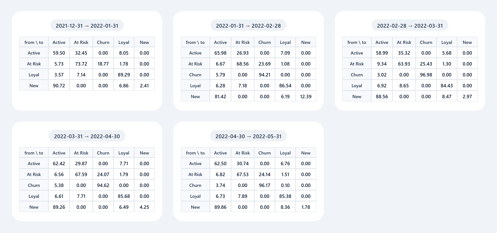

#### *Figure 8. Отток клиентов возникает в результате прогрессирующей деградации жизненного цикла.*
*Агрегированная матрица переходов между lifecycle-состояниями, обобщающая перемещения клиентов между этапами жизненного цикла за все периоды наблюдения.*
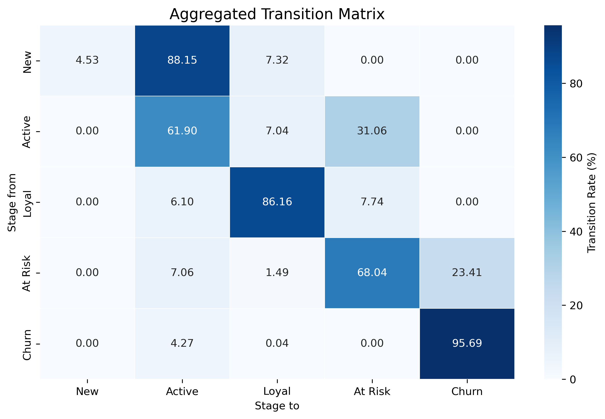
#
### Ключевые результаты

Анализ агрегированной матрицы переходов выявил существенные различия в устойчивости различных lifecycle-сегментов.
Наиболее стабильным состоянием среди активной клиентской базы оказался сегмент Loyal. Большинство клиентов, достигших данной стадии, сохраняют высокий уровень вовлеченности и продолжают совершать покупки в последующих периодах.
Сегмент Churn также характеризуется высокой стабильностью, однако уже в негативном смысле: подавляющее большинство клиентов, перешедших в состояние оттока, не возвращаются к активному потреблению.

Сегмент Active выступает ключевой точкой формирования будущей динамики клиентской базы. Несмотря на высокую долю клиентов, сохраняющих статус Active, вероятность перехода в состояние At Risk существенно превышает вероятность перехода в сегмент Loyal.
Сегмент At Risk выполняет роль промежуточного состояния между активным потреблением и окончательным оттоком. Для клиентов данной группы вероятность дальнейшей деградации оказывается выше вероятности возврата к стабильной активности.

Для новых клиентов наблюдается высокий уровень первичной активации: большинство пользователей успешно переходят в сегмент Active после первой покупки. Однако лишь небольшая часть сразу формирует устойчивое лояльное поведение.
#
### Бизнес-интерпретация

Полученные результаты показывают, что отток клиентов является не разовым событием, а постепенным процессом поведенческой деградации.

    Наиболее типичный сценарий развития негативной динамики:
    Active  →  At Risk  →  Churn

Таким образом, признаки будущего оттока начинают проявляться задолго до того момента, когда клиент фактически прекращает взаимодействие с компанией.
Одновременно анализ показывает, что сегмент Loyal является основным источником долгосрочной устойчивости клиентской базы. После формирования регулярного покупательского поведения вероятность дальнейшего удержания клиента существенно возрастает.
Это позволяет рассматривать lifecycle transitions как ранние индикаторы будущего состояния клиентского портфеля.
#
### Стратегические выводы

С точки зрения управления удержанием особое внимание следует уделять трем переходам:

    • Active → At Risk  
    Основной источник формирования будущего оттока.

    • At Risk → Churn  
    Критический этап окончательной потери клиента.

    • Active → Loyal  
    Наиболее важный путь формирования долгосрочной клиентской ценности.

Полученные результаты указывают на необходимость смещения retention-активностей в более ранние стадии жизненного цикла, когда изменения поведения еще являются обратимыми.
#
### Вывод по разделу Lifecycle Transition Framework

Переходы между lifecycle-состояниями формируют устойчивую и предсказуемую структуру поведения клиентской базы.
Большая часть клиентов перемещается между ограниченным набором типовых состояний, причем основные потери клиентов происходят через постепенную деградацию в сегменте At Risk, а основная клиентская ценность концентрируется в сегменте Loyal.
Следовательно, мониторинг lifecycle transitions может использоваться как инструмент раннего выявления рисков и как основа для построения проактивной retention-стратегии.

## 7.4 Customer Migration Dynamics

### Цель анализа

После оценки вероятностей переходов между lifecycle-состояниями необходимо понять не только вероятность миграции клиентов, но и масштаб этих перемещений.

Если Transition Matrix отвечает на вопрос:    
> Насколько вероятен тот или иной переход?

то анализ клиентских потоков отвечает на вопрос:  
> Какое количество клиентов реально перемещается между состояниями жизненного цикла?    

Это позволяет выявить наиболее значимые маршруты миграции внутри клиентской базы и определить сегменты, формирующие основные потоки удержания и потери клиентов.
#
### Методология
Для каждой пары последовательных snapshots были рассчитаны фактические переходы клиентов между lifecycle-состояниями.
Полученные переходы были агрегированы за весь период наблюдения и визуализированы с помощью Sankey Diagram, отражающей движение клиентов между состояниями жизненного цикла.

#### *Figure 9. Большинство клиентов движется по двум устойчивым сценариям: развитию (New → Active → Loyal) или постепенному уходу (Active → At Risk → Churn).*
*Агрегированные потоки переходов клиентов между lifecycle-состояниями за весь период наблюдения (Sankey Diagram).*  

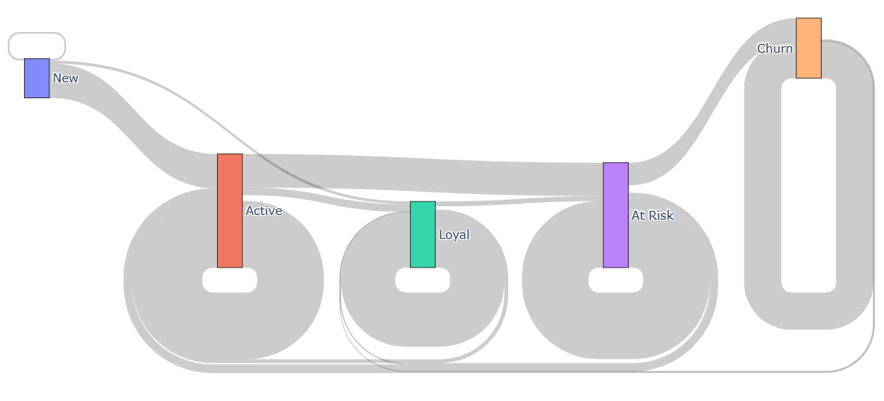

[Открыть интерактивный график](https://advantl.github.io/customer-lifecycle-analytics-framework/customer_lifecycle_transition_flow.html)

#
### Ключевые результаты
Анализ клиентских потоков показал, что большая часть пользователей перемещается между ограниченным набором состояний жизненного цикла.

    Наиболее крупные потоки формируются внутри сегментов:
    • Active → Active
    • Loyal → Loyal
    • At Risk → At Risk

что подтверждает наличие устойчивых поведенческих режимов внутри клиентской базы.

    Среди межсегментных переходов наибольший объем клиентов приходится на:
    • New → Active
    • Active → At Risk
    • At Risk → Churn

что отражает типичный жизненный цикл клиента после первой покупки.
#
### Бизнес-интерпретация

Клиентская база развивается по достаточно предсказуемой траектории.

    Основной сценарий роста выглядит следующим образом:
    New  →  Active  →  Loyal

    Основной сценарий деградации:
    Active  →  At Risk  →  Churn

Это свидетельствует о том, что формирование оттока происходит постепенно и может быть обнаружено на ранних этапах ухудшения поведения.
#
### Стратегические выводы

Сегмент At Risk выступает ключевой зоной формирования будущего churn.
Одновременно переход Active → Loyal является основным механизмом формирования долгосрочной клиентской ценности.
Следовательно, управление миграцией клиентов между lifecycle-состояниями должно стать одним из центральных элементов retention-стратегии компании.

## 7.5 Revenue Transition Analysis
### Цель анализа

После анализа клиентских потоков возникает следующий вопрос:
> Как перемещение клиентов между lifecycle-состояниями влияет на выручку компании?

Даже одинаковые по количеству клиентские переходы могут иметь принципиально разное финансовое значение.
Поэтому следующим этапом проводится анализ денежных потоков между lifecycle-состояниями.
#
### Методология
Для каждого перехода между lifecycle-состояниями была рассчитана совокупная выручка клиентов и изменение выручки относительно предыдущего периода.
На основе этих данных построены:  
-	Revenue Transition Matrix;   
-	Revenue Change Matrix;   
-	Top Positive & Negative Revenue Drivers.   

#### *Figure 10. Основная выручка компании формируется за счет удержания существующих клиентов и переходов в более ценные lifecycle-сегменты.*
*Совокупная выручка (млн) по переходам клиентов между lifecycle-состояниями за весь период наблюдения.*
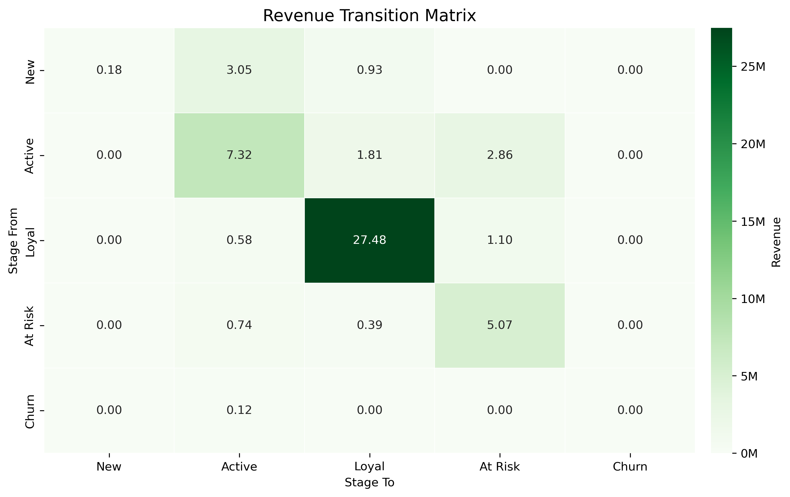

#### *Figure 11. Рост выручки обеспечивают переходы к более ценным сегментам, а первые признаки деградации клиентов приводят к существенным финансовым потерям.*
*Изменение выручки (млн) для каждого перехода между lifecycle-состояниями относительно предыдущего периода.*
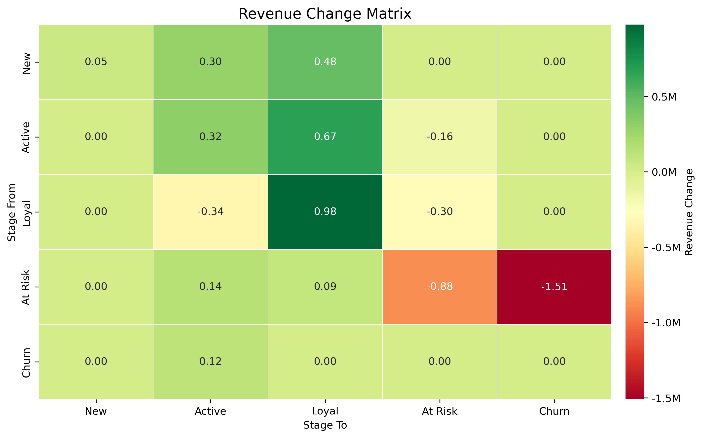

#### *Figure 12. Основные драйверы роста и потери выручки сосредоточены в нескольких ключевых переходах между lifecycle-состояниями.*
*Изменение выручки (млн) для переходов, оказывающих наибольшее положительное и отрицательное влияние на финансовый результат.*
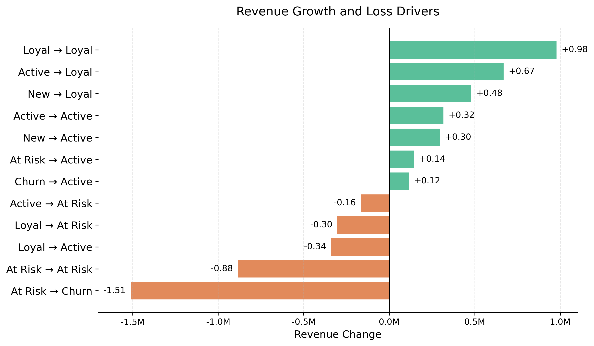

#
### Ключевые результаты
Анализ показал, что основная часть выручки концентрируется внутри удержанной клиентской базы.

    Наиболее значимый положительный вклад формируют переходы:
	    • Loyal → Loyal
	    • Active → Loyal
	    • New → Loyal

    Наиболее существенные потери выручки связаны с переходами:
	    • At Risk → Churn
	    • At Risk → At Risk
	    • Loyal → Active
    
Полученные результаты показывают, что деградация поведения клиентов оказывает значительное влияние на финансовые результаты компании еще до фактического оттока.
#
### Бизнес-интерпретация
Потери бизнеса формируются не только за счет churn.
Значительная часть revenue loss возникает на промежуточных стадиях ухудшения клиентского поведения.
Таким образом, снижение активности существующих клиентов представляет не меньшую угрозу, чем непосредственная потеря пользователей.
#
### Стратегические выводы
Наиболее эффективными точками воздействия являются переходы, сопровождающиеся ранними признаками деградации покупательского поведения.
Предотвращение переходов в сегмент At Risk потенциально позволяет сохранить значительно больший объем выручки, чем реакция на уже состоявшийся churn.

## 7.6 Revenue Driver Framework
### Цель анализа
После анализа revenue transitions возникает необходимость определить механизмы, через которые формируется изменение общей выручки бизнеса.
Для этого была построена модель классификации revenue drivers, позволяющая разделить рост и снижение выручки на отдельные поведенческие компоненты.
#
### Driver Classification Model

Все изменения выручки были распределены по пяти категориям:    
- *Acquisition* - Выручка от новых клиентов.   
- *Reactivation* - Выручка от ранее потерянных клиентов, вернувшихся к покупкам.  
- *Expansion* - Рост выручки внутри существующей клиентской базы.  
- *Contraction* - Снижение выручки среди удержанных клиентов.  
- *Churn* - - Потери выручки вследствие прекращения активности клиентов.    

#### *Figure 13. Основной вклад в изменение выручки формирует существующая клиентская база, а не привлечение новых клиентов.*
*Структура изменения выручки по поведенческим драйверам: Acquisition, Reactivation, Expansion, Contraction и Churn.*
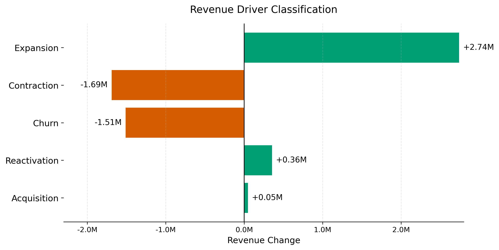
#
### Revenue Growth Decomposition
После определения основных драйверов изменения выручки необходимо оценить их совокупный вклад в итоговую динамику бизнеса. Для этого используется модель Revenue Growth Decomposition, которая позволяет разложить изменение выручки на ключевые компоненты роста бизнеса и количественно оценить влияние каждого из них на итоговый финансовый результат.

#### *Figure 14. Итоговая динамика выручки является результатом баланса роста существующих клиентов и потерь от их сокращения.*
*Декомпозиция изменения общей выручки по ключевым источникам роста и снижения.*

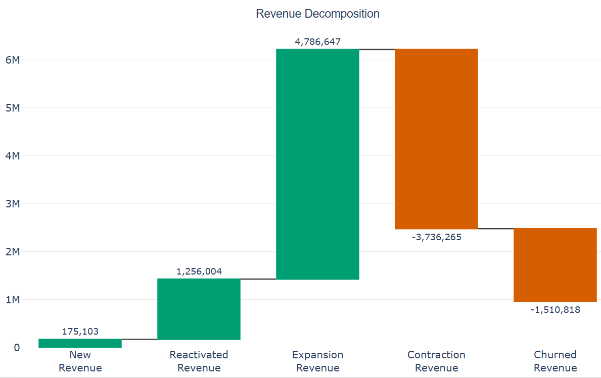

[Открыть интерактивный график](https://advantl.github.io/customer-lifecycle-analytics-framework/revenue_decomposition_waterfall.html)

#
### Ключевые результаты

Анализ показал, что изменение выручки формируется одновременно несколькими механизмами.
Рост бизнеса обеспечивается за счет:
-	привлечения новых клиентов; 
-	реактивации ранее потерянных пользователей; 
-	расширения потребления существующей клиентской базы.

Одновременно существенное влияние оказывают:
-	снижение активности удержанных клиентов; 
-	прямые потери вследствие churn.

Особенно важно, что значительная часть финансовой динамики формируется внутри уже существующей клиентской базы, а не исключительно за счет привлечения новых пользователей.
#
### Бизнес-интерпретация

Полученные результаты показывают, что долгосрочный рост бизнеса зависит не только от acquisition, но и от способности компании увеличивать ценность существующих клиентов.
Фактически retention и customer development оказываются не менее важными драйверами роста, чем привлечение новой аудитории.
#
### Стратегические выводы
Revenue Driver Framework позволяет перейти от анализа отдельных lifecycle-переходов к пониманию фундаментальных механизмов формирования финансового результата.
С точки зрения управления ростом бизнеса особое внимание следует уделять:
-	развитию существующей клиентской базы; 
-	снижению contraction среди удержанных клиентов; 
-	реактивации клиентов с высоким потенциалом возврата; 
-	предотвращению переходов в churn. 
#
### Вывод по разделу Revenue Driver Framework

Проведенный анализ показал, что динамика выручки является прямым следствием изменений клиентского поведения.
Рост бизнеса формируется через acquisition, reactivation и expansion, тогда как основные потери возникают вследствие contraction и churn.
Построенный Revenue Driver Framework обеспечивает прозрачную связь между изменением поведения клиентов и финансовыми результатами компании, создавая основу для принятия retention-ориентированных управленческих решений.

## 7.7 Retained Customer Economics
### Цель анализа

Предыдущие этапы исследования показали, каким образом клиенты перемещаются между lifecycle-состояниями и как эти переходы влияют на общую динамику выручки.
Однако изменение финансовых результатов бизнеса определяется не только удержанием клиентов как таковым.
Даже среди клиентов, которые остаются активными, могут происходить существенные изменения покупательского поведения:
-	часть пользователей увеличивает объем потребления; 
-	часть пользователей снижает интенсивность покупок; 
-	часть клиентов сохраняет относительно стабильный уровень потребления. 

Поэтому следующим этапом анализа проводится исследование экономики удержанной клиентской базы.
Основная задача данного этапа — определить, формируют ли удержанные клиенты дополнительный рост выручки или, наоборот, становятся источником постепенной деградации бизнеса.
#
### Методология

Для клиентов, сохранивших активность между последовательными периодами наблюдения, были рассчитаны изменения выручки относительно предыдущего периода.
Все удержанные клиенты были классифицированы по трем типам поведения:  
- *Expansion* - Рост выручки относительно предыдущего периода.  
- *Stable* - Сохранение сопоставимого уровня потребления.  
- *Contraction* - Снижение выручки относительно предыдущего периода.

Такой подход позволяет оценить качество удержания клиентской базы, а не только факт ее сохранения.

#### *Figure 15. Удержанные клиенты одновременно являются источником роста и скрытых потерь выручки.*
*Совокупный вклад Expansion и Contraction в изменение выручки среди удержанных клиентов.*
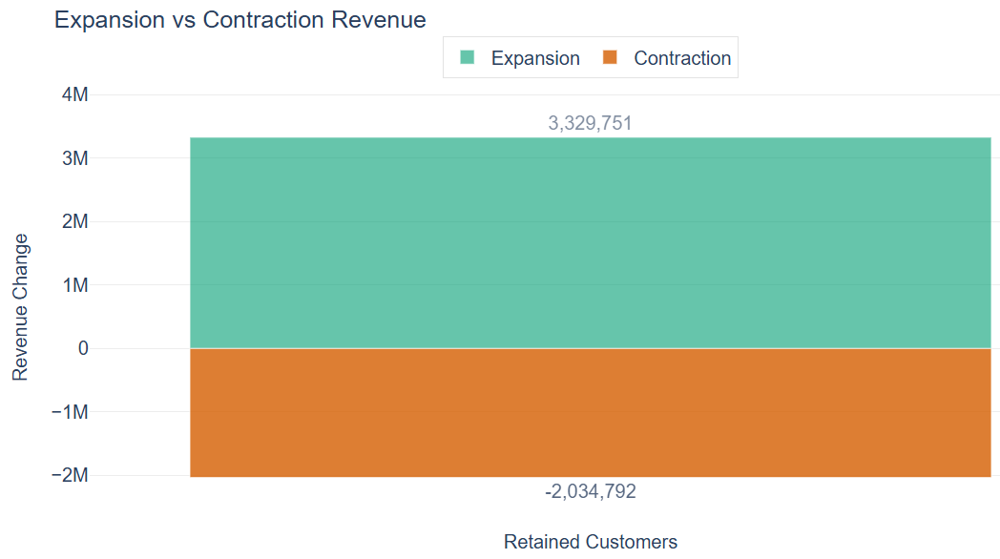 

#
### Ключевые результаты

Анализ показал, что удержание клиентов не является однородным процессом.
Даже внутри сохраненной клиентской базы наблюдаются существенные различия в динамике потребления.
Часть удержанных пользователей демонстрирует устойчивый рост покупательской активности и формирует положительный вклад в изменение выручки компании.
Одновременно значительная доля клиентов остается активной формально, однако постепенно сокращает объем потребления, генерируя скрытые потери выручки.
Таким образом, удержание клиента само по себе не гарантирует сохранение его экономической ценности.
#
### Бизнес-интерпретация

Полученные результаты показывают, что традиционные показатели retention отражают лишь количественную сторону удержания.
Фактическая экономическая эффективность retention зависит от качества удержанной клиентской базы.
Компания может демонстрировать высокие показатели удержания пользователей и одновременно сталкиваться с ухудшением финансовых результатов вследствие постепенного снижения активности существующих клиентов.
Поэтому анализ retained customer economics позволяет выявлять риски, которые остаются незаметными при использовании только классических retention-метрик.
#
### Стратегические выводы

Наибольшую ценность для бизнеса представляет не просто удержание клиентов, а увеличение их долгосрочной потребительской активности. С точки зрения управления клиентской базой особое внимание следует уделять:
-	стимулированию expansion среди активных клиентов; 
-	раннему выявлению contraction-поведения; 
-	разработке программ развития клиентской ценности; 
-	контролю скрытых потерь выручки внутри удержанной базы. 
#
### Вывод по разделу Retained Customer Economics
Анализ retained customer economics показал, что значительная часть финансовой динамики бизнеса формируется внутри уже удержанной клиентской базы.
Следовательно, управление ростом бизнеса требует не только предотвращения churn, но и систематического развития покупательской активности существующих клиентов.

## 7.8 Key Findings & Business Implications
### Executive Summary

Проведенный анализ показал, что динамика клиентской базы формируется через ограниченное количество устойчивых поведенческих сценариев.
Lifecycle-переходы демонстрируют высокую степень предсказуемости, что позволяет использовать их в качестве ранних индикаторов будущих изменений retention и revenue dynamics.
#
### Key Insights
### 1. Отток клиентов — это постепенный процесс.
Основная часть клиентских потерь формируется не одномоментно, а через последовательную деградацию поведения.
Наиболее характерный сценарий выглядит следующим образом:

    Active 
      ↓
    At Risk
      ↓
    Churn
    
Это означает, что признаки будущего оттока возникают значительно раньше фактической потери клиента.
#
### 2. Лояльные клиенты — основа стабильности бизнеса.  
Сегмент Loyal демонстрирует максимальную устойчивость среди активных lifecycle-состояний.
Клиенты, достигшие данной стадии, обладают значительно более высокой вероятностью дальнейшего удержания и формируют основу долгосрочной клиентской ценности.
#
### 3. Снижение выручки происходит до оттока клиентов. 
Финансовые потери начинают формироваться задолго до окончательного ухода клиента.
Переходы в сегмент At Risk сопровождаются заметным ухудшением потребительского поведения и снижением объема покупок.
В результате существенная часть revenue loss возникает еще до фактического перехода клиентов в состояние Churn.
#
### 4. Существующие клиенты в значительной степени определяют динамику доходов.
Изменение выручки определяется не только привлечением новых пользователей.
Существенную роль играют процессы expansion и contraction внутри существующей клиентской базы.
Это означает, что развитие отношений с текущими клиентами оказывает не меньшее влияние на финансовые результаты, чем acquisition.
#
### 5. Lifecycle-переходы могут использоваться в качестве опережающих индикаторов. 
Высокая устойчивость transition patterns позволяет использовать lifecycle-переходы в качестве инструмента раннего прогнозирования изменений клиентской базы.
Мониторинг переходов между lifecycle-состояниями способен выявлять ухудшение customer health существенно раньше традиционных показателей churn.
#
### Business Implications

Полученные результаты формируют несколько важных управленческих выводов.

**Retention Strategy**  
Фокус удержания должен смещаться в сторону раннего выявления клиентов, демонстрирующих признаки перехода из Active в At Risk.

**Revenue Protection**  
Для минимизации потерь выручки необходимо контролировать не только churn, но и процессы постепенной деградации покупательской активности внутри удержанной базы.

**Customer Development**  
Рост бизнеса зависит не только от acquisition, но и от способности компании развивать существующих клиентов и стимулировать expansion-поведение.

**CRM Prioritization**  
Lifecycle-состояния могут использоваться как основа для приоритизации CRM-активностей и персонализированных retention-механик.

## Итог раздела Lifecycle Transition Analytics

В рамках данного этапа была построена система Lifecycle Transition Analytics, объединяющая анализ клиентской миграции, денежных потоков и драйверов изменения выручки.
Проведенное исследование показало, что изменение финансовых результатов бизнеса является прямым следствием изменений клиентского поведения и может быть объяснено через ограниченный набор lifecycle-переходов и revenue drivers.
Полученные результаты формируют основу для следующего этапа исследования — анализа долгосрочного удержания и формирования customer value на уровне когорт пользователей.

# 8. Layer 2. Cohort Retention & Customer Value Dynamics

## 8.1 Business Objective

### Бизнес-контекст

Для большинства компаний привлечение новых клиентов является дорогостоящим процессом, поэтому долгосрочная устойчивость бизнеса во многом определяется способностью удерживать существующую клиентскую базу и увеличивать ценность клиентов после первой покупки. Однако традиционные показатели продаж позволяют оценить лишь текущие финансовые результаты и практически не отвечают на вопрос о том, как развивается поведение клиентов после привлечения.  

Для аптечной сети особенно важно понимать:  
-	насколько быстро пользователи прекращают совершать повторные покупки;   
-	существуют ли устойчивые модели долгосрочного потребления;   
-	как меняется покупательская активность по мере взросления клиентов;   
-	каким образом формируется долгосрочная клиентская ценность;   
-	какие когорты демонстрируют наиболее устойчивое поведение.

Для решения этих задач необходим переход от анализа отдельных транзакций к когортному подходу, позволяющему отслеживать жизненный цикл клиентов с момента первой покупки и анализировать их поведение во времени.  
#  
### Цель анализа

Цель данного раздела — исследовать долгосрочную динамику удержания клиентов и формирования customer value на уровне когорт пользователей. В рамках анализа необходимо:    
-	оценить скорость снижения клиентской активности после первой покупки;  
-	определить критические этапы жизненного цикла, на которых происходит максимальный отток;   
-	исследовать устойчивость удержания различных когорт;   
-	проанализировать изменение выручки удержанных клиентов во времени;   
-	оценить динамику customer value после привлечения;   
-	определить степень различий между когортами и устойчивость выявленных закономерностей.   
#
### Ключевые бизнес-вопросы

Анализ направлен на получение ответов на следующие вопросы:  
-	Как быстро снижается активность клиентов после первой покупки?   
-	На каких этапах жизненного цикла происходит основной отток?   
-	Формируется ли устойчивое повторное покупательское поведение?   
-	Насколько отличаются показатели удержания между различными когортами?   
-	Как изменяется выручка удержанных клиентов во времени?    
-	Растет или снижается ценность клиента по мере увеличения его жизненного цикла?  
-	Насколько стабильны наблюдаемые закономерности между различными поколениями клиентов?   
#
### Бизнес-ценность  

В отличие от классического retention-анализа данный подход позволяет исследовать не только факт удержания клиентов, но и процесс формирования долгосрочной клиентской ценности. Полученные результаты создают основу для:    
-	оценки качества привлечения клиентов;     
-	понимания экономики жизненного цикла пользователя;    
-	разработки retention-стратегий;   
-	оптимизации CRM-коммуникаций;   
-	повышения эффективности маркетинговых инвестиций;   
-	последующего построения прогнозных моделей customer lifetime value и churn.   

## 8.2 Analytical Approach

### Общая концепция анализа

Для исследования долгосрочной динамики клиентского поведения был реализован cohort-based analytical framework, позволяющий отслеживать эволюцию клиентской базы с момента первой покупки. В отличие от lifecycle-анализа предыдущего раздела, где основным объектом исследования являлись переходы между состояниями жизненного цикла, данный раздел фокусируется на поведении клиентских когорт и изменении их ценности во времени. Каждая когорта представляет собой группу пользователей, совершивших первую покупку в одном и том же календарном периоде. Такой подход позволяет сравнивать клиентов на одинаковых стадиях жизненного цикла независимо от даты их привлечения.  
#
### Формирование когорт

Для каждого клиента были определены:  
-	дата первой покупки;   
-	месяц привлечения;   
-	номер периода относительно первой покупки (cohort age).

На основе этих признаков пользователи были объединены в когорты по месяцу первого взаимодействия с компанией. Для каждого последующего месяца жизненного цикла рассчитывались показатели активности и монетизации пользователей.  
#
### Аналитический Framework

Исследование построено вокруг пяти взаимосвязанных аналитических блоков.

### 1. Cohort Retention Analysis  

На первом этапе анализируется динамика удержания клиентов. Для каждой когорты рассчитывается доля пользователей, сохранивших активность через определенное количество месяцев после первой покупки. Данный блок позволяет определить:  
-	скорость первоначального оттока;   
-	устойчивость удержания;   
-	точки стабилизации поведения клиентов;  
-	различия между когортами.   
#
### 2. Retention Decay Analysis  

Следующим этапом исследуется скорость ухудшения удержания во времени. Помимо абсолютных значений retention дополнительно рассчитывается динамика изменения показателей между соседними периодами жизненного цикла. Это позволяет определить:    
-	когда происходит наиболее интенсивная потеря клиентов;   
-	насколько быстро замедляется отток;   
-	существует ли стабильное ядро удержанных пользователей.   
#
### 3. Revenue Retention Dynamics   

После анализа удержания пользователей исследуется динамика выручки. Для каждой когорты рассчитывается уровень revenue retention относительно периода первой покупки. Это позволяет определить:  
-	как изменяется финансовая ценность удержанной базы;   
-	совпадают ли динамика пользователей и динамика выручки;   
-	сохраняется ли экономическая ценность клиентов по мере старения когорт.   
#
### 4. Customer Value Evolution 

Финальным этапом является исследование изменения customer value среди удержанных клиентов. Для этого рассчитывается показатель *Revenue per Retained User (RPRU)*, отражающий среднюю выручку на одного удержанного пользователя. Данный показатель позволяет оценить:   
-	качество удержания клиентской базы;   
-	изменение покупательской активности;   
-	долгосрочную динамику клиентской ценности;   
-	потенциал формирования устойчивой пользовательской экономики.   
#
### 5. Cohort Variability Analysis

После анализа удержания и монетизации необходимо оценить устойчивость выявленных закономерностей между различными когортами пользователей.  
Даже если средние показатели retention и revenue демонстрируют определенную тенденцию, важно понять:    
-	насколько различаются отдельные когорты;   
-	являются ли наблюдаемые закономерности стабильными;   
-	не обусловлены ли результаты поведением нескольких крупных когорт.  

Для этого дополнительно анализируются:  
-	cohort dispersion;   
-	confidence bands;   
-	behavioral heterogeneity.

Данный этап позволяет отделить структурные закономерности клиентского поведения от случайных колебаний отдельных когорт.
#
### Проверка устойчивости результатов

Для минимизации влияния статистического шума и эффекта незрелых когорт дополнительно применялись процедуры контроля надежности результатов.
В частности использовались:
-	mature cohort filtering; 
-	cohort variability analysis; 
-	стандартное отклонение; 
-	доверительные интервалы.

Данные подходы позволяют убедиться, что выявленные закономерности отражают устойчивые особенности клиентского поведения, а не случайные колебания отдельных когорт.
#
### Логика исследования

Исследование построено как последовательный анализ жизненного цикла клиента — от удержания пользователей после первой покупки до формирования долгосрочной клиентской ценности.

      Cohort Formation
              ↓
      Retention Analysis
              ↓
      Retention Decay Analysis
              ↓
      Revenue Retention Analysis
              ↓
      Customer Value Evolution
              ↓
      Cohort Variability Assessment
              ↓
      Long-Term Customer Value Framework

Такой подход позволяет последовательно перейти от оценки удержания клиентов к пониманию механизмов формирования долгосрочной ценности клиентской базы и устойчивости выявленных закономерностей между когортами.

## 8.3 Cohort Retention Analysis

### Business Question

Как изменяется удержание клиентов после первой покупки и существует ли устойчивая база пользователей, формирующая долгосрочную ценность бизнеса?
#
### Methodology 

Для каждого клиента был определен месяц первой покупки (cohort month), после чего пользователи были объединены в месячные когорты. Для каждой когорты рассчитывалась доля клиентов, совершивших хотя бы одну покупку в последующие месяцы жизненного цикла. Анализ выполнялся на двух уровнях:  
-	по отдельным когортам;   
-	в агрегированном виде по всем когортам.  
 
Это позволило оценить как общую retention-модель бизнеса, так и различия между поколениями клиентов.
#
### User Retention Dynamics
#### *Figure 16. Основная потеря клиентов происходит сразу после первой покупки, после чего удержание стабилизируется.*
*Кривые удержания пользователей по месячным когортам после первой покупки.*

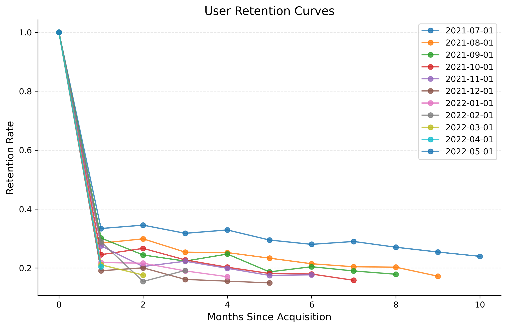

### Findings
Анализ retention-кривых выявил выраженный ранний отток клиентов практически во всех когортах. Средний User Retention снижается со 100% до примерно 19–34% уже после первого месяца жизненного цикла. После первоначального падения скорость оттока существенно замедляется, а уровень удержания стабилизируется в диапазоне 15–30% на горизонте 6–10 месяцев. Несмотря на различия между отдельными когортами, форма retention-кривых остается стабильной:

    Резкий ранний churn  →  Замедление оттока  →  Формирование устойчивого ядра клиентов

Это указывает на наличие типичной lifecycle-модели поведения покупателей внутри аптечной сети.

### Business Interpretation

Основная потеря клиентской базы происходит практически сразу после первой покупки. Значительная часть пользователей остается в категории transactional customers и не переходит к регулярному потреблению. При этом пользователи, сохранившие активность после первых месяцев жизненного цикла, демонстрируют существенно более высокий уровень долгосрочного удержания. Фактически именно прохождение раннего post-acquisition периода определяет вероятность формирования долгосрочной клиентской ценности.
#
### Cohort Retention Heatmap
#### *Figure 17. Независимо от месяца привлечения когорты демонстрируют одинаковую модель удержания.*
*Heatmap когортного удержания пользователей по месяцам жизни клиента.*

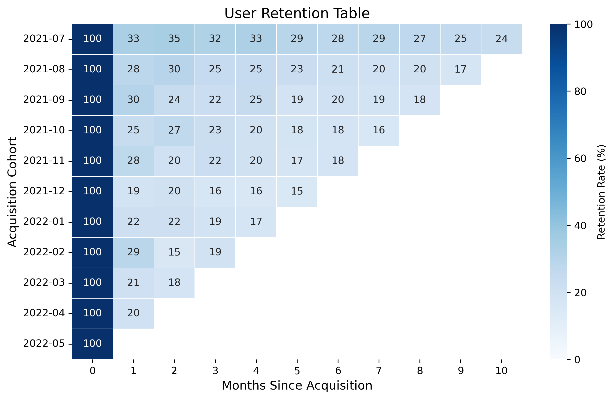

### Findings

Retention Heatmap подтверждает результаты агрегированного анализа. Практически все когорты демонстрируют схожий паттерн поведения:  
-	максимальный churn происходит в первые месяцы жизни;   
-	затем retention выходит на устойчивое плато;   
-	существенных структурных изменений между когортами не наблюдается.

При этом отдельные периоды привлечения демонстрируют более сильное удержание, что может свидетельствовать о различиях в качестве acquisition-трафика либо сезонных особенностях клиентского поведения.

### Key Insight

Ключевой проблемой retention-модели является не долгосрочное удержание клиентов, а низкая конверсия новых покупателей в repeat customers.
#
### Cohort Retention Curves
#### *Figure 18. Средняя retention-кривая разделяет жизненный цикл клиента на фазу раннего churn и устойчивого удержания.*
*Средняя когортная кривая удержания пользователей за весь период наблюдения (серые столбцы показывают количество когорт, доступных для расчета на каждом этапе).*

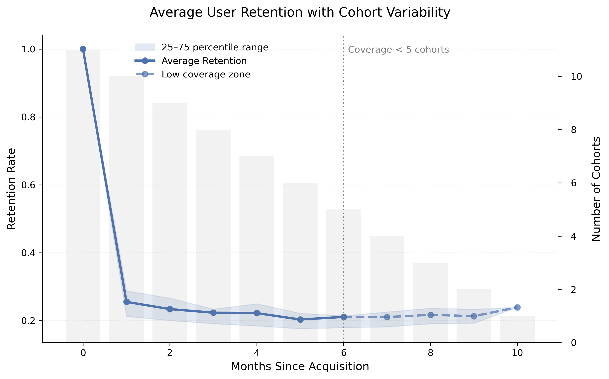

### Findings

Средняя retention-кривая позволяет более наглядно увидеть структуру жизненного цикла клиента.  
Фактически жизненный цикл разделяется на две отдельные фазы:  

    • Phase 1: Early Churn   
      Month 0 → Month 1–2   
      Основная потеря пользователей  

и

    • Phase 2: Retention Core
      Month 2+  
      Относительно стабильное удержание  

После прохождения критического периода вероятность дальнейшего удержания существенно возрастает.

### Business Implications
Полученные результаты показывают, что основной потенциал роста клиентской базы находится в улучшении раннего удержания. Даже небольшое увеличение вероятности второй покупки способно существенно увеличить размер долгосрочного активного сегмента клиентов.

## 8.4 Retention Decay Analysis
### Business Question

В какие моменты жизненного цикла компания теряет наибольшую долю клиентов и насколько быстро замедляется процесс оттока?
#
### Methodology

Для оценки скорости ухудшения удержания были рассчитаны две взаимодополняющие метрики:  

- *Absolute Retention Decay*    
Абсолютное изменение retention между соседними месяцами жизненного цикла.  

- *Relative Retention Decay*  
Относительное изменение retention относительно предыдущего периода.  

Использование обеих метрик позволяет оценить не только величину потерь клиентов, но и скорость деградации retention-модели.
#
### Absolute Retention Decay
#### *Figure 19. Большая часть потерь клиентской базы приходится на первый месяц жизненного цикла.*
*Абсолютное изменение User Retention и Revenue Retention между соседними месяцами жизненного цикла.*

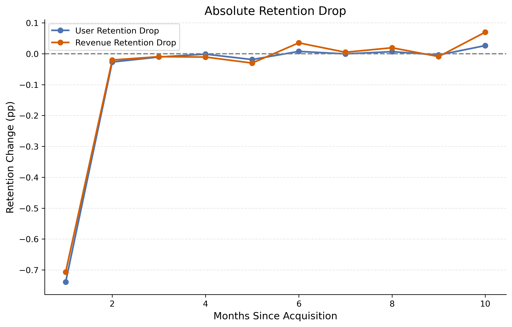

### Findings

Наиболее существенное снижение retention наблюдается между первым и вторым месяцем жизни клиента.  
Средняя потеря составляет:  
-	около 74 процентных пунктов по User Retention;    
-	около 71 процентного пункта по Revenue Retention.

После данного периода абсолютные изменения резко сокращаются и в большинстве случаев составляют лишь несколько процентных пунктов.

### Interpretation

Практически весь будущий объем клиентской базы определяется в течение первых недель после первой покупки.
После прохождения этого этапа система теряет клиентов значительно медленнее.
#
### Relative Retention Decay
#### *Figure 20. Скорость оттока резко снижается после раннего этапа жизненного цикла.*
*Относительное изменение User Retention и Revenue Retention между последовательными месяцами жизненного цикла.*
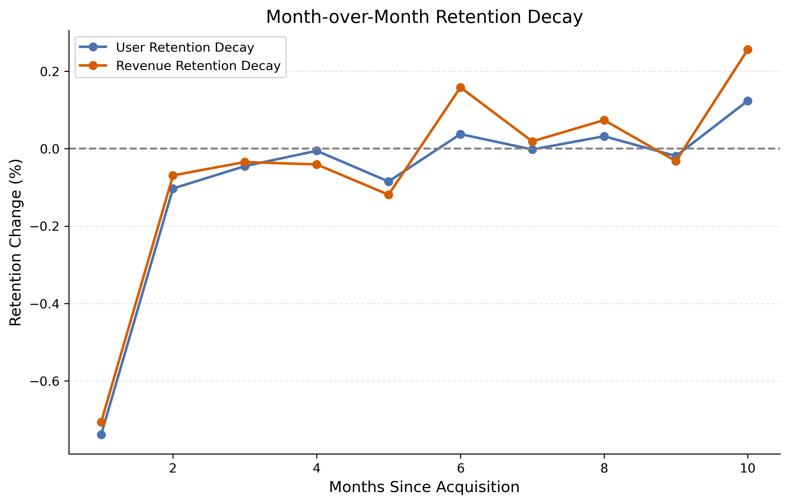

### Findings   

Относительная скорость снижения retention также демонстрирует выраженное замедление после первых месяцев жизненного цикла. После периода интенсивного churn обе метрики начинают приближаться к стабильным значениям. Это свидетельствует о переходе клиентской базы из режима активной деградации в режим относительно устойчивого поведения.
#
### Lifecycle Stabilization Point

Для выявления момента формирования устойчивого клиентского ядра дополнительно была рассчитана точка стабилизации жизненного цикла (Lifecycle Stabilization Point). В рамках данного исследования точкой стабилизации считается первый месяц, после которого абсолютное снижение User Retention остается ниже 5 процентных пунктов на протяжении как минимум двух последовательных периодов. Такой критерий позволяет отделить фазу быстрого первоначального оттока от этапа относительно стабильного поведения удержанных клиентов и определить момент перехода к более устойчивой структуре клиентской базы.

#### *Figure 21. После первых месяцев жизненного цикла формируется устойчивое ядро клиентов.*
*Совместная динамика User Retention, Revenue Retention и скорости их изменения с выделением точки стабилизации жизненного цикла.*
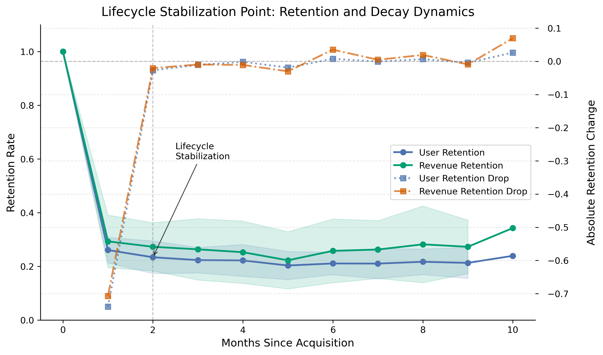

Полученная визуализация позволяет одновременно оценить как уровень удержания клиентов и выручки, так и скорость их изменения на различных этапах жизненного цикла. Для более детального анализа динамики стабилизации ниже представлены агрегированные значения retention и показателей снижения retention по месяцам жизненного цикла.

#### *Figure 22. Стабилизация удержания после раннего churn делает динамику клиентской базы предсказуемой.*
*Сводная динамика Retention и Retention Decay по месяцам жизненного цикла.*
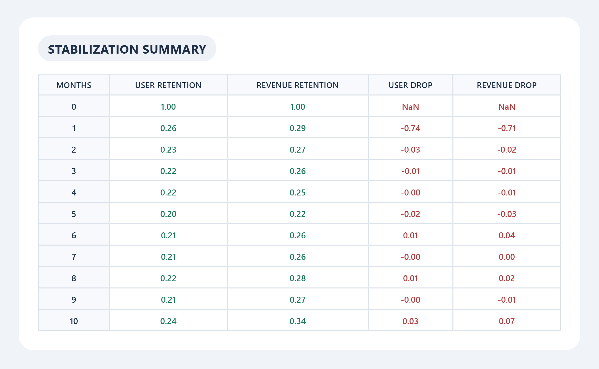


### Findings

Сопоставление абсолютного и относительного retention decay показывает наличие четкой точки стабилизации после первых месяцев жизненного цикла.
После этой точки:  
-	скорость оттока резко падает;   
-	размер клиентской базы становится более предсказуемым;   
-	начинают формироваться долгосрочные repeat customers.   
#
### Core Finding

Retention-модель бизнеса имеет ярко выраженную двухфазную структуру:

    Acquisition  →  Aggressive Early Churn  →  Retention Stabilization  →  Long-Term Customer Base

Большая часть будущего LTV определяется не качеством удержания зрелых клиентов, а способностью провести пользователя через фазу раннего churn.
#
### Business Implications

Результаты показывают, что наиболее существенная потеря клиентов происходит в первые месяцы после первой покупки, когда скорость снижения User Retention достигает максимальных значений. По мере развития жизненного цикла величина ежемесячных потерь постепенно уменьшается, что свидетельствует о формировании более устойчивой клиентской базы. 

После прохождения точки стабилизации дальнейшее снижение retention становится значительно менее выраженным, а поведение оставшихся клиентов приобретает более предсказуемый характер. При этом Revenue Retention стабилизируется на более высоком уровне, чем User Retention, что указывает на сохранение экономически наиболее ценной части клиентской базы. Данный результат подтверждает, что долгосрочная выручка компании формируется преимущественно за счет относительно небольшого ядра наиболее лояльных и регулярно покупающих клиентов. Выявленная точка стабилизации выступает важным элементом customer lifecycle model и служит естественным связующим звеном к дальнейшему анализу монетизации удержанных клиентов, динамики RPRU и формирования долгосрочного Customer Lifetime Value.
#
### Strategic Implications

Наибольший потенциальный эффект для бизнеса способны обеспечить инициативы, направленные на:  
-	увеличение вероятности второй покупки;   
-	ускорение формирования покупательской привычки;   
-	персонализированное сопровождение новых клиентов;   
-	CRM-механики в первые 30–60 дней после привлечения.  

Даже небольшое снижение churn на данном этапе способно оказать непропорционально сильное влияние на:  
-	размер активной клиентской базы;   
-	cumulative revenue;   
-	customer lifetime value;   
-	окупаемость привлечения клиентов.  

## 8.5 Revenue Retention Analysis
### Business Question

Сохраняется ли выручка клиентских когорт с той же скоростью, что и пользовательская база, или удержанные клиенты со временем концентрируют все большую долю дохода компании?
#
### Methodology

После анализа пользовательского удержания была исследована динамика выручки когорт. Для каждой acquisition-когорты рассчитывался показатель Revenue Retention, отражающий долю выручки относительно первого месяца жизненного цикла клиента. Метрика позволяет оценить не просто сохранение пользователей, а сохранение экономической ценности клиентской базы во времени. Анализ выполнялся:     
-	на уровне отдельных когорт;   
-	на уровне агрегированной динамики;    
-	в сравнении с User Retention.   
#
### Revenue Retention Dynamics Across Cohorts
#### *Figure 23. Выручка удерживается значительно лучше клиентской базы на протяжении всего жизненного цикла.*
*Кривые Revenue Retention по месячным когортам клиентов относительно первого месяца после привлечения.*
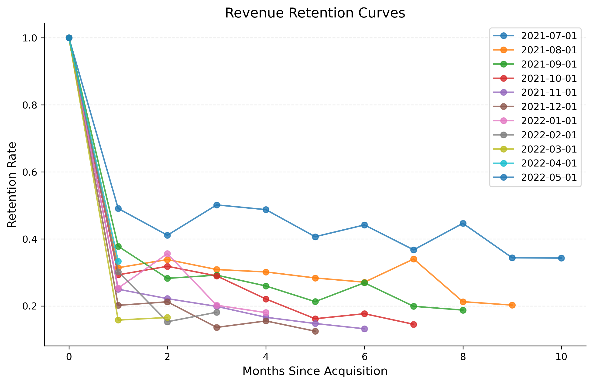

### Findings 

Анализ показал, что выручка снижается существенно медленнее, чем количество клиентов. Несмотря на выраженный churn в первые месяцы жизненного цикла, большинство когорт сохраняют от 20% до 45% первоначальной выручки даже на поздних этапах наблюдения.

Форма кривых Revenue Retention во многом повторяет User Retention:

      Резкое снижение  →  Замедление падения  →  Стабилизация

Однако уровень удержания выручки остается заметно выше уровня удержания пользователей практически на всем горизонте анализа.

### Business Interpretation

Полученные результаты показывают, что продукт теряет пользователей быстрее, чем экономическую ценность клиентской базы.
По мере развития жизненного цикла в системе остается все более концентрированная группа клиентов, формирующая непропорционально большую долю выручки.

Иными словами:
бизнес теряет количество клиентов быстрее, чем качество оставшейся аудитории.
#
### Revenue Retention Matrix
#### *Figure 24. Большинство когорт демонстрируют устойчивое удержание выручки независимо от периода привлечения.*
*Heatmap Revenue Retention по месячным когортам и возрасту клиента.*
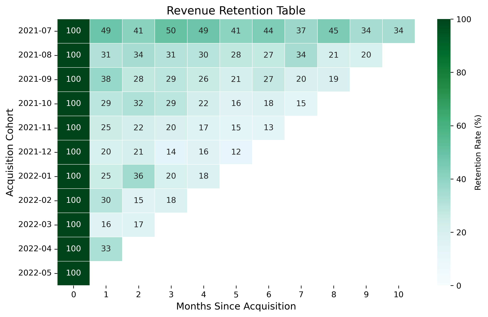

### Findings

Тепловая карта Revenue Retention подтверждает наличие устойчивого паттерна практически во всех когортах. Даже после значительного сокращения пользовательской базы зрелые когорты продолжают удерживать существенную часть первоначальной выручки. При этом различия между когортами постепенно увеличиваются по мере роста cohort age, что указывает на возрастающую роль качества привлеченных клиентов в формировании долгосрочной выручки.

### Key Insight

Revenue Retention систематически превосходит User Retention. Это означает, что удержанные пользователи обладают более высокой экономической ценностью по сравнению со средним клиентом исходной когорты.
#
### Revenue Retention vs User Retention
<a id="fig25"></a>
#### *Figure 25. Удержанные клиенты формируют непропорционально большую долю выручки по сравнению с их численностью.*
*Сравнение средней динамики User Retention и Revenue Retention по всем когортам (серые столбцы показывают количество когорт, доступных для расчета на каждом этапе).*

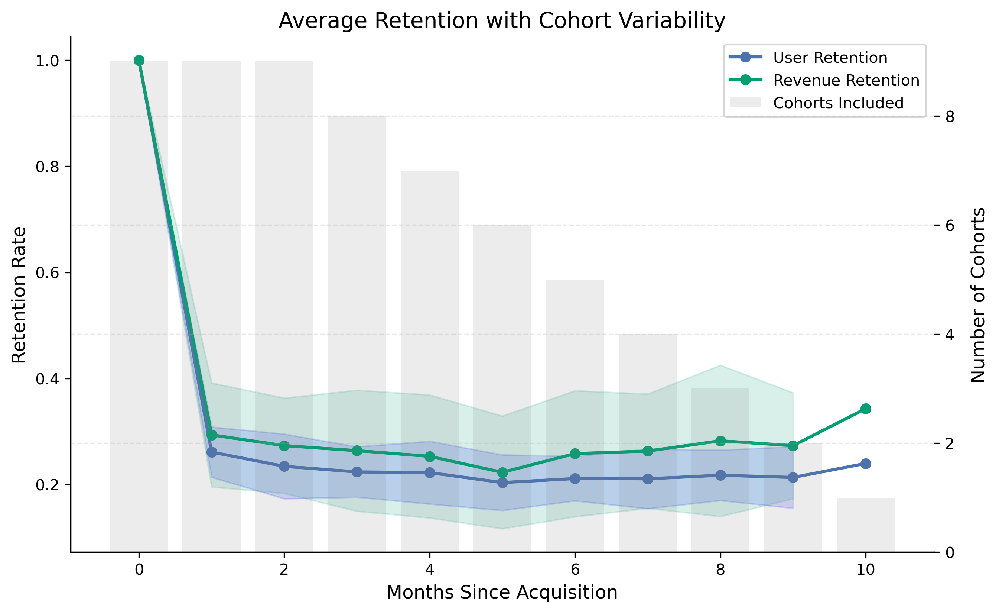

### Findings

Сравнение двух retention-кривых выявило устойчивое расхождение между динамикой пользователей и динамикой выручки. К моменту, когда значительная часть клиентской базы уже покидает продукт, удержанная аудитория продолжает генерировать непропорционально высокую долю первоначальной выручки. Наблюдаемая дивергенция становится особенно заметной после прохождения периода интенсивного раннего churn. Оставшиеся клиенты становятся экономически более ценными по мере развития жизненного цикла.

### Core Finding

Ключевое ограничение бизнеса находится не в способности монетизировать удержанных пользователей. Ключевое ограничение находится в количестве клиентов, которым удается дойти до стадии долгосрочного удержания.

### Business Implications

Результаты показывают, что внутри клиентской базы уже существует устойчивое ядро пользователей с высокой экономической ценностью. Следовательно, основной резерв роста заключается не в дополнительной оптимизации монетизации существующих loyal customers, а в увеличении числа клиентов, которые достигают стадии повторного потребления.
#
### Transition to Next Analysis
На данном этапе возникает следующий вопрос. 
> Если выручка удерживается лучше, чем пользователи, то за счет какого механизма это происходит?  

Для ответа необходимо исследовать изменение средней ценности удержанного клиента во времени.

## 8.6 Customer Value Evolution (RPRU)
### Business Question

Как изменяется экономическая ценность удержанных клиентов по мере развития их жизненного цикла и происходит ли рост customer value среди пользователей, остающихся в системе?
#
### Methodology

Для оценки качества удержанной аудитории рассчитывался показатель *Revenue per Retained User (RPRU)*. Метрика отражает среднюю выручку на одного активного пользователя внутри каждой когорты на каждом этапе жизненного цикла. Использование RPRU позволяет отделить изменения количества пользователей от изменений их экономической ценности.
#
### Revenue per Retained User Dynamics
#### *Figure 26. Средняя ценность удержанного клиента увеличивается по мере развития жизненного цикла.*
*Динамика Revenue per Retained User (RPRU) по месячным когортам клиентов.*

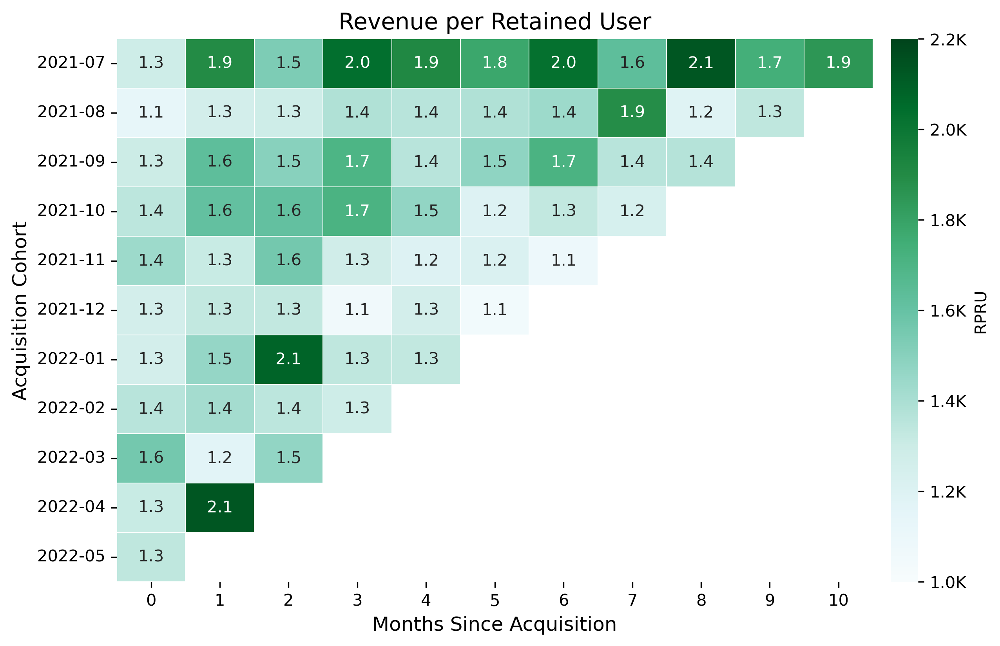

### Findings

В отличие от retention-показателей, средняя выручка на удержанного пользователя не демонстрирует снижения. Для большинства когорт RPRU остается стабильным либо постепенно увеличивается на протяжении жизненного цикла. Наиболее зрелые когорты достигают значений, превышающих уровень первого месяца на 20–40%. В отдельных случаях рост превышает 40%.

### Business Interpretation

Retention decay сопровождается естественной селекцией клиентской базы. Продукт постепенно теряет низкововлеченных пользователей и сохраняет клиентов с более высокой покупательской активностью. В результате средняя ценность одного retained customer со временем увеличивается.
#
### Relative Growth of Customer Value
#### *Figure 27. После раннего churn экономическая ценность удержанных клиентов начинает устойчиво расти.*
*Нормализованная динамика RPRU относительно первого месяца жизненного цикла(индекс относительно Month 0 = 100%).*

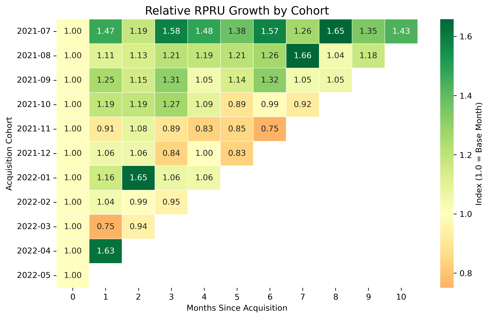

## Findings

Нормализованный анализ показывает устойчивый рост customer value практически во всех зрелых когортах. После прохождения периода интенсивного churn средний retained user начинает приносить существенно больше выручки по сравнению с моментом первоначального привлечения. Для ряда когорт рост достигает 20–65%.

## Interpretation

Долгосрочное удержание связано не только с сохранением клиентов. Оно связано с ростом качества оставшейся аудитории. По мере развития жизненного цикла в продукте концентрируются пользователи с более высокой частотой покупок, большим средним чеком и более устойчивыми потребительскими привычками.
#
### Average Monetization Growth
#### *Figure 28. Ограничением роста является не монетизация удержанных клиентов, а число пользователей, достигающих стадии высокой Customer Value.*
*Средняя динамика роста Revenue per Retained User по всем когортам.*
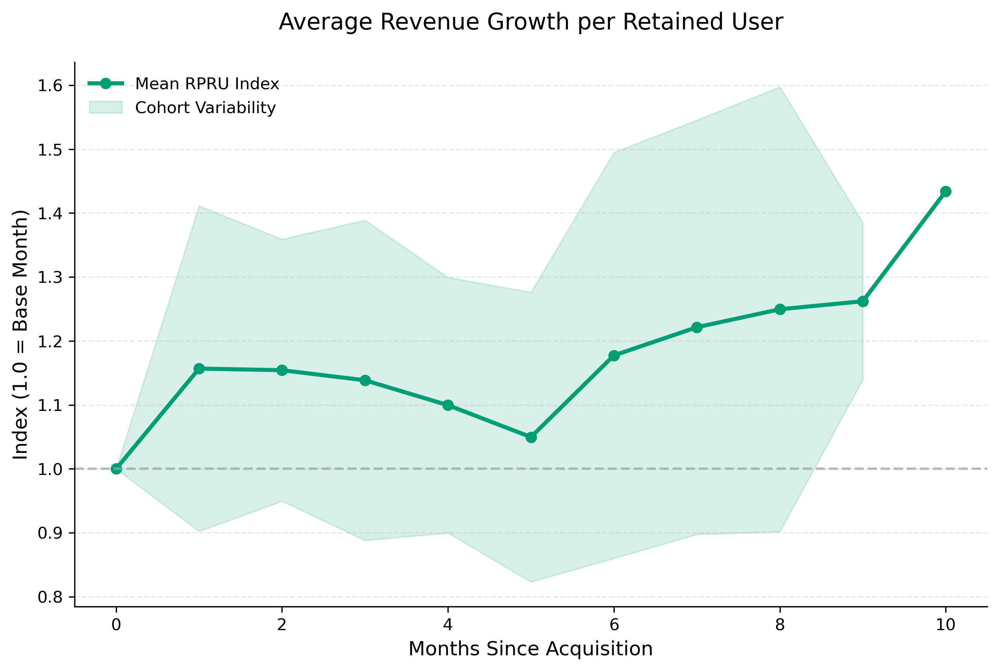

## Findings

В среднем по всем когортам RPRU начинает превышать уровень первого месяца уже после раннего периода жизненного цикла. Рост монетизации сохраняется на протяжении всего наблюдаемого горизонта. Даже после значительного сокращения клиентской базы средняя выручка на одного retained customer продолжает демонстрировать положительную динамику.

### Core Finding

Продукт уже умеет эффективно монетизировать удержанных пользователей. Основная проблема заключается не в низкой ценности retained customers. Основная проблема заключается в том, что до стадии высокой customer value доходит слишком небольшая доля первоначально привлеченных клиентов.

### Business Implications

Полученные результаты указывают на наличие сформированного сегмента клиентов, обладающих высокой долгосрочной ценностью. Именно эта группа становится основным источником Revenue Retention и будущего LTV. Следовательно, наиболее перспективным направлением развития является увеличение доли пользователей, переходящих в данный сегмент.

## 8.7 Retention vs Monetization Dynamics

### Business Question

Что оказывает большее влияние на долгосрочную ценность клиента и рост выручки компании:
-	удержание пользователей; 
-	рост монетизации удержанной аудитории? 
#
### Methodology

Для ответа на данный вопрос были объединены результаты предыдущих этапов анализа:
-	User Retention;   
-	Revenue Retention;   
-	Revenue per Retained User (RPRU).  
 
Сопоставление этих метрик позволяет разделить два независимых механизма формирования выручки:

- Retention Effect  
Изменение количества активных пользователей.

- Monetization Effect  
Изменение средней выручки на одного удержанного клиента.

Такой подход позволяет определить, какой из факторов оказывает наибольшее влияние на долгосрочную экономику клиентской базы.
#
### Retention vs Revenue Dynamics

### Findings

Сравнение user retention и revenue retention [Figure 25](#fig25) выявило устойчивое расхождение между динамикой клиентской базы и динамикой выручки. После первого месяца жизненного цикла пользовательская база сокращается примерно до 26% первоначального размера, тогда как Revenue Retention остается существенно выше и сохраняет значительную часть исходной выручки. Это означает, что потери пользователей не приводят к пропорциональному снижению финансовой ценности клиентской базы. По мере развития жизненного цикла происходит концентрация выручки среди меньшего количества клиентов.
#
### Retention vs Customer Value

#### *Figure 29. Ценность удержанных клиентов растет, но этого недостаточно, чтобы компенсировать потери аудитории.*
*Средний User Retention и индекс роста Revenue per Retained User (RPRU) по месяцам жизни когорты.*

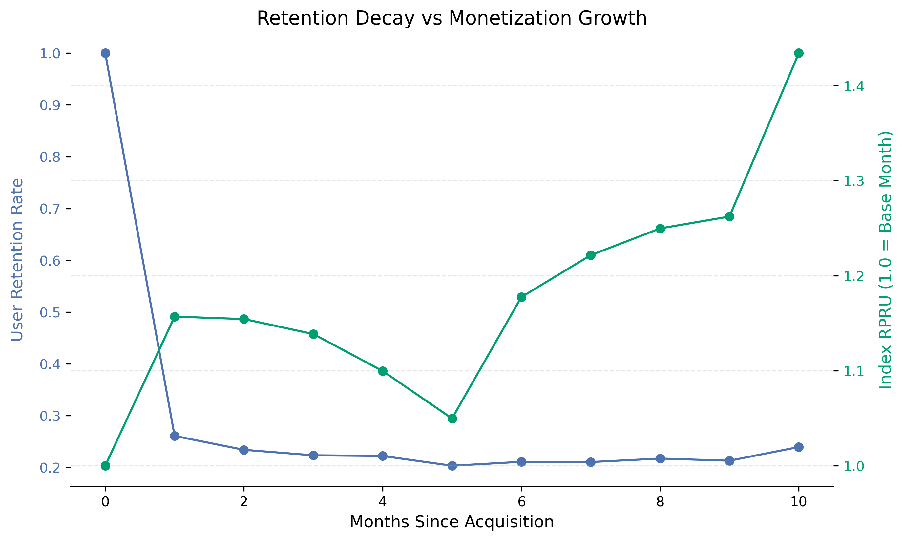

### Findings

Анализ показывает, что по мере сокращения клиентской базы средняя ценность удержанных пользователей систематически растет.
После прохождения периода интенсивного churn Revenue per Retained User превышает уровень первого месяца и продолжает увеличиваться на протяжении жизненного цикла. Для зрелых когорт рост RPRU достигает 20–40%, а в отдельных случаях превышает 40%. Таким образом, система одновременно демонстрирует:   
-	сокращение количества клиентов;   
-	рост ценности оставшейся аудитории.  

### Interpretation

Наблюдаемая динамика свидетельствует о механизме естественной селекции клиентской базы. Низкововлеченные пользователи покидают продукт на ранних стадиях жизненного цикла, тогда как наиболее активные покупатели продолжают взаимодействовать с компанией и увеличивают свой вклад в выручку. В результате продукт постепенно концентрирует все большую долю дохода внутри сегмента лояльных клиентов.
#
### Growth Constraint Analysis
### Findings

Несмотря на устойчивый рост RPRU, увеличение ценности удержанных клиентов не компенсирует масштаб первоначального churn. Средний рост монетизации на одного retained user составляет порядка 15–40%. Одновременно клиентская база сокращается более чем на 70% уже в первые месяцы жизненного цикла.
Это означает, что потери клиентов значительно превосходят выигрыш от роста монетизации удержанной аудитории.

### Core Insight

Главным ограничителем роста бизнеса является не монетизация удержанных клиентов. Главным ограничителем роста является способность компании переводить новых покупателей в сегмент повторного потребления.
#
### Business Implications

Полученные результаты показывают, что продукт уже обладает эффективной моделью монетизации удержанных пользователей. Основной резерв роста находится в расширении сегмента клиентов, достигающих стадии высокой customer value. Следовательно, наиболее перспективными направлениями развития являются:    
-	улучшение раннего retention;   
-	увеличение вероятности второй покупки;   
-	ускорение формирования покупательской привычки;   
-	развитие программ повторного вовлечения новых клиентов.   

## 8.8 Cohort LTV Dynamics

### Business Question

Как совокупное влияние удержания и монетизации формирует долгосрочную ценность клиента и каким образом развивается LTV различных когорт во времени?
#
### Methodology
Для каждой acquisition-когорты был рассчитан накопленный Customer Lifetime Value (LTV). Метрика отражает совокупную выручку, генерируемую клиентом с момента первой покупки на протяжении жизненного цикла.  
Дополнительно анализировались:
-	темпы накопления LTV; 
-	различия между когортами; 
-	точки замедления роста ценности клиента. 
#
### Cohort LTV Matrix

#### *Figure 30. LTV стабильно растет во всех когортах на протяжении жизненного цикла клиента.*
*Тепловая карта накопленного LTV по acquisition-когортам и месяцам жизни клиента.*

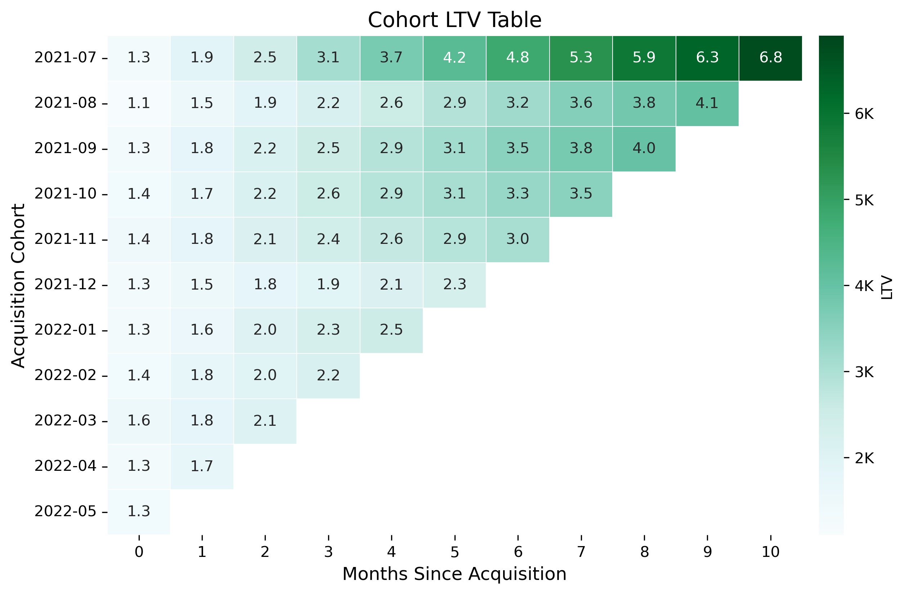

### Findings

Когортный анализ показывает устойчивый рост накопленной ценности клиента практически во всех когортах. Наиболее зрелые когорты достигают LTV на уровне 6.3–6.8 тыс. денежных единиц к 10–11 месяцу жизненного цикла. Несмотря на существенный churn, накопленная выручка продолжает увеличиваться на протяжении всего наблюдаемого горизонта.
#
### Cohort LTV Curves
#### *Figure 31. Основная часть LTV формируется в первые месяцы жизненного цикла клиентаs.*
*Кривые накопленного LTV по acquisition-когортам.*
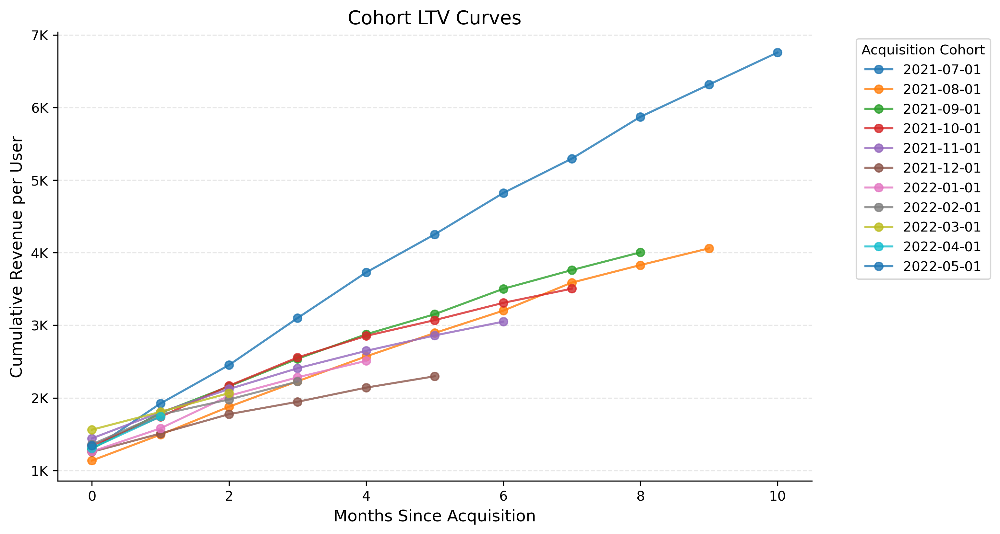

### Findings

LTV-кривые демонстрируют две характерные фазы. Первая фаза характеризуется быстрым накоплением клиентской ценности.
Наиболее интенсивный рост LTV происходит в первые 3–5 месяцев после первой покупки. После этого рост сохраняется, однако его скорость постепенно снижается.

### Interpretation

Полученные результаты показывают, что большая часть долгосрочной ценности клиента формируется в раннем lifecycle-периоде.  
Именно в этот момент одновременно происходят два ключевых процесса:  
-	основной churn; 
-	формирование будущих лояльных клиентов.

Поэтому любые изменения поведения пользователей в первые месяцы жизненного цикла оказывают непропорционально сильное влияние на итоговый LTV.
#
### LTV Accumulation Analysis
#### *Figure 32. Большая часть долгосрочной ценности клиента формируется в первые 5–6 месяцев.*
*Средняя кривая накопленного LTV по всем acquisition-когортам (серые столбцы — количество доступных когорт для оценки).*
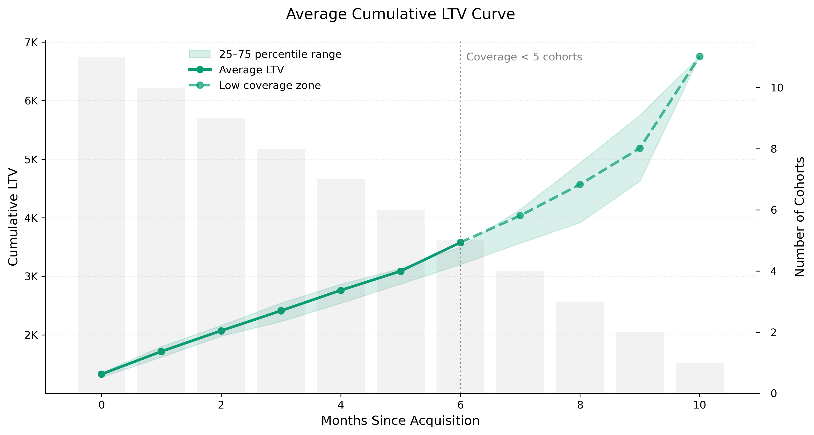

### Findings

Средняя LTV-кривая показывает, что основная часть накопленной ценности формируется в течение первых месяцев жизненного цикла клиента. Наиболее быстрый рост наблюдается в первые 5–6 месяцев, после чего темпы накопления выручки становятся более умеренными. При этом LTV продолжает расти на всех доступных этапах жизненного цикла, что указывает на сохранение монетизации среди удержанных пользователей. Оценки LTV после 6-го месяца следует интерпретировать с осторожностью из-за уменьшения охвата когорт.

### Core Insight

Даже при относительно низком уровне удержания продукт способен генерировать значительную долгосрочную ценность благодаря устойчивой монетизации retained-аудитории. Непрерывный рост кумулятивного LTV показывает, что пользователи, пережившие ранние этапы жизненного цикла, продолжают приносить компании дополнительную выручку в течение длительного времени. Однако итоговый LTV определяется прежде всего тем, сколько клиентов смогут пройти через период наиболее интенсивного churn в первые месяцы использования продукта.
#
### Business Implications

Полученные результаты позволяют сделать стратегически важный вывод. Рост долгосрочной выручки компании зависит не столько от дальнейшего повышения интенсивности трат существующих loyal клиентов, сколько от увеличения числа клиентов, достигающих стадий жизненного цикла с высокой клиентской ценностью. Каждый дополнительный процент retention в первые месяцы жизненного цикла оказывает существенно большее влияние на итоговый LTV, чем аналогичное улучшение удержания на поздних этапах. Дополнительно результаты указывают на высокий потенциальный эффект инвестиций в onboarding, активацию и раннее удержание пользователей, поскольку именно на этих этапах формируется основная часть будущей клиентской ценности.

## 8.9 Cohort Variability Analysis

### Business Question

Насколько выявленные закономерности retention и монетизации являются устойчивыми для всей клиентской базы, а не результатом поведения отдельных когорт?
#
### Почему этот анализ важен

До этого момента мы анализировали средние retention-кривые, revenue retention и динамику customer value. Однако средние значения могут скрывать существенные различия между когортами.  
Для принятия бизнес-решений важно понимать:  
-	являются ли выявленные закономерности структурными;   
-	насколько различаются отдельные acquisition cohorts;   
-	сохраняются ли выводы при анализе разных периодов привлечения клиентов;  
-	не формируется ли средний результат за счет нескольких крупных когорт.  
#
### Analytical Approach

Для оценки устойчивости результатов дополнительно исследуется межкогортная вариативность поведения.
Анализ включает три уровня проверки:

***Cohort Dispersion***  
Оценка разброса retention между когортами на различных стадиях жизненного цикла.  
Позволяет определить:
-	насколько похожи разные когорты; 
-	увеличивается ли неоднородность поведения со временем; 
-	существуют ли когорты с аномально высоким или низким удержанием. 

***Confidence Bands***  
Для средних retention curves рассчитываются доверительные интервалы.  
Это позволяет оценить:  
-	статистическую устойчивость наблюдаемых закономерностей;   
-	степень неопределенности на поздних lifecycle-этапах;   
-	надежность интерпретации retention plateau.   

***Behavioral Heterogeneity***     
Дополнительно анализируется изменение вариативности:  
-	User Retention;     
-	Revenue Retention;   
-	Revenue per Retained User.
  
Цель анализа — определить, становится ли клиентская база более или менее однородной по мере развития жизненного цикла.
#
#### *Figure 33. Основные различия между когортами формируются в монетизации, а не в удержании клиентов.*
*Стандартное отклонение Revenue Retention и Revenue per Retained User между acquisition-когортами по месяцам жизненного цикла (серые столбцы показывают количество когорт, доступных для расчета на каждом этапе).*

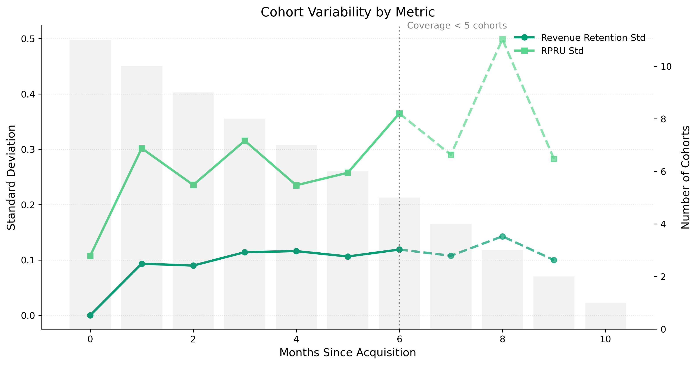

### Findings

Анализ межкогортной вариативности показал, что паттерны удержания клиентов остаются исключительно устойчивыми между различными когортами приобретения.

Практически все когорты демонстрируют одинаковую структуру жизненного цикла:  
- резкое снижение активности после первой покупки;  
- быстрое замедление скорости оттока;  
- формирование retention плато на последующих этапах жизненного цикла.  

Наиболее низкий уровень вариативности наблюдается у пользовательского удержания. Стандартное отклонение User Retention на протяжении большей части жизненного цикла остается в диапазоне 4–6 п.п., что свидетельствует о высокой воспроизводимости retention-паттернов между когортами. В отличие от пользовательского удержания, метрики монетизации демонстрируют существенно более высокий разброс. Для Revenue Retention стандартное отклонение достигает 10–14 п.п., тогда как для Revenue per Retained User наблюдается значительный разброс значений; стандартное отклонение в отдельные периоды превышает 0.45–0.50 (в единицах RPRU).

Это означает, что различия между когортами формируются не столько за счет различий в вероятности повторных покупок, сколько за счет различий в интенсивности потребления удержанных клиентов. Дополнительно наблюдается рост неопределенности на поздних стадиях жизненного цикла. Однако оценки после шестого месяца следует интерпретировать с осторожностью, поскольку в расчете участвует менее пяти зрелых когорт, что увеличивает чувствительность результатов к поведению отдельных групп клиентов.

В целом результаты подтверждают, что выявленные ранее закономерности retention являются структурной характеристикой клиентской базы, тогда как долгосрочная экономика клиентов существенно сильнее зависит от качества удержанной аудитории.
#
### Business Interpretation

Полученные результаты подтверждают высокую устойчивость ключевых выводов всего когортного анализа.

Независимо от месяца привлечения клиентов наблюдаются одни и те же фундаментальные закономерности:
- высокий ранний churn после первой покупки;  
- постепенное замедление скорости оттока;  
- формирование стабильного retention plateau;  
- рост экономической ценности удержанных клиентов.  

Особенно важным является тот факт, что вариативность User Retention остается низкой практически на всем горизонте наблюдения. Это позволяет рассматривать ранний churn как системную особенность клиентской базы, а не как результат поведения отдельных когорт. В то же время основные различия между когортами проявляются в метриках монетизации. Revenue Retention и Revenue per Retained User демонстрируют существенно больший разброс, что указывает на различия в составе удержанной аудитории и доле высокоценных клиентов внутри отдельных когорт. 

Иными словами, когорты теряют клиентов примерно одинаково, но удержанные пользователи обладают разной экономической ценностью. При интерпретации поздних lifecycle-периодов необходимо учитывать снижение статистической устойчивости оценок. После шестого месяца количество зрелых когорт становится ограниченным, поэтому наблюдаемая вариативность частично отражает эффект малой выборки.
#
### Strategic Implications

Полученные результаты имеют несколько важных практических следствий для бизнеса.

1. Высокий ранний churn является структурной характеристикой всей клиентской базы.Поскольку данный паттерн воспроизводится практически во всех когортах, приоритетом retention-стратегии должны стать мероприятия, направленные на удержание клиентов в первые месяцы после первой покупки.

2. Рост customer value среди retained users наблюдается во всех зрелых когортах, что подтверждает экономическую целесообразность инвестиций в удержание пользователей с высоким потенциалом долгосрочной ценности.

3. Основным источником различий между когортами становится не удержание как таковое, а монетизация удержанных клиентов. Это означает, что наряду с задачами retention бизнесу необходимо развивать механизмы повышения глубины потребления и расширения клиентской ценности внутри удержанной аудитории.

4. Долгосрочная выручка компании становится все более зависимой от относительно небольшой группы наиболее ценных клиентов. По мере созревания когорт влияние high-value customers на агрегированные показатели возрастает, что делает их удержание одним из ключевых факторов устойчивости бизнеса.

Таким образом, результаты анализа подтверждают, что управление customer value является не менее важным направлением развития, чем управление удержанием клиентов, а максимальный бизнес-эффект достигается при одновременной работе над обеими задачами.

## 8.10 Key Findings & Business Implications
### Executive Summary

Когортный анализ показал, что долгосрочная экономика клиентской базы определяется не столько масштабом привлечения пользователей, сколько способностью компании переводить новых покупателей в сегмент повторных клиентов. Несмотря на значительный ранний churn, удержанные пользователи демонстрируют устойчивый рост customer value и формируют непропорционально большую долю долгосрочной выручки. Таким образом, основным ограничением роста бизнеса является не монетизация существующих клиентов, а эффективность раннего удержания после первой покупки.
#
### Key Insights

### 1. Основной churn происходит сразу после первой покупки  
User Retention снижается примерно до 26% уже в течение первых месяцев жизненного цикла.
Именно этот период формирует основную потерю будущего LTV.
#
### 2. После initial churn формируется стабильное ядро клиентов   
После первых месяцев скорость оттока резко снижается.
Оставшиеся пользователи демонстрируют признаки устойчивого повторного покупательского поведения.
#
### 3. Revenue Retention устойчивее User Retention  
Выручка сокращается медленнее, чем клиентская база.
Это означает, что удержанные пользователи обладают более высокой экономической ценностью.
#
### 4. Customer Value растет по мере развития жизненного цикла  
Revenue per Retained User систематически увеличивается относительно acquisition period.
На поздних этапах жизненного цикла retained customers генерируют значительно больший revenue contribution.
#
### 5. LTV формируется преимущественно в первые месяцы жизненного цикла       
Наиболее значимая часть будущей ценности клиента определяется в период максимального churn.
Каждое улучшение раннего retention оказывает накопительный эффект на долгосрочную выручку.

## Business Implications
Полученные результаты свидетельствуют о наличии двухфазной структуры жизненного цикла клиентов. Первая фаза характеризуется интенсивным оттоком новых покупателей и определяет размер будущей клиентской базы. Вторая фаза связана с развитием удержанных пользователей, которые постепенно увеличивают свою ценность для бизнеса. В результате долгосрочный рост выручки определяется не столько способностью компании привлекать новых клиентов, сколько эффективностью перевода новых покупателей в сегмент регулярных пользователей.

## Strategic Recommendations

### Приоритет 1. Оптимизация Early Retention     
Максимальный бизнес-эффект ожидается от снижения churn в первые 30–60 дней после первой покупки.

### Приоритет 2. Ускорение повторных покупок   
Необходимо развивать механики, ускоряющие вторую и третью покупку клиента.

### Приоритет 3. Развитие ценных клиентов   
Следует выявить факторы, связанные с ростом RPRU и долгосрочного LTV.

### Приоритет 4. Мониторинг качества когорт  
Рекомендуется регулярно отслеживать качество новых когорт через retention, revenue retention и cohort LTV.

## Итог раздела Cohort Retention & Customer Value Dynamics   

Когортный анализ показал, что клиентская база обладает выраженной асимметрией жизненного цикла: большая часть пользователей прекращает активность после первой покупки, тогда как относительно небольшое ядро удержанных клиентов формирует основную часть долгосрочной выручки.
Следовательно, ключевой резерв роста находится не в увеличении монетизации существующей лояльной аудитории, а в повышении вероятности перехода новых клиентов в сегмент долгосрочно удерживаемых пользователей. Данный вывод формирует основу для следующего раздела проекта — Predictive Customer Analytics, где задача анализа смещается от описания жизненного цикла к прогнозированию будущего поведения клиентов, оценке риска оттока и приоритизации retention-инвестиций.

# 9. Layer 3. Predictive Customer Analytics
## 9.1 Business Objective
### Цель раздела

Первые два раздела проекта позволили понять, каким образом формируется жизненный цикл клиента, какие сегменты наиболее подвержены деградации и где возникают основные потери выручки.

Однако описательный анализ отвечает преимущественно на вопрос:
> Что произошло?

Для построения полноценной retention-стратегии необходимо перейти к следующему уровню аналитики и ответить на вопрос:
> Что произойдет дальше и на каких клиентах необходимо концентрировать усилия по удержанию?

Цель данного раздела заключается в построении системы прогнозирования клиентского поведения, позволяющей заранее выявлять пользователей с повышенным риском оттока, оценивать потенциальные финансовые последствия потери клиентов и определять наиболее приоритетные объекты для retention-инвестиций.
#
### Ключевые бизнес-вопросы

В рамках данного раздела исследуются следующие вопросы:
-	Какие поведенческие факторы наиболее сильно связаны с будущим оттоком клиентов? 
-	Можно ли выявлять риск ухода до фактического снижения активности? 
-	Насколько точно модель способна прогнозировать churn? 
-	Какие признаки являются ранними индикаторами деградации клиентского поведения? 
-	Какие клиенты одновременно обладают: 
	  -	высоким риском ухода; 
	  -	высокой экономической ценностью; 
	  -	потенциалом успешной реактивации? 
-	Как приоритизировать retention-инвестиции с точки зрения ожидаемого бизнес-эффекта? 
#
### Бизнес-значимость

Практическая ценность данного раздела состоит в переходе от реактивного управления клиентской базой к проактивной retention-модели.
Вместо работы с уже потерянными клиентами компания получает возможность:
-	заранее обнаруживать формирующийся churn-risk; 
-	оценивать объём потенциально теряемой выручки; 
-	концентрировать CRM-ресурсы на наиболее ценных клиентах; 
-	снижать объём revenue-at-risk; 
-	повышать эффективность retention-бюджета. 

## 9.2 Analytical Approach

### Общая концепция анализа

В предыдущих разделах было показано, что переход клиентов в стадии At Risk и Churn сопровождается постепенным ухудшением покупательского поведения.
На основании этих наблюдений была построена система predictive customer analytics, ориентированная на раннее выявление пользователей с высокой вероятностью будущего оттока.
В отличие от традиционного RFM-подхода, модель учитывает не только текущее состояние клиента, но и динамику изменения его поведения во времени. 
#
### Логика исследования
Анализ построен как последовательность четырех взаимосвязанных этапов.

      Behavioral Signals
              ↓
      Churn Prediction
              ↓
      Business Risk Assessment
              ↓
      Retention Prioritization
#
### Analytical Framework
### 1. Churn Prediction Modeling  
На первом этапе строится модель прогнозирования вероятности оттока.  
Цель этапа — определить, способен ли набор поведенческих признаков заранее идентифицировать клиентов, которые в следующем периоде перейдут в стадии:
-	At Risk 
-	Churn

Для прогнозирования используется Random Forest Classifier.
#
### 2. Churn Driver Analysis  
После построения модели анализируются факторы, формирующие прогноз.  
Для интерпретации результатов используются:
-	Feature Importance; 
-	SHAP Analysis.

Данный этап позволяет понять:  
-	какие признаки наиболее влияют на churn probability; 
-	какие поведенческие изменения являются ранними сигналами риска; 
-	как именно модель принимает решения. 
#
### 3. Revenue-at-Risk Framework  
Высокая вероятность ухода не всегда означает высокий финансовый риск.
Поэтому следующим этапом является интеграция churn probability с показателями клиентской ценности.  

Цель этапа:  
-	определить объём потенциально теряемой выручки;  
-	выявить клиентов с максимальным business impact;  
-	перейти от churn management к revenue-at-risk management.  
#
### 4. Retention Prioritization Framework    
Финальный этап объединяет:   
-	churn probability; 
-	customer value; 
-	recovery probability.

Это позволяет определить клиентов, для которых удержание обладает максимальным ожидаемым экономическим эффектом.
Именно данный слой превращает predictive model в практический инструмент CRM-принятия решений. 
#
### Почему выбран Random Forest
Для решения задачи прогнозирования был выбран алгоритм Random Forest.
Причины выбора:  
- хорошо работает на нелинейных зависимостях;   
- устойчив к шуму;   
- автоматически учитывает взаимодействия признаков;   
- не требует сложной подготовки данных;   
- обеспечивает высокую интерпретируемость через Feature Importance и SHAP.

Дополнительным преимуществом является устойчивость модели к мультиколлинеарности и выбросам, что особенно важно для клиентских поведенческих данных. 
#
### Почему используется Time-Based Validation
Для оценки качества модели использован временной train-test split.
Обучение выполнялось на snapshot-периодах до февраля 2022 года, а тестирование — на следующем временном срезе.
Такой подход максимально приближен к реальному production-сценарию.
Модель всегда обучается на прошлом и прогнозирует будущее.
#
### Защита от Data Leakage
Отдельное внимание уделено предотвращению temporal leakage.
При построении признаков используются только данные, доступные на момент соответствующего snapshot.
Будущая информация не участвует в расчёте признаков и не влияет на обучение модели.
Это позволяет рассматривать полученные результаты как реалистичную оценку качества прогнозирования в реальном бизнес-процессе. 
#
#### *Figure 34. Архитектурная схема бизнес-логики принятия решений.*

      Snapshot Features
              ↓
      Feature Engineering
              ↓
      Random Forest
              ↓
      Churn Probability
              ↓
      Revenue-at-Risk
              ↓
      Recovery Probability
              ↓
      Retention Priority Score

## 9.3 Feature Engineering

### Формирование признакового пространства

Для прогнозирования оттока был сформирован набор признаков, отражающих текущее состояние клиента, историю его взаимодействия с компанией и динамику изменения покупательского поведения. Все признаки рассчитываются на уровне snapshot и отражают информацию, доступную на момент прогнозирования.

### Блок 1. Current Behavioral State
Характеризует текущее состояние клиента.
Используемые признаки:

* *Recency* - Давность последней покупки  
* *Frequency* - Количество покупок  
* *Monetary* - Суммарная выручка  
* *Avg Check* - Средний чек  

Эти метрики отражают текущий уровень активности и коммерческой ценности клиента. 
#
### Блок 2. Purchase Cadence
Описывает покупательский ритм пользователя.

* *Avg Days Between Purchases* - Средний интервал между покупками

Данный показатель позволяет фиксировать замедление покупательской активности ещё до полного прекращения транзакций. 
#
### Блок 3. Behavioral Trend Features
Отражает изменение клиентского поведения относительно предыдущего периода.

* *Frequency Delta* - Изменение частоты покупок  
* *Monetary Delta* - Изменение выручки

Данные признаки позволяют выявлять ухудшение активности до наступления фактического churn.
#
### Блок 4. Growth Features
Используемые показатели:

* *Frequency Growth* - Темп изменения частоты покупок    
* *Monetary Growth* - Темп изменения выручки  

Именно данные признаки впоследствии оказываются среди наиболее сильных драйверов модели и позволяют фиксировать ранние признаки деградации клиентского поведения. 
#
#### *Figure 35. Структура признакового пространства*

				Current State
		(Recency, Frequency, Monetary)
		                +
				Purchase Cadence
		(Avg Days Between Purchases)
		                +
				Behavior Trends
		(Frequency Delta, Monetary Delta)
		                +
				Growth Metrics
		(Frequency Growth, Monetary Growth)
		                ↓
		        Churn Prediction

## 9.4 Model Development

### Постановка задачи прогнозирования

После анализа lifecycle-переходов и когортного поведения следующим шагом стало построение модели раннего выявления клиентов, находящихся на траектории деградации покупательской активности.  

Цель модели — прогнозировать вероятность ухудшения состояния клиента до фактического перехода в стадию оттока и предоставить основу для проактивного управления retention.  

В качестве целевого события был выбран переход клиента в одну из следующих lifecycle-стадий на следующем snapshot:
- At Risk  
- Churn
  
Таким образом, задача моделирования была сформулирована как задача бинарной классификации:   
Останется ли клиент в устойчивом состоянии или перейдет в зону риска в следующем периоде наблюдения?
#
### Архитектура обучающей выборки

Для каждого snapshot формировался набор поведенческих признаков клиента.
Модель обучалась на исторических snapshot-данных и прогнозировала состояние клиента в следующем временном периоде.  

Схема формирования данных:
				
						Snapshot T
						    ↓
						Customer Features
						    ↓
						Customer State at T+1
						    ↓
						Target Variable
		
Такой подход позволяет воспроизвести реальный production-сценарий использования модели, когда решение принимается исключительно на основе доступной исторической информации.
#
### Предотвращение Temporal Leakage
Одним из ключевых требований являлось исключение temporal leakage.   
Для этого использовался time-based split:
| Dataset |	  Период       |
|---------|----------------|
| Train   | до 2022-02-28  |
| Test	  | 2022-03-31     |

Модель обучалась только на исторических snapshots и тестировалась на более позднем временном периоде. Это обеспечивает корректную оценку способности модели обобщать знания на будущие данные.
#
### Выбор алгоритма
В качестве базового алгоритма был выбран Random Forest Classifier.  
Причины выбора:  
- способность моделировать нелинейные зависимости;  
- устойчивость к выбросам;  
- отсутствие требований к нормализации признаков;  
- хорошая интерпретируемость через Feature Importance и SHAP;  
- высокая устойчивость при работе с поведенческими признаками и ограниченным количеством snapshot-периодов.

Параметры модели:
- n_estimators = 500
- max_depth = 6
- min_samples_leaf = 30
- class_weight = balanced

## 9.5 Model Performance

### Оценка качества модели

После обучения модель была протестирована на полностью отложенном временном периоде.

### Результаты

|Метрика				|Значение    |
|-----------------------|------------|
|  ROC-AUC				|0.89 		 |
|  Accuracy				|82%		 |
|  Recall (Churn Class)	|95%		 |

#### *Figure 36. Модель позволяет выявлять большинство клиентов с высоким риском оттока до фактической потери.*
*ROC-кривая и Precision–Recall-кривая модели прогнозирования оттока на отложенной выборке.*

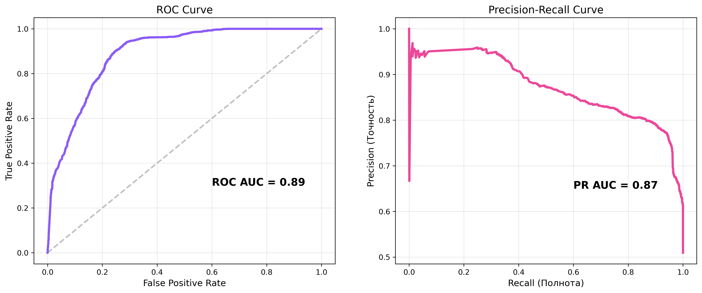
#
### Интерпретация результатов
Модель демонстрирует высокую способность различать клиентов с повышенным и пониженным риском деградации поведения.
Особенно важным является высокий Recall для churn-класса.
Модель корректно идентифицирует около 95% клиентов, которые в следующем периоде переходят в стадии At Risk или Churn.
Для задач retention это значительно важнее максимизации общей точности классификации, поскольку стоимость пропущенного риска обычно существенно выше стоимости ложного срабатывания.
#
### Бизнес-интерпретация
Полученные результаты показывают, что риск деградации клиента может быть выявлен до фактического прекращения покупок.
Модель фиксирует ранние признаки ухудшения поведения и позволяет перейти от реактивного управления churn к проактивному управлению клиентским портфелем.
Фактически система начинает отвечать на вопрос:
> Какие клиенты находятся на траектории ухода уже сейчас, даже если они еще продолжают совершать покупки?  

Именно этот тип сигналов обладает наибольшей ценностью для CRM и retention-команд.

## 9.6 SHAP Analysis
### Интерпретация драйверов оттока

Высокое качество модели само по себе недостаточно для принятия бизнес-решений.
Поэтому дополнительно был проведен SHAP-анализ, позволяющий определить факторы, оказывающие наибольшее влияние на прогнозируемый риск оттока.

#### *Figure 37. Риск оттока определяется ухудшением покупательского поведения, а не текущим состоянием клиента.*
*SHAP Summary Plot, показывающий влияние поведенческих признаков на прогнозируемую вероятность оттока.*

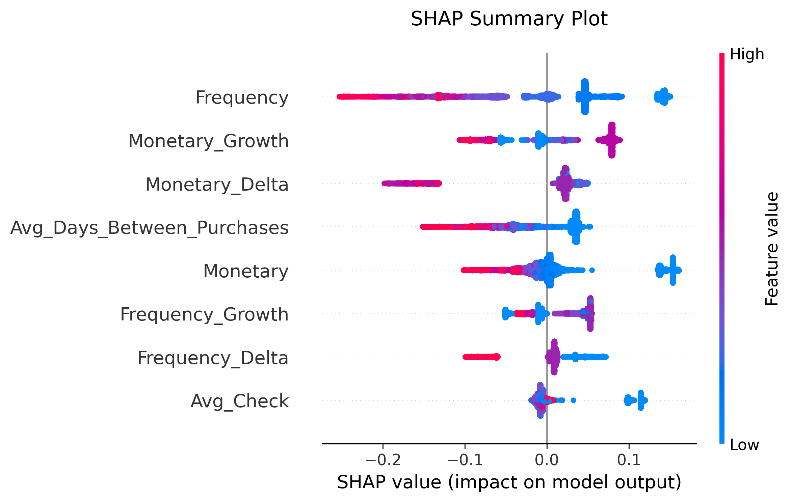
#
### Ключевые драйверы churn-risk
SHAP-анализ показал, что наибольшее влияние на вероятность оттока оказывают:
1. Frequency
2. Monetary Growth
3. Monetary Delta
4. Frequency Growth
5. Avg Days Between Purchases
#
### Главный инсайт
Наиболее важный вывод заключается в том, что модель реагирует не столько на текущий уровень активности клиента, сколько на изменение его поведения относительно собственной исторической нормы.
Другими словами:
Высокий риск возникает не потому, что клиент уже перестал покупать.
Высокий риск возникает потому, что клиент начинает покупать реже, тратить меньше и увеличивает интервалы между покупками.
#
### Поведенческая механика деградации
Результаты показывают, что churn представляет собой постепенный процесс ухудшения покупательского поведения.
		Типичная последовательность выглядит следующим образом:
		
		Снижение Frequency Growth
		          ↓
		Снижение Monetary Growth
		          ↓
		Увеличение интервалов между покупками
		          ↓
		Рост Churn Probability
		          ↓
			  At Risk
		          ↓
		        Churn
#
### Business Implication
Полученные результаты подтверждают одну из центральных гипотез проекта:
Риск оттока определяется не статическими RFM-характеристиками клиента, а динамикой изменения его поведения.  
Следовательно, наиболее ценной системой мониторинга являются не разовые snapshot-оценки клиентской базы, а непрерывное отслеживание:
- изменения частоты покупок;
- изменения выручки;
- изменения покупательского ритма;
- ухудшения transactional dynamics.

Именно эти показатели позволяют обнаруживать формирующийся churn задолго до того, как клиент перейдет в стадию фактической потери активности.

## 9.7 Risk Segmentation

### Business Question

После того как модель научилась прогнозировать вероятность оттока отдельных клиентов, возникает следующий вопрос:
> Как распределяется риск оттока внутри клиентской базы и какие группы клиентов требуют различных retention-стратегий?  

Важно не только предсказывать churn probability для каждого клиента, но и переводить прогнозы модели в понятные для бизнеса сегменты риска.
Для решения этой задачи клиенты были распределены по пяти risk-сегментам на основе предсказанной вероятности оттока:
- Very Low Risk 
- Low Risk 
- Medium Risk 
- High Risk 
- Critical Risk 
#
### Methodology

Для каждого клиента была рассчитана индивидуальная вероятность перехода в состояние At Risk или Churn на следующем временном горизонте.
Далее пользователи были сгруппированы по квинтилям распределения churn probability, что позволило сформировать пятиуровневую систему риск-сегментации.  
Для каждого сегмента дополнительно были рассчитаны:  
- количество клиентов; 
- средняя вероятность оттока; 
- средняя выручка; 
- средняя частота покупок; 
- средний чек.
  
Это позволило оценить не только уровень риска, но и коммерческий профиль каждой группы клиентов. 
#
#### *Figure 38. Основной объем выручки под риском сосредоточен в сегментах Medium и High Risk.*
*Суммарная выручка под риском (Revenue at Risk) по сегментам прогнозируемой вероятности оттока.*
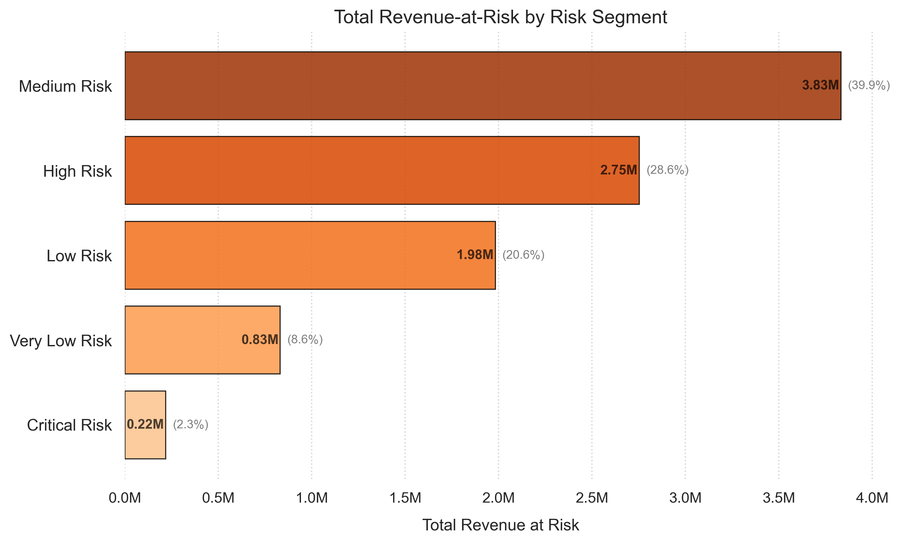

#### *Figure 39. Рост риска оттока сопровождается последовательным снижением клиентской ценности.*
*Средняя вероятность оттока и средняя выручка на клиента по риск-сегментам.*
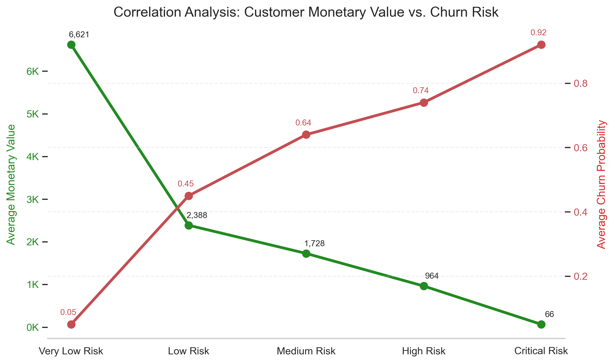
#
### Findings
Модель сформировала хорошо разделенную структуру клиентской базы.
По мере роста прогнозируемого риска наблюдается последовательное ухудшение ключевых поведенческих и финансовых показателей.  
Средняя частота покупок снижается:  
- с 6.99 транзакций в сегменте Very Low Risk   
- до 0.17 транзакций в сегменте Critical Risk. 
  
Средняя выручка сокращается более чем в 100 раз:  
- с 6 621  
- до 66 денежных единиц на клиента.

Такая монотонная деградация подтверждает высокую бизнес-интерпретируемость модели и показывает, что churn probability отражает общий процесс ухудшения customer engagement. 
#
### Business Implications
Результаты показывают, что вероятность оттока является не только индикатором будущего churn, но и ранним сигналом деградации клиентской ценности.  
Следовательно:  
- Very Low Risk и Low Risk должны становиться объектом программ развития клиентской ценности;   
- High Risk и Critical Risk требуют удерживающих коммуникаций;   
- динамика риск-сегментов может использоваться как регулярный KPI customer health monitoring.   

## 9.8 Customer Value & Risk Matrix
### Business Question
Высокий риск оттока сам по себе не означает высокий бизнес-риск.
Компания теряет деньги не тогда, когда уходит любой клиент, а тогда, когда уходит ценный клиент.  
Поэтому следующий вопрос выглядит так:  
> Какие клиенты одновременно обладают высокой ценностью и высоким риском оттока?
#
### Methodology
Для решения этой задачи была построена двумерная система приоритизации.  
Клиенты были сегментированы по двум измерениям:

- **Customer Value**  
На основе Monetary:  
	- Low Value 
	- Medium Value 
	- High Value 

- **Churn Risk**  
На основе модели:   
	- Very Low Risk   
	- Low Risk   
	- Medium Risk   
	- High Risk   
	- Critical Risk
   
После объединения двух измерений была построена стратегическая матрица клиентских сегментов. 
#
#### *Figure 40. Максимальный ROI retention достигается при удержании клиентов с высокой ценностью и высоким риском оттока.*
*Матрица распределения клиентов по сегментам Customer Value и прогнозируемого риска оттока.*

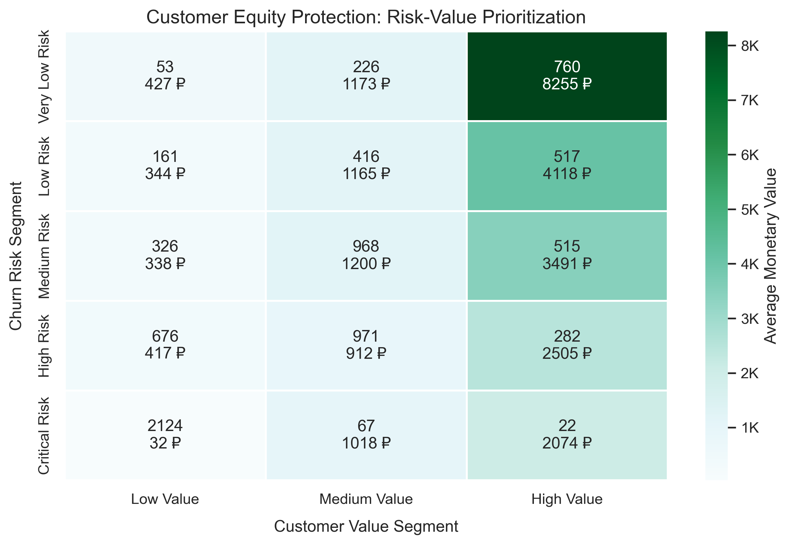
#
### Findings
Анализ показал, что риск распределен между клиентами с принципиально различной коммерческой ценностью.  
Наиболее крупным сегментом оказался   

**High Value | Very Low Risk**
- 727 клиентов; 
- средняя выручка 8 378.

Основная концентрация критического риска наблюдается в группе:  

**Low Value | Critical Risk**  
- 927 клиентов;   
- средняя выручка около 29.  
  
Однако наиболее интересным сегментом является:  

**High Value | High/Critical Risk**  
- 144 клиента; 
- средняя выручка более 2 500; 
- вероятность оттока выше 0.74. 
#
### Business Implications
Полученные результаты показывают, что стратегия «удерживать всех клиентов с высоким риском» является экономически неоптимальной.  

Наибольший ROI retention-инвестиций обеспечивают клиенты, которые одновременно обладают:  
- высокой ценностью;   
- высокой вероятностью оттока.
  
Именно эта группа должна становиться основным объектом CRM-интервенций. 

## 9.9 Recovery Modeling & Retention Prioritization

### Business Question
Даже среди клиентов с высоким риском оттока существуют принципиальные различия.
Некоторые пользователи практически потеряны для бизнеса.
Другие могут быть успешно возвращены при своевременном вмешательстве.
Поэтому возникает вопрос:
> Какие клиенты одновременно обладают высоким риском оттока, высокой будущей ценностью и высокой вероятностью восстановления активности?
#
### Methodology
Для ранжирования клиентов сегмента At Risk по относительному потенциалу восстановления активности и последующей приоритизации retention-инвестиций был построен Recovery scoring framework.    

Целевая переменная:  
- Recovered = 1

если клиент в следующем периоде возвращается в:  
- Active   
- Loyal
  
состояние. 

Для оценки вероятности восстановления использовались:
- Frequency; 
- Monetary; 
- Avg Check; 
- Frequency Delta; 
- Monetary Delta; 
- Frequency Growth; 
- Monetary Growth; 
- Purchase Cadence.
  
После расчета Recovery Probability была сформирована итоговая метрика:  
- *Retention Priority Score*

		  Retention Priority  =  Churn Probability  ×  Expected Future Revenue  ×  Recovery Probability
#
#### *Figure 41. Клиенты с одинаковым риском оттока существенно различаются по потенциалу восстановления.*  
*Распределение вероятности восстановления активности (Recovery Probability) по сегментам прогнозируемого риска оттока.*

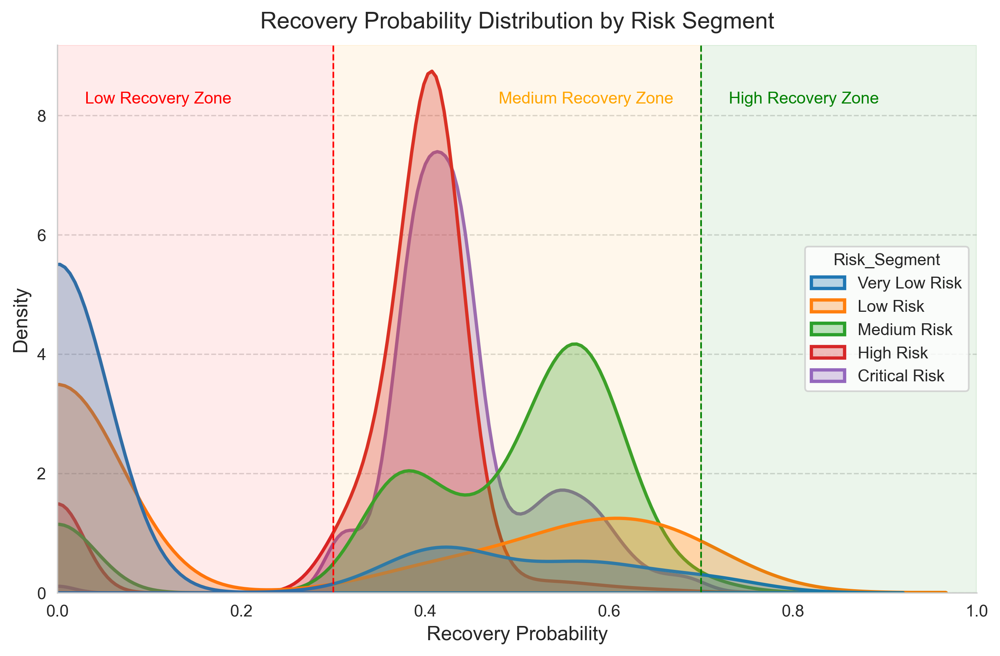

Recovery probability демонстрирует неравномерное распределение, указывая на то, что значительная часть клиентов, находящихся в группе риска, сохраняет высокий потенциал для повторной активации, что подтверждает необходимость дифференцированных стратегий удержания, а не бинарного таргетирования оттока.

#### *Figure 42. Основной retention-потенциал сосредоточен у небольшой группы клиентов с максимальным приоритетом.*  
*Распределение интегрального показателя Retention Priority Score с выделением верхних 10% и 1% клиентов.*
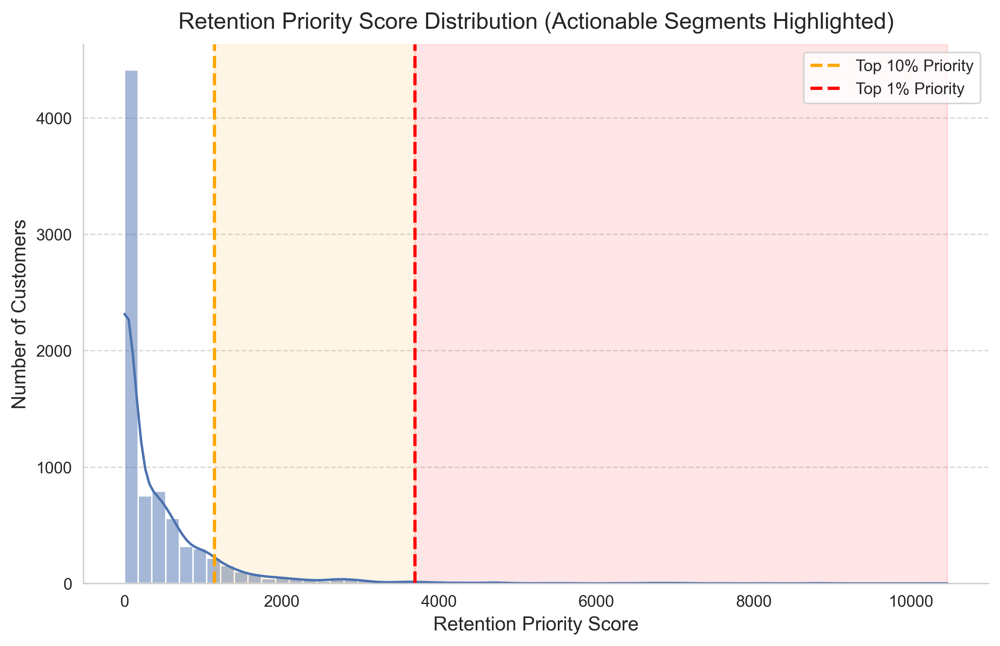  

Retention Priority Score демонстрирует распределение с «тяжелым хвостом», указывая на то, что небольшая группа клиентов концентрирует непропорционально большую долю ценности удержания. Это позволяет эффективно распределять ресурсы удержания на высокоэффективные возможности восстановления.

#
### Findings
Интегральный показатель Retention Priority Score позволил выделить группу клиентов, которые одновременно обладают:
- высоким риском оттока; 
- значительным будущим revenue potential; 
- высокой вероятностью успешного восстановления.

Анализ показал, что наиболее перспективными объектами для retention-инвестиций являются не только клиенты из At Risk сегмента, но и часть пользователей из Active и Loyal сегментов, демонстрирующих ранние признаки ухудшения поведения. 
#
### Business Implications
Главный вывод данного раздела состоит в том, что бизнесу необходимо управлять не churn probability, а объемом будущей выручки под риском.  

Показатель    

		Revenue-at-Risk = Expected Future Revenue × Churn Probability  

позволяет перейти от классического churn management к системе экономически обоснованной retention-приоритизации.    

Интеграция:  
- Churn Prediction; 
- Customer Value; 
- Recovery Modeling;
   
формирует полноценную систему data-driven retention management, ориентированную на сохранение будущих денежных потоков, а не просто на снижение количества ушедших клиентов. 

## 9.10 Retention Prioritization Score
### Business Question
Если ресурсов на удержание ограниченное количество, каких клиентов необходимо спасать в первую очередь?
Высокий риск оттока сам по себе не означает высокий бизнес-приоритет. Аналогично, высокая ценность клиента не гарантирует, что его возможно вернуть.
Поэтому финальной целью predictive framework является не просто прогнозирование churn, а определение клиентов, для которых retention-инвестиции способны принести максимальный экономический эффект.
#
### Analytical Approach
Для решения данной задачи был разработан интегральный показатель Retention Priority Score.  
Метрика объединяет три независимых компонента:  
- вероятность оттока (Churn Probability);   
- ожидаемую будущую ценность клиента (Expected Future Revenue);   
- вероятность успешного восстановления активности (Recovery Probability).
#  
### Формула
		Retention Priority Score =  Churn Probability  × Expected Future Revenue  × Recovery Probability  

Таким образом, высокий приоритет получают клиенты, которые одновременно:
- находятся под высоким риском потери; 
- обладают существенным future revenue potential; 
- сохраняют высокий потенциал восстановления.
  
Данный подход позволяет перейти от управления риском к управлению ожидаемой экономической отдачей от retention-интервенций. 
#
#### *Figure 43. Топ-20% клиентов формируют 70% потенциально сохраняемой выручки (эффективность приоритизации удержания).*
*Кривая накопленного Recoverable Revenue относительно охвата клиентской базы, отсортированной по Retention Priority Score.*

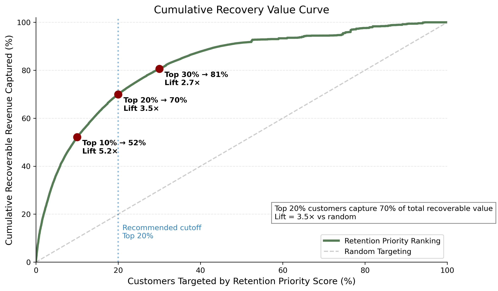

#### *Figure 44. Высокоприоритетные клиенты не ограничиваются сегментом с максимальным риском оттока.*
*Распределение клиентов из топ-20% по Retention Priority Score в пространстве вероятности оттока, ожидаемой будущей выручки и вероятности восстановления. Цвет пузыря соответствует Recovery Probability, размер — Retention Priority Score. Вертикальная пунктирная линия показывает медианную вероятность оттока среди выбранных клиентов, горизонтальная — медианную ожидаемую будущую выручку.*

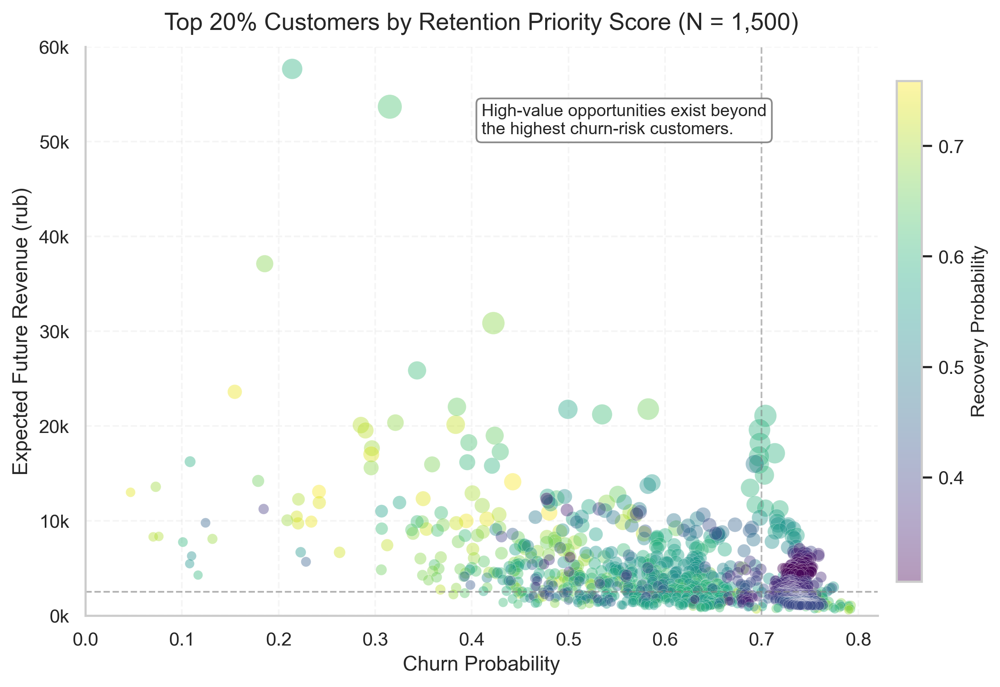

#
### Key Findings
Модель эффективно ранжирует клиентов по ожидаемому recovery-потенциалу: обработка только топ-20% клиентов позволяет вернуть около 70% всей recoverable revenue. При расширении охвата до 30% клиентов покрытие увеличивается до 81%, что указывает на высокую концентрацию ценности в верхней части скоринга и позволяет существенно снизить операционные затраты на retention-кампании.    

Интегральный показатель Retention Priority Score позволил выделить отдельную группу клиентов, сочетающих высокий churn-risk, значимый будущий revenue potential и высокую вероятность восстановления. Анализ показал, что наиболее приоритетными объектами удержания являются не только клиенты из сегмента At Risk, но и часть пользователей из Active и Loyal сегментов, демонстрирующих ранние признаки ухудшения поведения.   

Полученные результаты показывают, что риск оттока и экономическая значимость клиента не всегда совпадают. Значительная часть пользователей с высоким churn probability обладает ограниченной будущей ценностью, тогда как отдельные клиенты с умеренным риском формируют существенно больший объем потенциально сохраняемой выручки.
#
### Business Implications
Retention Prioritization Score переводит систему управления клиентской базой из режима:
*«Кто может уйти?»*
в режим:
*«Кого выгоднее всего сохранить?»*
Это позволяет существенно повысить эффективность CRM-бюджета за счет концентрации ресурсов на клиентах с максимальным ожидаемым возвратом инвестиций.

## 9.11 Saveability Matrix
### Business Question
Все ли клиенты с высоким риском оттока одинаково поддаются удержанию?  
Или среди них существует отдельный сегмент пользователей, которых еще возможно эффективно вернуть?
#
### Analytical Approach
Для ответа на этот вопрос была построена Saveability Matrix.
По осям матрицы отображаются:
- Churn Probability; 
- Recovery Probability.

Каждый клиент позиционируется одновременно по двум измерениям:
- вероятность ухода; 
- вероятность успешного восстановления.
  
Такой подход позволяет разделить клиентскую базу на несколько стратегически различных групп.
#
#### *Figure 45. Среди клиентов с высоким риском оттока сохраняется значительный потенциал успешного удержания.*
*Распределение клиентов по вероятности оттока (Churn Probability) и вероятности успешного восстановления (Recovery Probability) за весь период наблюдения. Размер пузыря отражает ожидаемый вклад клиента в будущую выручку.*
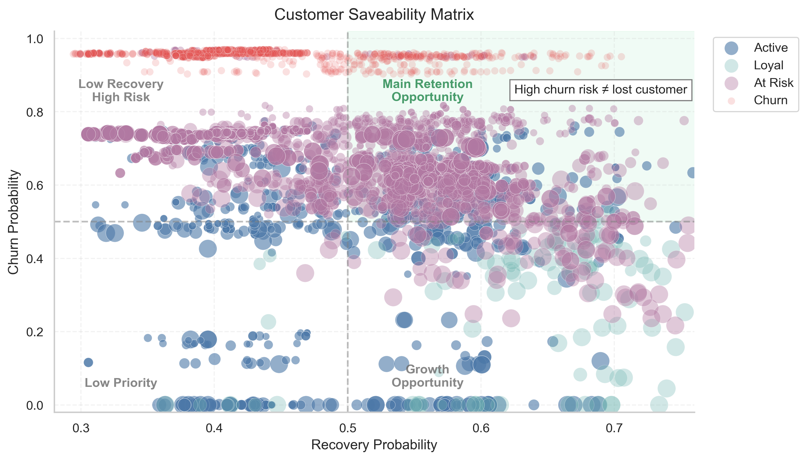
#
### Интерпретация квадрантов
| Квадрант					| Интерпретация							|
|---------------------------|---------------------------------------|
|High Risk + High Recovery	|Главная retention-возможность			|
|High Risk + Low Recovery	|Ограниченная эффективность удержания	|
|Low Risk + High Recovery	|Потенциальный резерв развития			|
|Low Risk + Low Recovery	|Низкий приоритет						|
#
### Key Findings
Матрица Saveability показала наличие значительного числа клиентов с одновременно высокой вероятностью оттока (0.5–0.9+) и умеренно высокой вероятностью восстановления (0.5–0.7). При этом зависимость между churn-risk и recovery probability выражена слабо. Высокий риск ухода не означает автоматически низкую вероятность возврата клиента. 
Существенная часть клиентской базы остается потенциально управляемой даже после появления выраженных признаков деградации поведения. Это означает, что потеря клиента не является необратимым процессом, а эффективность CRM зависит от способности выявлять наиболее «спасаемых» пользователей. 
#
### Business Implications
Матрица показывает фундаментально важную вещь:
Высокий churn-risk не равен потерянному клиенту.
Часть наиболее рискованных клиентов сохраняет высокий потенциал восстановления и может приносить дополнительную выручку при своевременном вмешательстве. Поэтому приоритизация удержания должна учитывать не только риск ухода, но и вероятность успешного возврата клиента. 

## 9.12 Key Findings & Business Implications
### Executive Summary
Построенная predictive-система показала, что риск оттока формируется задолго до фактической потери клиента и может быть выявлен по изменениям поведенческих характеристик пользователей. Наиболее сильными индикаторами будущей деградации выступают динамика покупательской частоты, изменение выручки и увеличение интервалов между покупками. 
Дополнительный анализ показал, что экономический риск бизнеса определяется не количеством клиентов с высокой вероятностью ухода, а объемом будущей выручки, находящейся под угрозой потери. Это делает Revenue-at-Risk более полезным инструментом управления, чем традиционный churn monitoring. 
Интеграция Recovery Modeling позволила расширить predictive framework от прогнозирования оттока к прогнозированию эффективности удержания. В результате была сформирована система retention-prioritization, способная определять клиентов с максимальной ожидаемой отдачей от CRM-инвестиций. 
#
### Key Insights
### 1. Поведенческие тренды важнее статических метрик   
Наиболее значимыми факторами риска являются изменения покупательского поведения, а не только текущее состояние клиента.
Ухудшение Frequency Growth, Monetary Growth и Purchase Cadence выступает ранним сигналом будущего churn. 

### 2. Revenue-at-Risk важнее количества рискованных клиентов     
Не все клиенты с высоким churn probability одинаково опасны для бизнеса.
Основной риск создают пользователи, сочетающие высокий риск ухода и высокую будущую ценность. 

### 3. Не каждый рискованный клиент требует удержания      
Recovery Modeling показал, что вероятность возврата существенно различается между пользователями.
Часть клиентов остается экономически целесообразной целью для retention-инвестиций даже при высоком риске ухода. 

### 4. Максимальную ценность создает сегмент High Value × High Risk × High Recovery      
Именно эта группа обеспечивает наибольший потенциальный эффект от CRM-вмешательства и должна являться главным объектом персонализированных retention-кампаний. 
#
### Strategic Implications
Проведенный анализ показывает необходимость перехода от Mass CRM к Predictive Retention Management и далее от Risk-Based Retention к Value-Adjusted Retention, где решение об удержании принимается одновременно на основе:  
- риска потери клиента;   
- ожидаемой будущей выручки;   
- вероятности успешного восстановления.   
#
### Business Impact
Внедрение подобного подхода позволяет:
- повысить ROI retention-кампаний; 
- снизить неэффективные CRM-расходы; 
- сфокусировать бюджет на наиболее ценных клиентах; 
- увеличить объем сохраненной выручки; 
- перейти от churn management к Revenue-at-Risk management. 
#
### Финальный Executive Takeaway
Максимальную ценность для бизнеса представляет не выявление клиентов с высокой вероятностью ухода, а выявление клиентов, чья потеря создаёт наибольший финансовый ущерб и при этом остаётся предотвратимой. Объединение churn prediction, customer value и recovery modeling формирует основу для перехода от массовых CRM-коммуникаций к системе data-driven retention management. 

		Churn Prediction
		        ↓
		Revenue-at-Risk
		        ↓
		Recovery Modeling
		        ↓
		Retention Prioritization
		        ↓
		Data-Driven CRM Decision System


# 10. Layer 4. Lifecycle KPI Framework & Customer Health Monitoring

## 10.1 Business Objective

### Цель раздела 
Предыдущие разделы проекта позволили определить:  
- как клиенты перемещаются между lifecycle-состояниями;  
- где формируются основные потери выручки;  
- как развивается долгосрочная ценность клиента;  
- какие пользователи наиболее склонны к оттоку;  
- какие факторы формируют churn-risk.
  
Однако отдельные аналитические исследования сами по себе не обеспечивают операционное управление клиентской базой.
Для поддержки retention-стратегии компании необходим единый framework мониторинга, позволяющий регулярно отслеживать состояние клиентского портфеля, выявлять признаки ухудшения customer health и своевременно определять сегменты, требующие управленческого вмешательства.

Цель данного раздела — объединить результаты lifecycle analytics, cohort analytics и predictive modeling в единую систему Customer Health Monitoring, ориентированную на поддержку бизнес-решений.
#
### Бизнес-вопросы
Разработанный framework отвечает на следующие вопросы.  

**Customer Base Health**  
- Насколько устойчива клиентская база?
- Как меняется состояние клиентского портфеля во времени?
- Какие lifecycle-сегменты демонстрируют признаки деградации?
- Насколько стабильно клиенты сохраняют своё текущее состояние жизненного цикла?

**Revenue Health**
- Какие сегменты формируют основную часть выручки?
- Насколько концентрирована выручка внутри клиентского портфеля?
- Какие группы клиентов являются ключевыми драйверами бизнеса?

**Risk Monitoring**
- Где сосредоточен максимальный churn-risk?
- Какие сегменты формируют основной объём revenue-at-risk?
- Какие группы клиентов требуют приоритетного retention-вмешательства?

**Lifecycle Stability**
- Насколько стабильна структура жизненного цикла между периодами?
- Как меняется устойчивость здоровой части клиентской базы?
- Наблюдаются ли признаки ускоренной деградации customer health?

**Retention Prioritization**
- Куда следует направлять CRM-бюджет в первую очередь?
- Какие сегменты обладают наибольшим потенциалом возврата retention-инвестиций?
- Какие группы клиентов одновременно являются ценными и уязвимыми?
#
### Роль раздела в архитектуре проекта
Если предыдущие разделы проекта отвечают на вопросы:  
- Почему происходит отток клиентов?
- Какие факторы определяют долгосрочную ценность клиента?
- Какие пользователи обладают высоким риском ухода?

то данный раздел отвечает на принципиально иной вопрос: 
> Что необходимо постоянно мониторить для управления этими процессами?

Таким образом, Lifecycle KPI Framework выступает операционным уровнем всей аналитической системы и трансформирует результаты анализа в набор управляемых бизнес-индикаторов.

## 10.2 Framework Architecture
### Концепция Framework
Lifecycle KPI Framework представляет собой многоуровневую систему мониторинга клиентского здоровья, объединяющую структурные, поведенческие, финансовые и предиктивные показатели в единую модель оценки customer health.

Архитектура framework состоит из семи взаимосвязанных уровней:
		
						Lifecycle Structure
								↓
						Behavioral Health
								↓
						Revenue Health
								↓
						Lifecycle Stability
								↓
						Churn Risk
								↓
						Revenue-at-Risk
								↓
						Retention Prioritization
Каждый последующий уровень добавляет новый слой информации о состоянии клиентского портфеля.
#
### Уровень 1. Lifecycle Structure Layer
Первый уровень описывает распределение клиентов между стадиями жизненного цикла.
По состоянию на последний snapshot структура клиентской базы выглядит следующим образом:
|Stage	|Customers	|Share|
|-------|-----------|-----|
|New	|404		|7.1% |
|Active	|1612		|28.2%|
|Loyal	|904		|15.8%|
|At Risk|1458		|25.5%|
|Churn	|1340		|23.4%|

Несмотря на относительно небольшой размер Loyal-сегмента, именно он формирует основу долгосрочной клиентской экономики компании.
#
### Уровень 2. Behavioral Health Layer
На втором уровне анализируются поведенческие характеристики сегментов.
|Stage	|Avg Frequency	|Avg Recency|
|-------|---------------|-----------|
|New	|1.3			|12			|
|Active	|1.7			|47			|
|Loyal	|7.9			|26			|
|At Risk|1.5			|135		|

Наблюдается последовательное ухудшение поведенческих метрик по мере движения клиентов от активных состояний к стадиям риска и оттока.
#
### Уровень 3. Revenue Health Layer
Следующий уровень показывает экономическую значимость сегментов.
|Stage	|Revenue Share  |
|-------|---------------|
|New	|4.8%			|
|Active	|22.8%			|
|Loyal	|55.4%			|	
|At Risk|17.0%			|

Менее 16% клиентов формируют более половины всей выручки компании.
Это свидетельствует о высокой концентрации customer value внутри ограниченного сегмента лояльных покупателей.
#
### Уровень 4. Lifecycle Stability Layer
Для оценки устойчивости клиентской базы дополнительно рассчитываются две агрегированные метрики.

#### *Lifecycle Stability Index*
Показывает долю клиентов, сохранивших своё lifecycle-состояние между соседними периодами.
Метрика отражает общую устойчивость структуры клиентской базы и интенсивность миграции между сегментами.

#### *Healthy Stability Index*
Показывает долю клиентов из здоровых сегментов (Active и Loyal), сохранивших своё состояние между периодами.
Метрика используется как ранний индикатор ухудшения customer health и позволяет оценивать устойчивость наиболее ценной части клиентской базы.  

Снижение данных показателей сигнализирует о росте деградации клиентского портфеля ещё до существенного ухудшения retention или revenue metrics.
#
### Уровень 5. Risk Layer
После интеграции результатов churn-модели становится возможным анализ распределения риска между сегментами.
|Stage	|Avg Churn Risk |
|-------|---------------|
|New	|0.45			|
|Active	|0.52			|
|Loyal	|0.16			|
|At Risk|0.68			|
|Churn	|0.95			|

Наиболее высокий риск сосредоточен внутри At Risk и Active сегментов.
#
### Уровень 6. Economic Risk Layer
Для оценки потенциальных финансовых потерь вероятность оттока объединяется с выручкой сегмента через показатель Revenue-at-Risk.  

		Revenue-at-Risk = Revenue × Churn Probability   
			
|Stage	|Revenue-at-Risk|
|-------|---------------|
|New	|0.25M			|
|Active	|1.39M			|
|Loyal	|1.02M			|
|At Risk|1.35M			|

Основная часть потенциальных потерь сосредоточена внутри Active и At Risk сегментов.
#
### Уровень 7. Retention Prioritization Layer
Финальный уровень объединяет:  
- churn probability;  
- customer value;  
- потенциальный бизнес-эффект удержания.
  
Для оценки используется Priority Score.
|Stage	|Priority Score |
|-------|---------------|
|New	|2.1			|
|Active	|11.9		    |
|Loyal	|8.8			|
|At Risk|11.5			|

Полученные результаты показывают, что максимальный эффект retention-инвестиций ожидается внутри Active и At Risk сегментов.

## 10.3 KPI Dashboard
### Lifecycle KPI Trends
Для оценки динамики клиентской базы был сформирован набор агрегированных lifecycle KPI.

|Период	|Retention	|Churn	|Reactivation	|Resurrection|
|-------|-----------|-------|---------------|------------|
|Dec → Jan|	59.9%	|5.4%	|7.5%			|0.0%		|
|Jan → Feb|	55.5%	|11.8%	|8.7%			|5.8%		|
|Feb → Mar|	51.3%	|17.5%	|11.8%			|3.0%		|
|Mar → Apr|	48.7%	|21.8%	|11.4%			|5.4%		|
|Apr → May|	47.3%	|25.2%	|11.2%			|3.8%		|

Наблюдается последовательное ухудшение состояния клиентской базы:     
- Retention снижается с 59.9% до 47.3%;    
- Churn увеличивается почти в пять раз;    
- Reactivation и Resurrection частично компенсируют потери, но не способны переломить негативный тренд.   

Полученные результаты следует интерпретировать с учетом ограничений наблюдаемого периода. Анализ основан на snapshot-подходе и охватывает относительно ранний этап формирования lifecycle-структуры. Рост доли At Risk и Churn клиентов частично обусловлен естественным эффектом созревания когорт.

#### *Figure 46. Клиентская база постепенно теряет устойчивость: удержание снижается быстрее, чем компенсируется восстановление.*
*Динамика Retention и Churn по последовательным snapshot-периодам.*
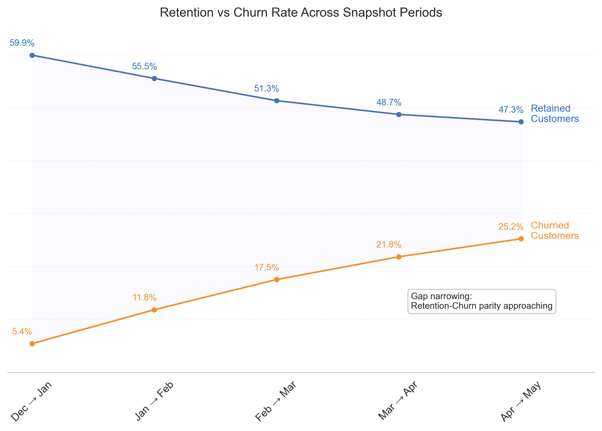

#### *Figure 47. Восстановление клиентов частично компенсирует потери, но не меняет общий тренд деградации.*
*Динамика Reactivation и Resurrection между соседними snapshot-периодами.*
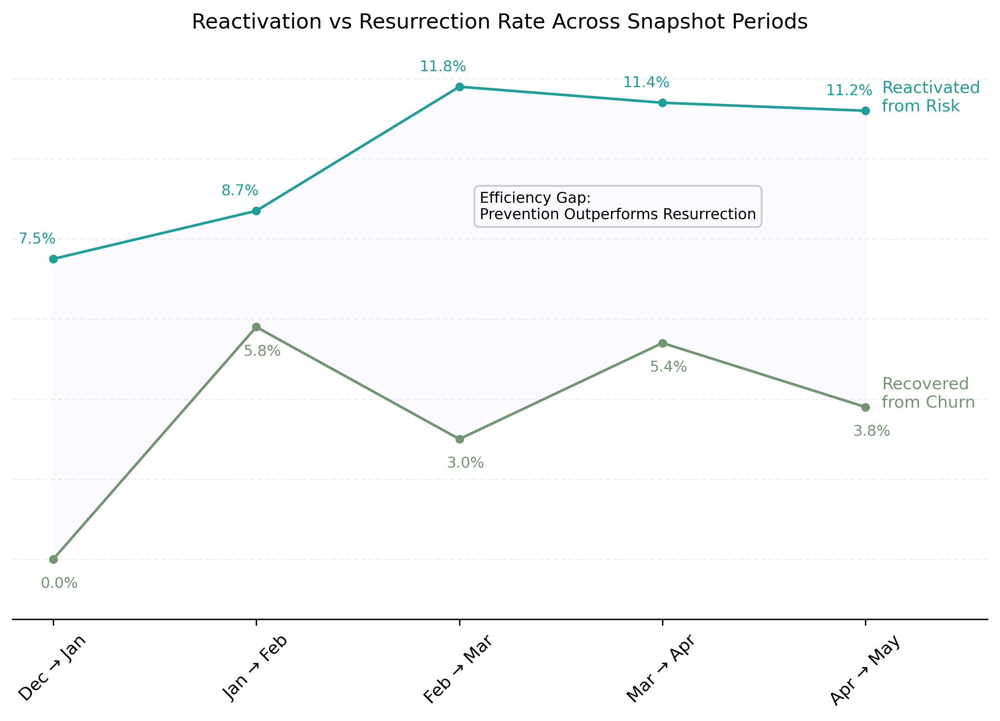 

#
### • Revenue Dynamics
Для оценки устойчивости выручки анализируется динамика revenue retention и баланс между расширением и сокращением потребления внутри удержанной клиентской базы.
|Период	|Revenue Retention|
|-------|-----------------|
|Dec → Jan|	86.8%|
|Jan → Feb|	83.4%|
|Feb → Mar|	83.2%|
|Mar → Apr|	79.4%|
|Apr → May|	79.0%|

Несмотря на ухудшение пользовательских метрик, компания сохраняет около 80% выручки между соседними периодами.
Это подтверждает вывод предыдущих разделов: удержанные клиенты обладают существенно большей ценностью, чем средний пользователь базы.

<a id="fig48"></a>
#### *Figure 48. Удержанные клиенты продолжают сохранять основную часть выручки несмотря на ухудшение customer health.*
*Динамика Revenue Retention по последовательным snapshot-периодам.*
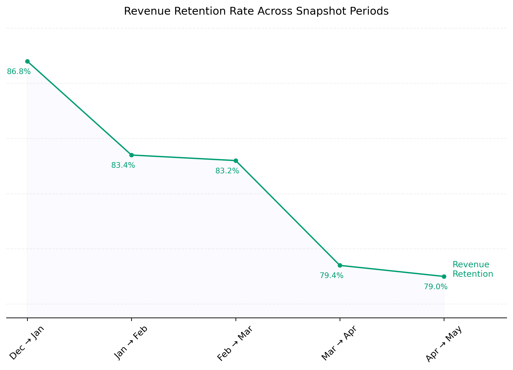  
#
### • Expansion vs Contraction Monitoring

|Период	|Expansion	|Contraction|
|-------|-----------|-----------|
|Dec → Jan	|1.06M	|0.58M|
|Jan → Feb	|1.06M	|0.84M|
|Feb → Mar	|1.23M	|1.15M|
|Mar → Apr	|0.93M	|1.34M|
|Apr → May	|1.06M	|1.49M|

К концу периода contraction revenue начинает устойчиво превышать expansion revenue.
Это один из наиболее ранних сигналов ухудшения customer health, поскольку снижение потребления появляется раньше полного оттока клиентов.

<a id="fig49"></a>
#### *Figure 49. Снижение потребления начинает опережать рост потребления — ранний сигнал будущей деградации выручки.*
*Динамика Expansion Revenue и Contraction Revenue внутри удержанной клиентской базы.*
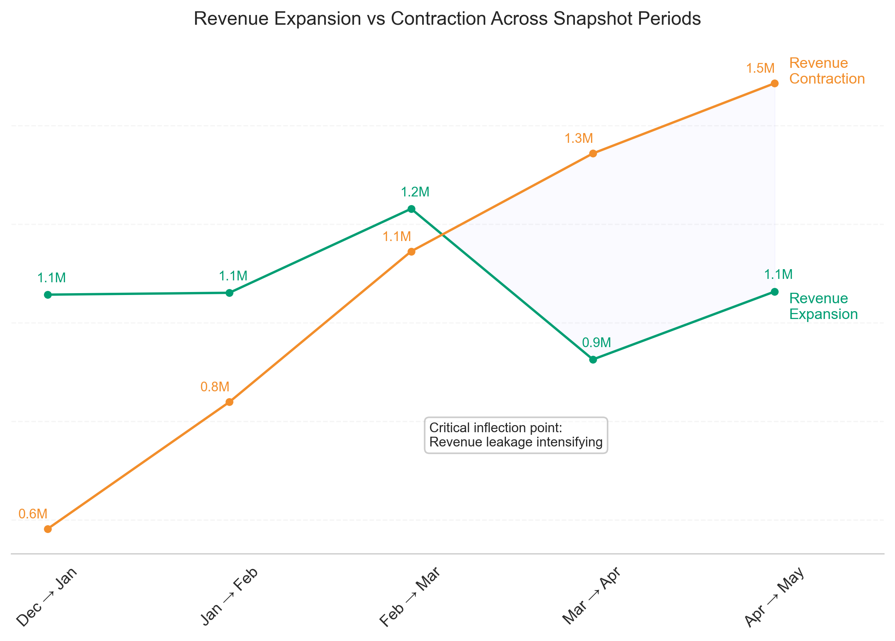   
#
### • Lifecycle Stability Monitoring
Дополнительно framework отслеживает устойчивость жизненного цикла клиентов между соседними периодами.
Для этого используются:  

- *Lifecycle Stability Index;*  
Отражает общую стабильность структуры клиентской базы.

- *Healthy Stability Index.*  
Показывает устойчивость наиболее ценной части портфеля — клиентов сегментов Active и Loyal.  

Снижение данных показателей интерпретируется как ранний сигнал ухудшения customer health и роста вероятности будущей деградации retention и revenue metrics.

<a id="fig50"></a>
#### *Figure 50. Стабильность жизненного цикла восстанавливается после локального снижения.*
*Динамика Lifecycle Stability Index и Healthy Stability Index между последовательными snapshot-периодами.*
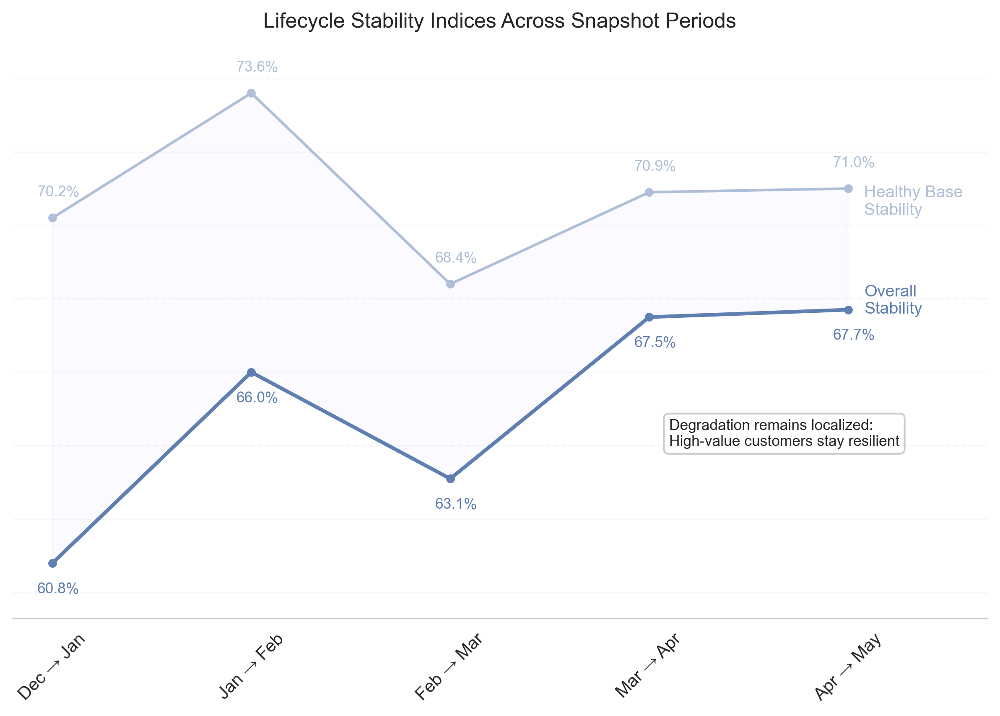 
#
### Business Value
Разработанный KPI Dashboard позволяет перейти от ретроспективного анализа к непрерывному мониторингу состояния клиентского портфеля.  
Framework обеспечивает:   
- контроль структуры клиентской базы;  
- мониторинг customer health dynamics;  
- анализ эффективности восстановления клиентов;  
- оценку стабильности жизненного цикла;  
- выявление ухудшения revenue dynamics;  
- раннее обнаружение деградации клиентского здоровья.

Таким образом компания получает единую систему Customer Health Monitoring, объединяющую результаты всех предыдущих аналитических разделов в платформу поддержки retention-решений.


## 10.4 Lifecycle Stability Analysis
### Цель анализа
Retention, churn и revenue retention показывают результат происходящих процессов.   
Однако они не отвечают на вопрос:  
> Насколько стабильна сама структура клиентской базы?  

Например:  
- retention может снижаться; 
- churn может расти; 
- но при этом большая часть клиентов может оставаться внутри своих lifecycle-сегментов.
  
И наоборот:  
- общий retention может выглядеть приемлемо; 
- но клиенты могут активно мигрировать между стадиями,

что указывает на скрытую нестабильность клиентского портфеля.   
Для оценки структурной устойчивости lifecycle-системы были дополнительно рассчитаны два интегральных показателя стабильности.
#
### Методология
#### • Lifecycle Stability Index
Показывает долю клиентов, сохранивших свою lifecycle-стадию между соседними snapshot-периодами.  

Формула:

		Lifecycle Stability Index  =  Customers with unchanged stage  /  Total customers

Высокое значение индекса означает:    
- низкую турбулентность клиентской базы;   
- стабильность lifecycle-структуры;   
- предсказуемость поведения пользователей.   

#### • Healthy Stability Index
Дополнительно был рассчитан показатель устойчивости здоровой части клиентской базы.  
В расчет включаются только стадии:    
- Active   
- Loyal
  
Формула:  

		Healthy Stability Index  =  Healthy customers remaining healthy  /  Total healthy customers

Показатель позволяет оценить способность бизнеса удерживать наиболее ценных клиентов внутри активной части lifecycle.
#
### Reference Visualization
См. [Figure 50](#fig50) Динамика Lifecycle Stability Index и Healthy Stability Index между последовательными snapshot-периодами.

#
### Результаты анализа
#### Общая стабильность клиентской базы
Анализ показал, что по мере развития жизненного цикла структура клиентской базы становится менее устойчивой.
Несмотря на наличие значительного сегмента клиентов, сохраняющих свою стадию между периодами, наблюдается постепенное увеличение миграции между lifecycle-состояниями.  
Это согласуется с результатами предыдущих разделов:   
- retention постепенно снижается;   
- churn растет;   
- увеличивается количество клиентов, переходящих в At Risk.
#
#### Устойчивость здоровой части базы
Особый интерес представляет динамика Healthy Stability Index.
Показатель отражает способность компании удерживать клиентов внутри наиболее ценных сегментов:  
- Active;   
- Loyal.
  
Снижение данного индекса означает, что даже сохраненные клиенты начинают постепенно деградировать внутри жизненного цикла и переходить в более рискованные состояния.
Это особенно важно с точки зрения долгосрочной экономики бизнеса, поскольку именно данные сегменты формируют основную часть будущей выручки.
#
### Бизнес-интерпретация
Наблюдаемый разрыв между Healthy Stability Index и Lifecycle Stability Index отражает запас структурной устойчивости клиентской базы. Доминирование Healthy Stability Index на протяжении всего периода анализа указывает на локальный характер деградации, затрагивающей преимущественно периферийные lifecycle-сегменты. Это делает Lifecycle Stability Index опережающим индикатором структурных изменений: сокращение разрыва между индексами будет означать, что ухудшение начинает распространяться на наиболее ценных клиентов, создавая риск системного снижения retention, роста churn и долгосрочной потери выручки.

Таким образом Lifecycle Stability Index выступает ранним индикатором ухудшения customer health.
В отличие от churn, который фиксирует уже состоявшуюся потерю клиента, снижение стабильности позволяет обнаруживать проблемы значительно раньше:

			Снижение стабильности
			          ↓
			Рост миграции между стадиями
			          ↓
			Рост At Risk сегмента
			          ↓
			     Рост churn
			          ↓
			    Потеря выручки
				
Поэтому стабильность lifecycle-структуры может использоваться как leading indicator будущих проблем удержания.

## 10.4.1 Customer Health Dynamics
### Цель

Оценить изменение состояния клиентской базы во времени.

Для этого анализируются:
- Retention Rate
- Churn Rate
- Reactivation Rate
- Resurrection Rate
- Lifecycle Stability Index
- Healthy Stability Index
#
### Ключевые наблюдения

Периодический анализ показывает постепенное ухудшение customer health.

- Retention

Retention последовательно снижается: 59.9% → 47.3%  
что свидетельствует об ослаблении способности системы удерживать существующих клиентов.

- Churn

Одновременно наблюдается ускорение оттока: 5.4% → 25.2%  
Рост churn существенно опережает темпы реактивации пользователей.

- Reactivation

Reactivation остается относительно стабильным: 7–12%  
что подтверждает наличие механизма возврата клиентов, однако его масштаб недостаточен для компенсации роста потерь.

- Lifecycle Stability

Дополнительный анализ стабильности показывает постепенное увеличение структурной турбулентности клиентской базы.
Все больше пользователей меняют lifecycle-состояния между периодами.
Это означает, что ухудшение customer health происходит еще до появления финального churn.

- Healthy Stability

Особое внимание заслуживает снижение устойчивости Active и Loyal клиентов.
Данный сигнал указывает на постепенную деградацию наиболее ценной части клиентской базы и может рассматриваться как раннее предупреждение будущих потерь выручки.
#
### Reference Visualization
См. [Figure 50](#fig50) Динамика Lifecycle Stability Index и Healthy Stability Index между последовательными snapshot-периодами.

#### *Figure 51. Текущие показатели реактивации и восстановления не компенсируют фундаментальное снижение лояльности.*
*Совокупная динамика Retention Rate, Churn Rate, Reactivation Rate и Resurrection Rate между последовательными snapshot-периодами.*
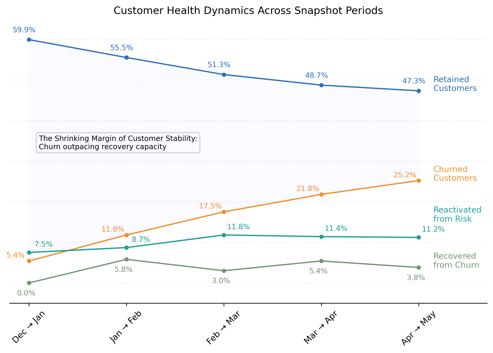   

## 10.4.2 Recovery Dynamics
### Цель

Оценить способность системы компенсировать потерю клиентов за счет возврата ранее неактивных пользователей.
#
### Ключевые наблюдения

Несмотря на наличие реактивации клиентов, её масштаб остается существенно ниже темпов деградации клиентской базы.  
На протяжении периода:  
- churn ускоряется;  
- reactivation остается относительно стабильной;  
- resurrection носит эпизодический характер.  

Это означает, что текущая recovery-модель не компенсирует ухудшение customer health.
#
### Бизнес-интерпретация
Ключевым результатом анализа является расширение Recovery Gap — устойчивого разрыва между скоростью оттока и возможностями восстановления клиентов. Пока churn продолжает ускоряться, показатели реактивации и возврата остаются практически неизменными, что свидетельствует о достижении текущей retention-моделью предела эффективности. Если эта динамика сохранится, дальнейший рост бизнеса будет все больше зависеть от привлечения новых клиентов, а не от способности удерживать существующую клиентскую базу.

Компания постепенно переходит от режима *Retention-driven growth* к режиму *Acquisition-dependent growth*, где удержание уже не покрывает естественный отток пользователей.

 #### *Figure 52. Recovery Gap продолжает расширяться: восстановление клиентов больше не компенсирует ускоряющийся churn.*
 *Динамика долей клиентов, ушедших в churn, реактивированных из группы риска и восстановленных после churn по последовательным snapshot-периодам.*
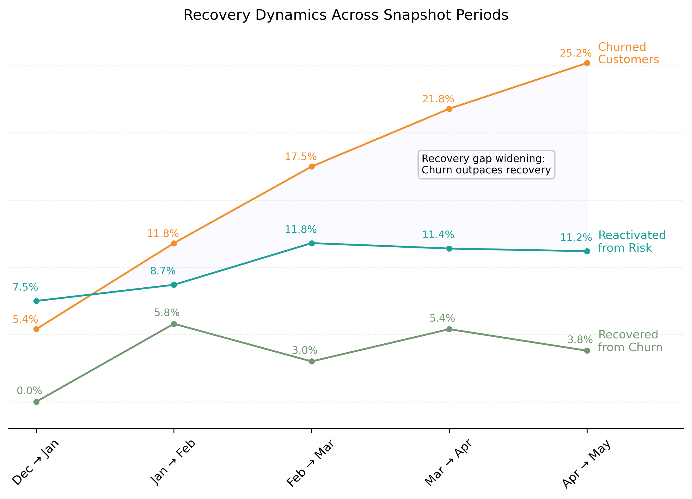   


## 10.4.3 Revenue Dynamics
### Цель

Оценить устойчивость выручки и ранние признаки ухудшения клиентской экономики.
#
### Revenue Retention

Несмотря на ухудшение пользовательских метрик, бизнес сохраняет около 79–87% выручки между соседними периодами.

Это подтверждает выводы предыдущих разделов:  
> основная выручка концентрируется среди наиболее лояльных клиентов.
#
### Expansion vs Contraction

Наиболее важным наблюдением является изменение баланса между expansion и contraction revenue.

В начале периода: Expansion > Contraction

Однако затем происходит разворот тенденции.

К последним периодам:  
- Expansion Revenue ≈ 1.06M  
- Contraction Revenue ≈ 1.49M  

То есть сокращение потребления внутри существующей базы начинает систематически превышать рост.
#
### Бизнес-интерпретация

Данный сигнал особенно важен, поскольку возникает раньше полноценного churn.

Последовательность выглядит следующим образом:

					    Expansion ↓
					   Contraction ↑
					        ↓
					Revenue Retention ↓
					        ↓
					      Churn ↑
					        ↓
					   Revenue Loss

Таким образом, Contraction Revenue выступает одним из наиболее ранних индикаторов ухудшения customer health.
#
### Reference Visualization
См. [Figure 48](#fig48) Динамика Revenue Retention по последовательным snapshot-периодам.

См. [Figure 49](#fig49) Динамика Expansion Revenue и Contraction Revenue внутри удержанной клиентской базы по последовательным snapshot-периодам..

## 10.5 Revenue Concentration
### Цель анализа

После оценки состояния клиентской базы необходимо определить, как распределяется выручка между различными lifecycle-сегментами.
Для бизнеса важно понимать не только размер клиентских групп, но и их фактический вклад в финансовый результат компании.

Даже относительно небольшой сегмент клиентов может формировать непропорционально большую долю выручки и являться критически важным для устойчивости бизнеса.

Цель данного анализа — выявить концентрацию выручки внутри клиентского портфеля и определить сегменты, от которых зависит долгосрочная финансовая стабильность компании.
#
### Распределение выручки по lifecycle-стадиям

Последний lifecycle snapshot показывает крайне неравномерную структуру формирования выручки.

| Stage   | Customers | Revenue Share |
| ------- | --------: | ------------: |
| Loyal   |       904 |         55.4% |
| Active  |      1612 |         22.8% |
| At Risk |      1458 |         17.0% |
| New     |       404 |          4.8% |
| Churn   |      1340 |          0.0% |

Несмотря на то что сегмент Loyal составляет лишь около 16% клиентской базы, он генерирует более половины всей выручки компании.
Одновременно Active и At Risk формируют еще около 40% доходов бизнеса.

Фактически более 95% всей выручки сосредоточено внутри трех сегментов:
- Loyal;
- Active;
- At Risk.
#  
### Revenue Concentration Analysis

Для дополнительной оценки была рассчитана относительная экономическая значимость сегментов через Revenue Index.
Показатель отражает способность сегмента генерировать выручку относительно среднего клиента базы.

| Stage   | Revenue Index |
| ------- | ------------: |
| Loyal   |          3.51 |
| Active  |          0.81 |
| At Risk |          0.67 |
| New     |          0.67 |
| Churn   |          0.00 |

Полученные результаты показывают крайне высокую концентрацию customer value внутри Loyal-сегмента.
Средний Loyal-клиент приносит компании более чем в 3.5 раза больше выручки, чем средний клиент базы.
При этом Active, At Risk и New демонстрируют близкие уровни монетизации и существенно уступают лояльным клиентам по экономической ценности.
#
### Бизнес-интерпретация

Полученная структура характерна для зрелых retail-моделей.
Клиентская база состоит из двух принципиально разных частей:   

- Массовая база
	- New
	- Active
	- At Risk

Обеспечивает масштаб клиентского портфеля, но генерирует относительно низкую выручку на пользователя.

- Высокоценное ядро
	- Loyal

Формирует основную часть долгосрочной выручки компании.

Фактически устойчивость бизнеса определяется не количеством клиентов как таковым, а способностью удерживать и развивать сегмент Loyal.

Результаты полностью согласуются с выводами предыдущих разделов:
- cohort analysis показал рост customer value среди retained users;
- lifecycle analysis выявил высокую концентрацию выручки внутри стабильных клиентов;
- predictive model показала минимальный churn-risk среди Loyal-клиентов.

Таким образом, Loyal-сегмент выступает главным экономическим активом клиентской базы.

#### *Figure 53. Более 95% выручки сосредоточено в трех lifecycle-сегментах, при этом Loyal формирует основную экономическую ценность клиентской базы.*
*Распределение доли выручки по lifecycle-сегментам и накопленная кумулятивная доля выручки (Pareto-анализ).*
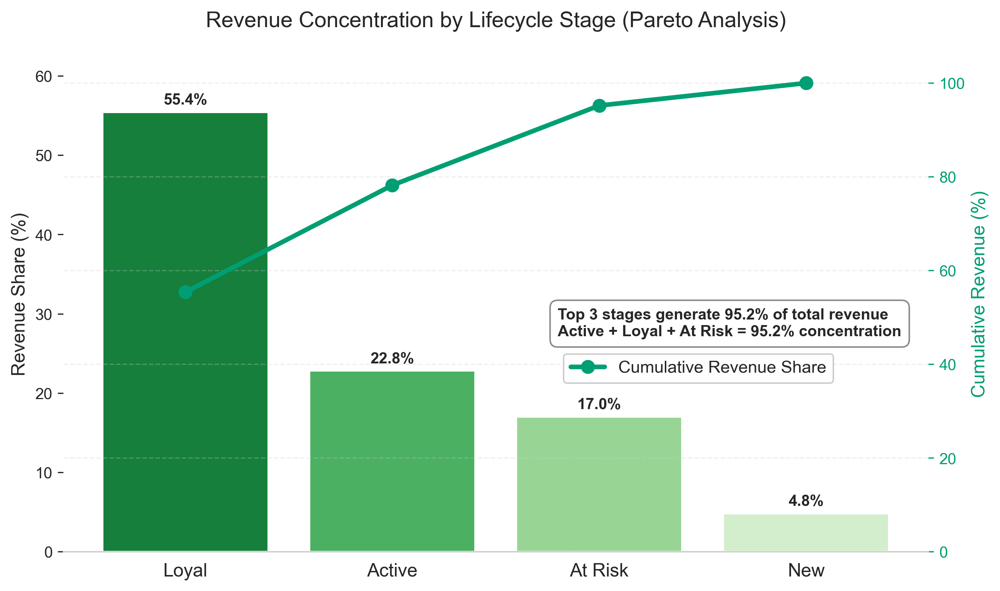

#### *Figure 54. Loyal-клиенты генерируют существенно больше выручки, чем соответствует их численности, тогда как остальные сегменты недопредставлены в доходах.*
*Отклонение доли выручки от доли клиентской базы по lifecycle-сегментам (Revenue Share − Customer Share, п.п.).*
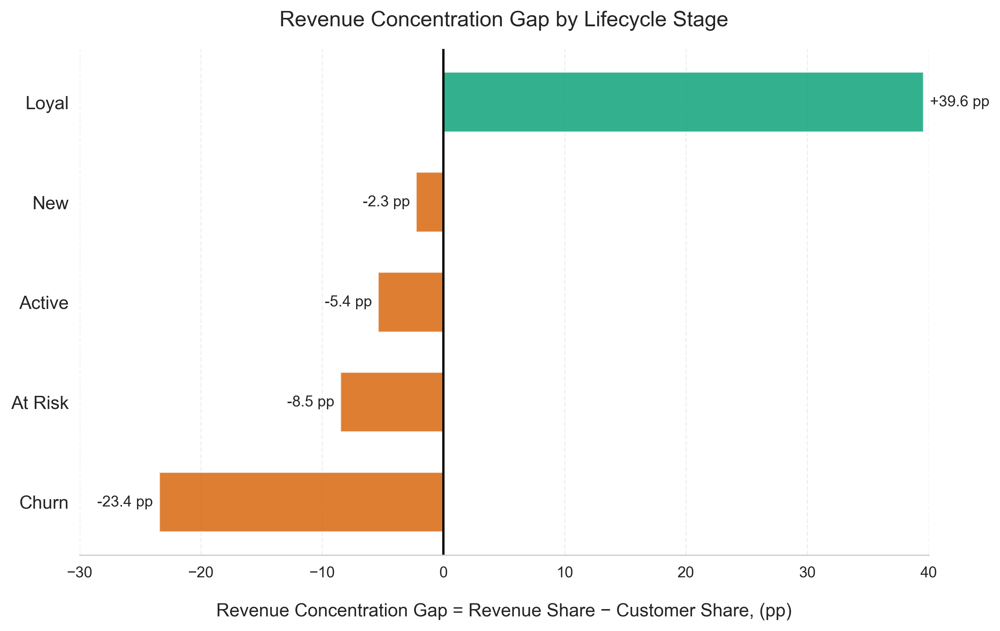
#
### Ключевой вывод

Бизнес обладает высокой концентрацией выручки внутри ограниченного сегмента лояльных клиентов.
Несмотря на то что Loyal-пользователи составляют лишь небольшую часть клиентского портфеля, именно они формируют большую часть финансового результата компании.
Это делает удержание и развитие данного сегмента стратегически важным направлением retention-стратегии.

## 10.6 Revenue-at-Risk
### Цель анализа

После определения сегментов, формирующих выручку, необходимо понять, какая часть этой выручки находится под угрозой потери.
Высокая выручка сама по себе не гарантирует устойчивость бизнеса.

Для принятия управленческих решений важно учитывать вероятность потери клиентов и потенциальные финансовые последствия такого оттока.
С этой целью была построена система оценки Revenue-at-Risk.
#
### Методология

Для каждого lifecycle-сегмента рассчитывается показатель:

			Revenue At Risk  =  Revenue  ×  Churn Probability

Метрика объединяет:  
- текущую экономическую ценность сегмента;  
- вероятность его потери;
- потенциальный финансовый ущерб.

В отличие от обычного churn-risk данный показатель позволяет оценивать риск в денежном выражении.
#
### Результаты анализа

| Stage   | Revenue-at-Risk |
| ------- | --------------: |
| Active  |           1.39M |
| At Risk |           1.35M |
| Loyal   |           1.02M |
| New     |           0.25M |
| Churn   |           0.00M |

Полученные результаты приводят к неожиданному выводу.
Интуитивно можно было ожидать, что максимальный риск будет сосредоточен внутри сегмента At Risk.
Однако на практике наибольший объём потенциальных потерь формируется внутри Active-клиентов.
#
### Почему Active оказался опаснее At Risk

Причина заключается в сочетании факторов:

***Active***    
- крупнейший сегмент базы;  
- значительный объём выручки;  
- уже заметный churn-risk.  
	
***At Risk***    
- более высокий риск;  
- меньшая выручка.  

В результате общий объём потенциальных потерь оказывается сопоставимым:

| Segment | Revenue-at-Risk |
| ------- | --------------: |
| Active  |           1.39M |
| At Risk |           1.35M |

Это означает, что значительная часть будущего churn формируется ещё до того, как клиент официально попадает в At Risk.
#
### Loyal Segment Risk     
Особенно важен результат для Loyal-сегмента.   
- Несмотря на минимальную вероятность оттока: Average Churn Risk = 0.16    
- высокая концентрация выручки приводит к тому, что потенциальные потери достигают: 1.02M  

Таким образом, даже небольшое ухудшение удержания наиболее ценных клиентов может иметь существенные финансовые последствия.
#
### Бизнес-интерпретация

Анализ показывает существование трёх разных типов риска.

**Active Risk**

- Риск ранней деградации клиентской базы.  
- Клиенты ещё не выглядят проблемными, но уже формируют значительный объём будущих потерь.  

**At Risk Risk**

- Риск непосредственного перехода в churn.  
- Наиболее очевидная зона удержания.  

**Loyal Risk**

- Риск потери высокоценной выручки.  
- Даже небольшой churn внутри данного сегмента оказывает непропорционально сильное влияние на бизнес.  
#
### Управленческие выводы

Большинство retention-стратегий концентрируются исключительно на At Risk клиентах. Однако результаты показывают, что такая стратегия упускает значительную часть будущих потерь.    

Наиболее эффективная модель удержания должна одновременно работать с тремя группами:

| Segment | Основная задача           |
| ------- | ------------------------- |
| Active  | Предотвращение деградации |
| At Risk | Реактивация               |
| Loyal   | Защита выручки            |

#### *Figure 55. Основная зона будущих потерь выручки находится среди клиентов, которые ещё не считаются проблемными.*
*Revenue-at-Risk по lifecycle-сегментам: вклад каждого сегмента в потенциальные финансовые потери и ожидаемую сохраняемую выручку.*
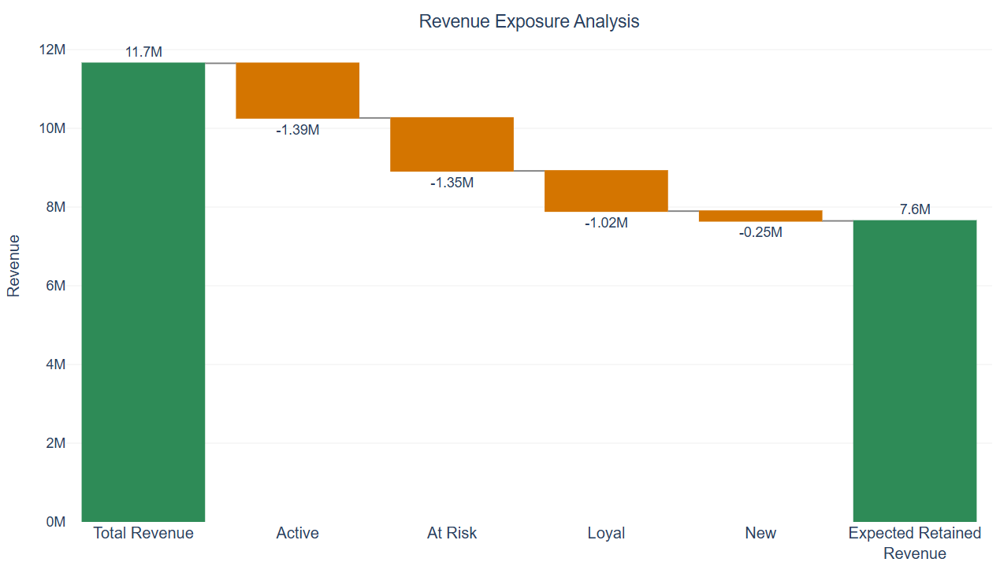  

[Открыть интерактивный график](https://advantl.github.io/customer-lifecycle-analytics-framework/revenue_exposure_analysis.html)

#### *Figure 56. Основной объём потенциальных финансовых потерь формируется ещё до перехода клиентов в At Risk*
*Карта распределения lifecycle-сегментов по средней вероятности оттока (Average Churn Probability) и объёму потенциальных финансовых потерь (Revenue-at-Risk) на момент последнего периода наблюдения (последнего snapshot). Положение пузыря определяется средней вероятностью оттока и величиной Revenue-at-Risk сегмента; цвет отражает совокупную выручку сегмента (Total Revenue), размер пузыря — численность клиентской базы.*
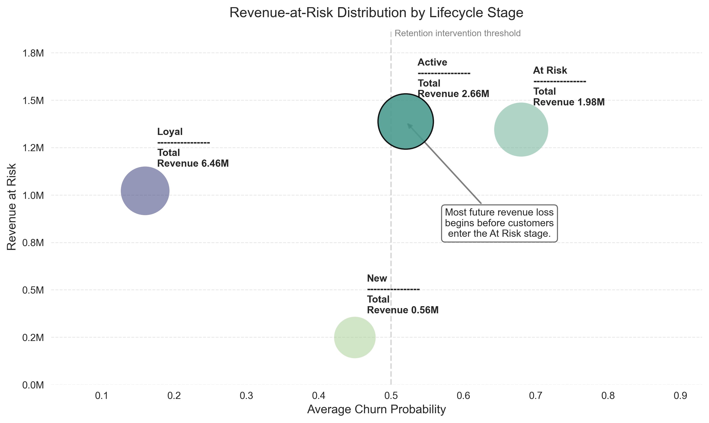 
#
### Ключевой вывод

Основная зона потенциальных финансовых потерь сосредоточена не только среди At Risk клиентов, но и внутри Active-сегмента.
Это означает, что эффективная retention-стратегия должна начинаться значительно раньше момента появления явных признаков оттока.
Одновременно высокая концентрация выручки внутри Loyal-сегмента требует отдельной стратегии защиты наиболее ценных клиентов, поскольку даже небольшой рост churn в данной группе способен привести к существенным потерям будущей выручки.

## 10.7 Retention Prioritization
### Цель анализа

Предыдущие подразделы позволили определить:
- какие сегменты формируют основную выручку;
- где сосредоточен churn-risk;
- какие группы клиентов создают наибольший объём revenue-at-risk.

Однако ограниченность CRM-ресурсов не позволяет одинаково активно работать со всеми клиентами одновременно.
Поэтому следующим шагом является определение приоритетности retention-инвестиций между lifecycle-сегментами.

Цель анализа — определить, какие группы клиентов способны обеспечить наибольший экономический эффект от удержания.
#
### Методология

Для ранжирования сегментов используется интегральный показатель Priority Score.

Показатель объединяет:
- размер сегмента;
- объём выручки;
- churn-risk;
- величину revenue-at-risk.

Чем выше значение Priority Score, тем выше ожидаемый бизнес-эффект от retention-интервенций.
#
### Результаты анализа

| Lifecycle Stage | Priority Score |
| --------------- | -------------: |
| Active          |           11.9 |
| At Risk         |           11.5 |
| Loyal           |            8.8 |
| New             |            2.1 |
| Churn           |            0.0 |

Полученные результаты показывают, что наиболее приоритетным сегментом неожиданно оказывается не At Risk, а Active.
#
### Почему Active занимает первое место

На первый взгляд At Risk обладает более высоким риском потери. Однако Priority Score учитывает не только вероятность оттока, но и потенциальный масштаб последствий.

Active-клиенты одновременно характеризуются:  
- крупнейшим размером сегмента;    
- значительным объёмом выручки;  
- заметным уровнем churn-risk.  

Поэтому даже небольшое ухудшение удержания внутри Active-сегмента способно привести к существенным потерям будущей выручки.
#
### Роль Loyal-сегмента

Отдельного внимания заслуживает Loyal-сегмент. Несмотря на низкий churn-risk, высокая концентрация выручки приводит к тому, что данный сегмент сохраняет высокий приоритет удержания. Потеря одного Loyal-клиента обходится бизнесу существенно дороже, чем потеря среднего пользователя базы. Поэтому задача удержания Loyal-клиентов заключается не в массовых реактивационных кампаниях, а в предотвращении деградации наиболее ценной части клиентского портфеля.
#
### Бизнес-интерпретация

Анализ показывает, что классическая модель:

			At Risk → CRM Action

слишком упрощает реальную структуру риска.

На практике наиболее эффективная стратегия должна охватывать три разные зоны:

- **Active**  
Предотвращение будущей деградации.

- **At Risk**  
Возврат клиентов до перехода в churn.

- **Loyal**  
Защита наиболее ценной части выручки.

#### *Figure 57. Максимальный эффект retention-инвестиций сосредоточен в сегментах Active и At Risk.*
*Матрица приоритетов lifecycle-сегментов по Revenue-at-Risk и интегральному Priority Score.*
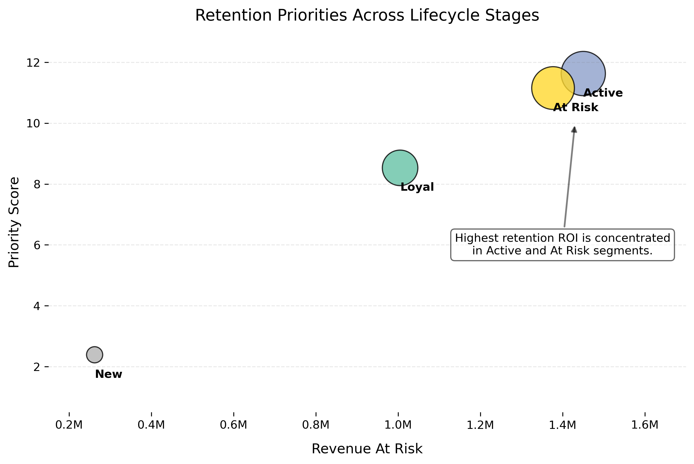 
#
### Ключевой вывод

Максимальный ожидаемый эффект от retention-инвестиций сосредоточен внутри сегментов Active и At Risk.
При этом удержание Loyal-клиентов остаётся стратегически важной задачей из-за высокой концентрации выручки внутри данной группы.

## 10.8 Retention Strategy Matrix
### Цель анализа

После определения приоритетности сегментов необходимо преобразовать аналитические выводы в практические рекомендации по управлению клиентской базой.
Для этого строится Retention Strategy Matrix, связывающая lifecycle-сегменты с соответствующими стратегиями воздействия.
#
### Концепция матрицы

Каждый сегмент оценивается по двум измерениям:

- **Business Value**  
Экономическая ценность сегмента.

- **Churn Risk**  
Вероятность потери клиентов.

В результате формируется стратегическая карта retention-действий.
#
### Retention Strategy Matrix

**Loyal**  
Высокая ценность + низкий риск  
Стратегия: Protect & Grow  
Основная задача:  
- предотвращение деградации;  
- развитие customer value;  
- программы лояльности;  
- персонализированные предложения.  

**Active**  
Высокая ценность + средний риск  
Стратегия: Monitor & Develop  
Основная задача:  
- раннее выявление признаков ухудшения поведения;  
- стимулирование повторных покупок;  
- ускорение перехода в Loyal.  

**At Risk**  
Средняя ценность + высокий риск  
Стратегия: Recover  
Основная задача:  
- реактивационные кампании;  
- персонализированные предложения;  
- специальные CRM-механики возврата.  

**New**  
Низкая ценность + умеренный риск  
Стратегия: Activate  
Основная задача:  
- формирование второй покупки;  
- развитие привычки использования;  
- onboarding-коммуникации.  

**Churn**   
Низкая ценность + максимальный риск   
Стратегия: Selective Win-back   
Основная задача:  
- выборочный возврат наиболее ценных клиентов;  
- контроль стоимости реактивации.  
  
#### *Figure 58. Основной риск потери выручки сосредоточен в сегментах At Risk и Active, тогда как Loyal требует стратегии защиты и роста.*
*Матрица сегментов по доле выручки и среднему риску оттока с рекомендованными retention-стратегиями для каждого lifecycle-сегмента.*
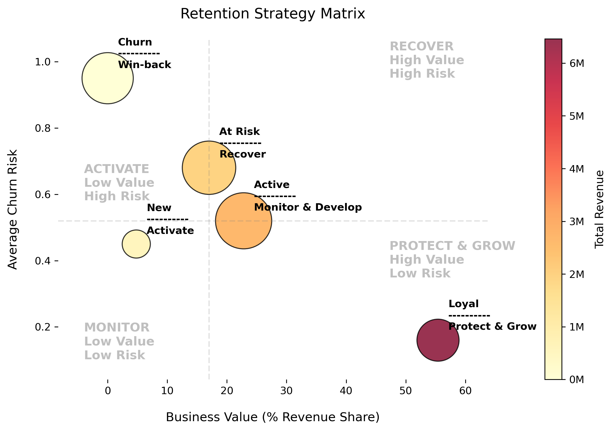 
#
### Business Value

Построенная матрица позволяет перевести результаты аналитики в систему принятия решений.

Компания получает инструмент, позволяющий:
- приоритизировать CRM-бюджет;
- распределять retention-ресурсы;
- управлять revenue-at-risk;
- контролировать customer health;
- защищать наиболее ценные сегменты клиентской базы.

## 10.9 Key Findings & Business Implications
### Executive Summary

Разработанный Lifecycle KPI Framework показал, что клиентская база аптечной сети демонстрирует признаки постепенного ухудшения customer health по мере развития жизненного цикла.

Несмотря на наличие устойчивого сегмента лояльных покупателей, наблюдается последовательное снижение retention, рост churn и увеличение объема revenue-at-risk внутри активной части клиентской базы.

Одновременно анализ выявил высокую концентрацию выручки среди ограниченного числа наиболее ценных клиентов. Сегмент Loyal составляет менее 16% клиентской базы, однако генерирует более половины всей выручки компании.

Дополнительный анализ lifecycle stability показал снижение устойчивости структуры клиентского портфеля. Увеличение миграции между lifecycle-сегментами происходит раньше фактического churn и может рассматриваться как ранний индикатор ухудшения customer health.

В совокупности результаты показывают, что ключевой риск бизнеса связан не только с уже потерянными клиентами, но и с постепенной деградацией активной части клиентской базы, формирующей будущую выручку компании.
#
### Key Insights

### 1. Клиентская база демонстрирует ухудшение customer health

Lifecycle KPI Trends показывают последовательное снижение удержания клиентов на протяжении периода наблюдения.

Retention Rate снижается: 59.9% → 47.3%  
Одновременно Churn Rate возрастает: 5.4% → 25.2%  

Несмотря на наличие реактивации пользователей, скорость возврата клиентов недостаточна для компенсации растущего оттока.
Это свидетельствует об ухудшении общего состояния клиентского портфеля.
#
### 2. Структурная устойчивость клиентской базы снижается раньше фактического churn

Анализ Lifecycle Stability показал, что деградация клиентской базы начинается значительно раньше потери клиентов.
Рост количества переходов между lifecycle-сегментами сопровождается снижением доли клиентов, сохраняющих устойчивое поведение между периодами наблюдения.

Особенно важным является ухудшение Healthy Stability Index, отражающего устойчивость сегментов Active и Loyal.
Это означает, что ухудшение customer health происходит внутри активной клиентской базы задолго до появления явного churn.
#
### 3. Выручка бизнеса крайне концентрирована

Распределение выручки между lifecycle-сегментами оказалось существенно более неравномерным, чем распределение клиентов.

Сегмент Loyal:  
- 15.8% клиентов;  
- 55.4% общей выручки.  

Средний Revenue Index для Loyal-клиентов достигает 3.51, что более чем в три раза превышает средний уровень по базе.

Таким образом, устойчивость бизнеса критически зависит от сохранения ограниченного сегмента высокоценных покупателей.
#
### 4. Основной финансовый риск сосредоточен внутри Active и At Risk сегментов

Расчет Revenue-at-Risk показал, что наибольший объем потенциальных потерь связан не только с клиентами, уже находящимися в стадии риска.  

Наиболее высокий уровень Revenue-at-Risk наблюдается для:

| Stage   | Revenue-at-Risk |
| ------- | --------------: |
| Active  |           1.39M |
| At Risk |           1.35M |
| Loyal   |           1.02M |

Полученные результаты показывают, что значительная часть будущих потерь формируется еще до перехода клиента в стадию At Risk.
Это делает Active-сегмент критически важной зоной раннего retention-вмешательства.
#
### 5. Contraction Revenue становится системной угрозой будущему росту

Анализ Revenue Dynamics показал постепенное ухудшение структуры удержанной выручки.
В начале периода Expansion Revenue превышает Contraction Revenue.   

Однако к концу периода ситуация меняется:

| Metric              |  Value |
| ------------------- | -----: |
| Expansion Revenue   | ~1.06M |
| Contraction Revenue | ~1.49M |


Рост сокращения потребления внутри существующей клиентской базы начинает превышать рост потребления.
Это указывает на накопление будущих потерь еще до появления полноценного churn.
#
### 6. Приоритет удержания должен смещаться от реактивной к проактивной модели

Retention Prioritization Framework показал следующую структуру приоритетов:

| Segment | Priority Score |
| ------- | -------------: |
| Active  |           11.9 |
| At Risk |           11.5 |
| Loyal   |            8.8 |
| New     |            2.1 |

Наиболее высокий ожидаемый эффект от retention-инвестиций сосредоточен внутри Active-сегмента.

Это означает, что эффективная стратегия удержания должна начинаться значительно раньше появления явных признаков оттока.
#
### Business Interpretation

Объединение результатов всех аналитических блоков позволяет описать текущее состояние клиентской базы следующим образом.
Компания обладает относительно небольшим, но экономически крайне ценным сегментом лояльных клиентов, который обеспечивает основную часть выручки бизнеса.

Однако по мере развития жизненного цикла наблюдаются признаки постепенного ухудшения customer health:  
- снижается retention;  
- растет churn;  
- ухудшается lifecycle stability;  
- увеличивается contraction revenue;  
- растет объем revenue-at-risk.  

Наиболее важным выводом является то, что основная зона риска находится не среди уже уходящих клиентов, а внутри Active-сегмента, который формирует будущий Loyal-сегмент и будущую выручку компании.

Фактически бизнес сталкивается не столько с проблемой возврата потерянных клиентов, сколько с проблемой предотвращения деградации активной части клиентской базы.
#
### Business Impact

Полученные результаты показывают, что дальнейший рост бизнеса будет определяться способностью компании решать три ключевые задачи:

**Сохранение высокоценного Loyal-сегмента**  
Минимизация потерь наиболее прибыльных клиентов.

**Раннее выявление деградации Active-клиентов**  
Предотвращение перехода пользователей в стадию риска.

**Снижение объема Revenue-at-Risk**  
Управление будущими потерями до возникновения фактического churn.

В результате построенный Lifecycle KPI Framework формирует полноценную систему Customer Health Monitoring, объединяющую:  
- lifecycle analytics;  
- cohort analytics;
- predictive churn modeling;
- revenue risk management;
- retention prioritization.

Framework позволяет перейти от ретроспективного анализа клиентского поведения к системному управлению состоянием клиентского портфеля и может использоваться как основа для CRM-аналитики, retention reporting и стратегического управления жизненным циклом клиентов.
#
#### *Figure 59. Customer Health Monitoring Framework*

			Lifecycle Structure
			        ↓
			  Customer Health
			        ↓
			Revenue Concentration
			        ↓
			  Revenue-at-Risk
			        ↓
			Retention Prioritization
			        ↓
			  Retention Strategy
			        ↓
			   Business Actions

# 11. Executive Metrics Overview
## Executive Snapshot
Данный раздел агрегирует ключевые результаты всего проекта в единую систему стратегических показателей, отражающих текущее состояние клиентской базы, качество удержания, устойчивость выручки и эффективность predictive analytics. Представленные метрики позволяют руководству компании быстро оценить:  
- состояние customer health;     
- устойчивость retention-модели;    
- концентрацию выручки;   
- масштаб потенциальных финансовых рисков;   
- эффективность системы прогнозирования оттока;   
- ключевые драйверы долгосрочного роста клиентской ценности.   

## 11.1 Lifecycle Health Snapshot
#### Состояние клиентской базы

| KPI                       |  Значение |
| ------------------------- | --------: |
| Retention Rate            | **47.3%** |
| Churn Rate                | **25.2%** |
| Reactivation Rate         | **11.2%** |
| Revenue Retention         | **79.0%** |
| Lifecycle Stability Index | **67.7%** |
| Healthy Stability Index   | **71.0%** |


### Интерпретация

Клиентская база сохраняет признаки относительной структурной устойчивости: около 68% клиентов остаются в своих lifecycle-состояниях между соседними периодами, а среди здоровых сегментов (Active и Loyal) стабильность превышает 71%.
Одновременно наблюдается постепенное ухудшение retention dynamics: churn достигает 25.2%, а retention снижается до 47.3%, что указывает на нарастающее давление на долгосрочное удержание клиентской базы.
Несмотря на ухудшение пользовательских метрик, компания удерживает 79% выручки между периодами, что подтверждает высокую ценность retained-аудитории.

#### *Figure 60. Executive KPI Cards*  
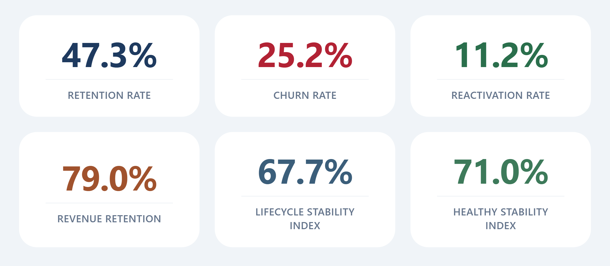  

## 11.2 Customer Economics Snapshot
#### Экономика жизненного цикла клиента

| KPI                              |         Значение |
| -------------------------------- | ---------------: |
| Early Retention (Month 1–2)      |         **≈26%** |
| Revenue Retention Plateau        |       **20–45%** |
| Revenue per Retained User Growth |      **до +43%** |
| Mature Cohort LTV                | **6.3–6.8 тыс.** |


### Интерпретация
Главным ограничением экономики продукта является ранний churn.
После первой покупки около 74% клиентов покидают систему до формирования устойчивого покупательского поведения. При этом пользователи, остающиеся в продукте, демонстрируют рост customer value:   
- Revenue per Retained User увеличивается до 43%;   
- Revenue Retention существенно превышает User Retention;   
- LTV продолжает накапливаться даже на поздних стадиях жизненного цикла.   

Это означает, что проблема бизнеса заключается не в монетизации удержанных клиентов, а в недостаточном количестве клиентов, достигающих стадии долгосрочного удержания.

#### *Figure 61. Customer Economics Scorecard*

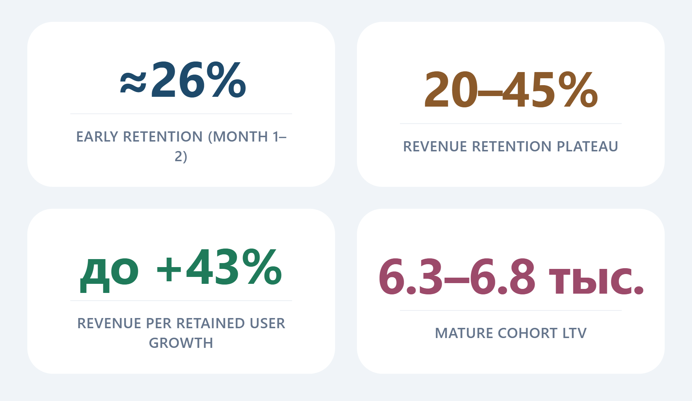         

## 11.3 Revenue Risk Snapshot
#### Концентрация экономической ценности  

| KPI                       |     Значение |
| ------------------------- | -----------: |
| Loyal Revenue Share       |    **55.4%** |
| Revenue-at-Risk (Active)  | **1.39 млн** |
| Revenue-at-Risk (At Risk) | **1.35 млн** |
| Combined Revenue-at-Risk  | **2.73 млн** |

Combined Revenue-at-Risk	2.73 млн  

### Интерпретация
Несмотря на то что сегмент Loyal составляет лишь 15.8% клиентской базы, он формирует более половины всей выручки компании.
Одновременно основной объём потенциальных финансовых потерь сосредоточен не только среди At Risk клиентов, но и внутри Active-сегмента.
Это означает, что деградация поведения начинается значительно раньше момента формального перехода клиента в стадию риска.
Для бизнеса наиболее опасным является постепенное ухудшение customer health внутри активной аудитории.

#### *Figure 62. Revenue Risk Dashboard*

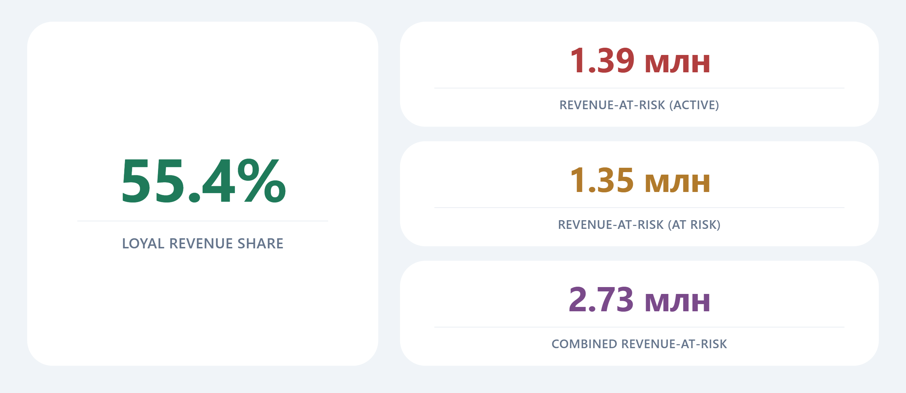  

## 11.4 Predictive Analytics Snapshot
#### Качество модели прогнозирования оттока

| KPI       | Значение |
| --------- | -------: |
| ROC-AUC   | **0.89** |
| Precision | **0.76** |
| Recall    | **0.95** |
| F1 Score  | **0.84** |
| Accuracy  | **0.82** |


### Интерпретация
Разработанная churn-модель демонстрирует высокую способность выявлять клиентов с повышенной вероятностью оттока.
Особенно важным является Recall на уровне 95%, что означает успешное обнаружение большинства будущих churn-клиентов.
Это делает модель пригодной для использования в CRM-процессах, системах раннего предупреждения и программах удержания клиентов.

#### *Figure 63. Predictive Model KPI Cards*  

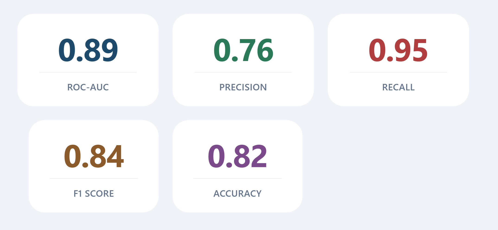 

## 11.5 Executive Summary
Проведённый анализ показывает, что клиентская база аптечной сети проходит через выраженный процесс ранней селекции.
Основная часть клиентов покидает продукт в течение первых месяцев после первой покупки, однако пользователи, успешно преодолевающие данный этап, демонстрируют устойчивое удержание и рост экономической ценности.
Несмотря на снижение retention и рост churn, структура выручки остаётся относительно устойчивой благодаря высокой концентрации доходов внутри loyal-сегмента и постепенному увеличению монетизации удержанных клиентов.
При этом значительная часть revenue-at-risk сосредоточена в сегментах Active и At Risk, что делает раннее выявление деградации клиентского поведения критически важным фактором сохранения будущей выручки.
Разработанная predictive-модель позволяет своевременно обнаруживать клиентов с повышенной вероятностью оттока, а Lifecycle KPI Framework обеспечивает системный мониторинг customer health, retention dynamics и концентрации финансовых рисков.

# 12. Integrated Business Insights
## 12.1 Synthesis of Findings

### Интеграция результатов проекта
Проведённый анализ позволил исследовать клиентскую базу аптечной сети с четырёх взаимодополняющих точек зрения:  
1.	Lifecycle Analytics — динамика переходов между состояниями жизненного цикла. 
2.	Cohort Analytics — долгосрочное удержание и накопление клиентской ценности. 
3.	Predictive Analytics — раннее выявление риска оттока. 
4.	KPI Framework — мониторинг состояния клиентского портфеля и концентрации финансовых рисков.
   
Несмотря на различие аналитических подходов, все разделы приводят к одному и тому же системному выводу:  
> Основной риск бизнеса связан не с монетизацией существующих клиентов, а с неспособностью переводить новых покупателей в сегмент долгосрочно удерживаемой аудитории.
#
### Инсайт 1. Основная потеря клиентов происходит сразу после первой покупки
Результаты cohort-анализа показали, что уже в первые месяцы жизненного цикла происходит наиболее интенсивный отток пользователей.
Средний User Retention снижается примерно до 26% уже после первых месяцев взаимодействия с компанией.    

Lifecycle-анализ подтверждает данный вывод:  
- большинство клиентов начинают деградировать ещё до перехода в формальный churn;  
- поток клиентов из Active в At Risk стабильно превышает обратные переходы;   
- churn является следствием более ранних процессов ухудшения customer health.   

Таким образом, ключевая проблема бизнеса находится не в удержании лояльных клиентов, а значительно раньше — на этапе формирования повторной покупки.
#
### Инсайт 2. После прохождения раннего периода формируется устойчивое ядро клиентов
Несмотря на высокий initial churn, retention-кривые демонстрируют выраженное плато после первых месяцев жизненного цикла.
Retention decay существенно замедляется, а большая часть оставшихся пользователей сохраняет стабильную активность на протяжении длительного периода времени.  

Дополнительно это подтверждается результатами lifecycle stability analysis:   
- Lifecycle Stability Index достигает 67.7%;  
- Healthy Stability Index составляет 71.0%.
  
Это означает, что после прохождения критической стадии ранней селекции клиентская база становится существенно более устойчивой.
Для бизнеса это особенно важно:
каждый дополнительный клиент, удержанный в первые месяцы после первой покупки, получает значительно более высокую вероятность долгосрочного сохранения.
#
### Инсайт 3. Выручка удерживается лучше, чем пользователи
Практически во всех когортах Revenue Retention систематически превышает User Retention.
Даже при сокращении клиентской базы компания сохраняет около 79% выручки между соседними периодами.  

Это свидетельствует о наличии механизма естественной селекции:  
- менее вовлечённые клиенты покидают продукт быстрее;    
- наиболее ценные пользователи остаются значительно дольше;   
- концентрация выручки постепенно возрастает внутри удержанной аудитории.   

Фактически система теряет клиентов быстрее, чем теряет деньги.  
#
### Инсайт 4. Ценность клиента растёт по мере развития жизненного цикла
Анализ Revenue per Retained User показал устойчивый рост монетизации удержанных пользователей.
В наиболее зрелых когортах средняя выручка на одного retained customer превышает стартовый уровень на 43%.
Одновременно накопленный LTV продолжает увеличиваться на протяжении всего наблюдаемого горизонта и достигает 6.3–6.8 тыс. денежных единиц.
Это означает, что долгосрочная ценность клиента формируется не в момент первой покупки, а в процессе его постепенного развития внутри системы.
Каждый пользователь, успешно прошедший ранний этап жизненного цикла, становится всё более экономически значимым для бизнеса.
#
### Инсайт 5. Основной финансовый риск сосредоточен внутри Active-сегмента
Predictive Analytics и Revenue-at-Risk анализ выявили важный управленческий вывод.
Наиболее крупный объём потенциальных потерь формируется не среди уже проблемных клиентов, а среди пользователей, которые ещё остаются активными.  

Revenue-at-Risk:  
- Active — 1.39 млн; 
- At Risk — 1.35 млн.
  
Это означает, что деградация клиентского поведения начинается значительно раньше момента явного ухода клиента.
Следовательно, эффективная retention-стратегия должна работать проактивно, а не реактивно.
#
### Инсайт 6. Бизнес становится зависимым от ограниченного числа лояльных клиентов
Несмотря на то что сегмент Loyal составляет лишь около 16% клиентской базы, он генерирует 55.4% всей выручки компании. Это создаёт одновременно два эффекта:  

Позитивный:  
- высокая устойчивость денежного потока;   
- сильная монетизация удержанных клиентов.     

Негативный:  
- возрастающая концентрация бизнеса вокруг ограниченного числа покупателей;  
- риск ускоренного ухудшения выручки при деградации loyal-сегмента.
  
Именно поэтому сохранение здоровья данной группы становится критически важным элементом долгосрочной стратегии роста.
#
### Главный вывод проекта
Все выполненные анализы указывают на один и тот же системный механизм:  
- Компания уже умеет эффективно монетизировать удержанных клиентов, но теряет слишком большую часть будущей ценной аудитории до момента формирования устойчивой покупательской привычки.  

Следовательно:  
- проблема бизнеса — не monetization; 
- проблема бизнеса — early retention.

Именно раннее удержание является главным рычагом роста LTV, Revenue Retention и общей эффективности клиентской экономики.
#
#### *Figure 64. Integrated Insights Framework*

			High Early Churn
			        ↓
			Smaller Retained Base
			        ↓
			Formation of Loyal Core
			        ↓
			Growth of Customer Value
			        ↓
			Revenue Concentration
			        ↓
			Revenue-at-Risk
			        ↓
			Business Growth Potential


## 12.2 Unified Customer Lifecycle Model
### Единая модель формирования клиентской ценности   
На основании результатов всех разделов была сформирована интегрированная модель жизненного цикла клиента, отражающая полный путь создания экономической ценности внутри клиентской базы.  
Модель показывает, каким образом отдельные этапы клиентского поведения формируют долгосрочные бизнес-результаты компании.
#
### *Этап 1. Acquisition*
Жизненный цикл начинается с привлечения нового клиента. На данном этапе пользователь совершает первую покупку и попадает в сегмент New. Однако первая транзакция сама по себе практически не создаёт долгосрочной ценности. Основной вопрос этого этапа: 
> Сможет ли клиент совершить повторную покупку?  
#
### *Этап 2. Early Retention*
Следующий этап является наиболее критичным для всей системы. Именно здесь происходит основной объём потерь клиентской базы. Большинство пользователей не переходят к регулярному взаимодействию и постепенно покидают продукт. 
Данный этап определяет:    
- будущий retention;   
- будущий revenue retention;   
- будущий LTV.   

Именно здесь сосредоточен основной резерв роста бизнеса.  
#
### *Этап 3. Behavioral Selection*
Пользователи, успешно преодолевшие ранний период, начинают демонстрировать более устойчивое поведение. Происходит естественная селекция клиентской базы:    
- случайные покупатели уходят;    
- остаются более вовлечённые пользователи.   
  
На этом этапе начинают формироваться будущие loyal customers. 
#
### *Этап 4. Loyalty Formation*
После прохождения стадии селекции клиент переходит в фазу устойчивого потребления.    
Характерные признаки этапа:    
- высокая частота покупок;     
- низкий churn-risk;     
- высокая вероятность сохранения активности.    

Именно здесь начинает концентрироваться большая часть выручки бизнеса.
#
### *Этап 5. Customer Value Expansion*
По мере развития жизненного цикла удержанные клиенты постепенно увеличивают свою экономическую ценность. Наблюдается:   
- рост RPRU;  
- рост cumulative revenue;    
- накопление LTV.   

На данном этапе каждый дополнительный месяц удержания приносит всё больший экономический эффект.
#
### *Этап 6. Revenue Concentration*
В результате долгосрочного удержания происходит концентрация бизнеса вокруг наиболее ценных клиентов. Сегмент Loyal становится главным источником выручки компании. Формируется устойчивая monetization engine всего бизнеса.  
#
### *Этап 7. Customer Health Management*
Заключительный этап представляет собой постоянный мониторинг состояния клиентского портфеля. Для управления системой используются:    
- Lifecycle KPI Framework;     
- Predictive Churn Model;     
- Revenue-at-Risk Monitoring;    
- Retention Prioritization Framework.   

Именно здесь аналитика превращается в инструмент принятия решений.
#
#### *Figure 65. Unified Customer Lifecycle Model*

			Customer Acquisition
			          ↓
			Early Retention
			          ↓
			Behavioral Selection
			          ↓
			Loyalty Formation
			          ↓
			Customer Value Expansion
			          ↓
			Revenue Concentration
			          ↓
			Customer Health Monitoring
			          ↓
			Retention Interventions
			          ↓
			Long-Term Revenue Growth

## 12.3 Strategic Priorities
### От аналитических выводов к бизнес-действиям
Проведенный анализ показал, что ключевые ограничения роста аптечной сети связаны не с привлечением новых клиентов и не с монетизацией удержанной аудитории, а с высокой потерей пользователей на ранних этапах жизненного цикла.
Несмотря на наличие устойчивого сегмента лояльных клиентов, формирующего более половины выручки компании, значительная часть покупателей не переходит к повторному потреблению после первой покупки. В результате бизнес вынужден постоянно компенсировать потери клиентской базы за счет новых привлечений, что повышает зависимость от маркетинговых инвестиций и ограничивает долгосрочный рост клиентской ценности.
Полученные результаты позволяют сформулировать четыре ключевых стратегических приоритета развития retention-системы.
#
### Приоритет 1. Снижение раннего оттока после первой покупки
Наиболее критическим ограничением текущей lifecycle-модели является резкий churn в первые месяцы после привлечения клиента.
Когортный анализ показал, что уже ко второму месяцу жизненного цикла удержание снижается примерно до 26%, после чего скорость оттока существенно замедляется и формируется стабильное ядро постоянных покупателей.
Это означает, что основная часть будущих потерь LTV возникает еще до формирования регулярного покупательского поведения.   

Основными направлениями развития должны стать:  
- стимулирование второй покупки;  
- персонализированные post-purchase коммуникации;   
- механики раннего вовлечения клиентов;   
- программы ускоренного формирования покупательской привычки.   

Даже умеренное улучшение раннего retention способно оказать непропорционально сильное влияние на долгосрочную выручку за счет увеличения числа клиентов, достигающих стадии высокой монетизации.
#
### Приоритет 2. Защита ядра высокоценных клиентов
Lifecycle-анализ показал высокую концентрацию выручки внутри сегмента Loyal.
Несмотря на относительно небольшой размер сегмента, лояльные клиенты формируют около 55% общей выручки компании и демонстрируют наиболее высокий уровень покупательской активности.
Дополнительный риск заключается в том, что значительная часть долгосрочного LTV бизнеса зависит именно от сохранения данной аудитории.  

Для повышения устойчивости выручки необходимо:  
- внедрять программы лояльности;  
- использовать персонализированные CRM-сценарии; 
- развивать механики удержания high-value клиентов;   
- регулярно мониторить показатели customer health и churn risk внутри Loyal-сегмента.  

Сохранение ядра лояльных покупателей обеспечивает максимальную защиту будущих денежных потоков компании.
#
### Приоритет 3. Проактивное управление Revenue-at-Risk
Интеграция predictive analytics показала, что наибольший объем потенциальных потерь сосредоточен не среди уже ушедших клиентов, а среди сегментов Active и At Risk. Совокупный объем Revenue-at-Risk внутри этих групп превышает 2.7 млн денежных единиц и существенно превосходит аналогичные показатели остальных lifecycle-сегментов.
Данный результат указывает на необходимость перехода от реактивной модели удержания к проактивному управлению риском.  

Приоритетными направлениями являются:
- регулярное обновление churn-scoring модели; 
- мониторинг динамики вероятности оттока; 
- раннее выявление признаков деградации поведения; 
- автоматизация retention-интервенций для клиентов с повышенным риском ухода. 

Такой подход позволяет предотвращать потери до фактического прекращения активности пользователя.
#
### Приоритет 4. Развитие системы Customer Health Monitoring
Отдельные аналитические исследования дают понимание причин потерь клиентской базы, однако для практического управления retention необходим постоянный мониторинг состояния клиентского портфеля.  
Разработанный Lifecycle KPI Framework создает основу для построения полноценной системы Customer Health Monitoring, объединяющей:  
- lifecycle metrics; 
- retention metrics; 
- revenue metrics; 
- churn-risk indicators; 
- revenue-at-risk indicators; 
- retention prioritization metrics. 

Особую ценность представляет возможность отслеживания изменений клиентского здоровья во времени через показатели:
- Retention Rate;  
- Revenue Retention; 
- Lifecycle Stability Index; 
- Healthy Stability Index; 
- Revenue-at-Risk; 
- Priority Score. 

Это позволяет превратить результаты анализа в постоянно действующую систему поддержки управленческих решений.
#
#### *Figure 66. Стратегическая карта.*
*Strategic Priorities Roadmap.*

			Early Retention
			        ↓
			Loyal Customer Protection
			        ↓
			Revenue-at-Risk Management
			        ↓
			Customer Health Monitoring
			        ↓
			Sustainable Revenue Growth

## 12.4 Final Executive Conclusion

Проведенное исследование позволило комплексно проанализировать жизненный цикл клиентов аптечной сети, объединяя методы lifecycle analytics, cohort analysis, predictive modeling и customer health monitoring в единую аналитическую систему.
Полученные результаты показывают, что клиентская база характеризуется выраженной двухфазной структурой жизненного цикла.
На первом этапе происходит интенсивный отток пользователей после первой покупки. Большая часть клиентов не формирует устойчивого покупательского поведения и прекращает взаимодействие с компанией в течение первых месяцев после привлечения.
На втором этапе формируется относительно небольшое, но стабильное ядро лояльных покупателей, которое обеспечивает основную часть долгосрочной выручки бизнеса.

Когортный анализ подтвердил, что именно раннее удержание является главным фактором формирования долгосрочного LTV. Несмотря на существенное сокращение клиентской базы, удержанные пользователи демонстрируют устойчивый рост экономической ценности, что проявляется в более высокой динамике Revenue Retention по сравнению с User Retention и росте Revenue per Retained User на поздних этапах жизненного цикла.
Дополнительный анализ переходов между lifecycle-сегментами показал постепенное ухудшение customer health по мере старения клиентской базы. Снижение retention, рост churn и превышение contraction revenue над expansion revenue свидетельствуют о накоплении будущих потерь внутри существующего клиентского портфеля.
Разработанная predictive churn-модель продемонстрировала высокое качество прогнозирования и позволила перейти от ретроспективного анализа к раннему выявлению клиентов с повышенной вероятностью ухода. Интеграция прогнозного риска с показателями клиентской ценности позволила сформировать систему приоритизации retention-инвестиций и количественно оценить объем потенциальных финансовых потерь.

На основе результатов проекта был построен Lifecycle KPI Framework, объединяющий показатели удержания, монетизации, клиентского здоровья и прогнозного риска в единую систему мониторинга. Такой подход позволяет не только объяснять происходящие изменения клиентской базы, но и управлять ими в режиме непрерывного наблюдения. В целом результаты исследования показывают, что основной потенциал роста бизнеса находится не в расширении объема привлечения клиентов и не в дополнительной монетизации существующей лояльной аудитории. Наибольший экономический эффект может быть достигнут за счет улучшения раннего удержания, увеличения доли клиентов, переходящих в сегмент регулярных покупателей, и более эффективного управления Revenue-at-Risk.
Именно развитие retention-системы, основанной на данных и прогнозной аналитике, представляет собой наиболее перспективное направление повышения долгосрочной клиентской ценности, устойчивости выручки и эффективности инвестиций в развитие клиентской базы.

####  *Figure 67. End-to-End Customer Lifecycle Intelligence Framework*

			Customer Acquisition
			          ↓
			Lifecycle Segmentation
			          ↓
			Transition Analytics
			          ↓
			Cohort Retention Analysis
			          ↓
			Predictive Churn Modeling
			          ↓
			Revenue-at-Risk Assessment
			          ↓
			Customer Health Monitoring
			          ↓
			Retention Prioritization
			          ↓
			Business Decision Making


# 13. Strategic Recommendations
## 13.1 Retention Strategy
### Strategic Objective

Основной целью retention-стратегии является снижение объема потенциально теряемой выручки за счет раннего выявления клиентов с высоким риском оттока и концентрации ресурсов на пользователях с максимальным ожидаемым эффектом удержания.

Результаты predictive analytics показали, что риск потери клиентов распределяется неравномерно внутри клиентской базы. Наибольший объем потенциальных потерь сосредоточен в сегментах Active и At Risk, которые одновременно характеризуются высокой концентрацией revenue-at-risk и максимальными значениями Retention Priority Score.

Дополнительно анализ факторов оттока показал, что ухудшение клиентского поведения начинается задолго до фактического перехода пользователя в стадию Churn. Наиболее сильными предикторами будущего оттока являются снижение покупательской активности, ухудшение динамики выручки и увеличение интервалов между покупками.
#
### Key Findings Driving the Strategy
***Revenue-at-Risk Concentration***

Основная часть потенциальных потерь выручки сосредоточена в двух сегментах:

| Segment | Revenue-at-Risk |
| ------- | --------------: |
| Active  |           1.39M |
| At Risk |           1.35M |

Совокупно данные сегменты формируют более 2.7 млн потенциально уязвимой выручки. Это означает, что значительная часть будущих потерь возникает еще до формального перехода клиента в состояние оттока.
#
***Main Churn Drivers***

SHAP-анализ и Feature Importance показали, что наиболее важными индикаторами будущего ухода являются:

| Driver                     | Importance |
| -------------------------- | ---------: |
| Frequency                  |      22.4% |
| Monetary Growth            |      18.5% |
| Monetary Delta             |      14.0% |
| Frequency Growth           |      12.5% |
| Avg Days Between Purchases |      10.4% |
| Monetary                   |       9.2% |

Полученные результаты показывают, что ключевым сигналом риска является не текущее значение клиентских метрик, а ухудшение их динамики во времени.
Особенно важным ранним индикатором выступает снижение частоты покупок и замедление темпов потребления.
#
### Strategic Recommendation 1
*Создать систему раннего предупреждения и удержания.*

Результаты модели подтверждают возможность обнаружения признаков деградации клиентского поведения до фактического ухода клиента.
Вместо запуска реактивных кампаний после перехода пользователя в At Risk компания должна использовать churn probability как систему раннего предупреждения.
Клиенты с растущим интервалом между покупками, снижением Frequency Growth и ухудшением Monetary Growth должны автоматически попадать в retention-monitoring до появления критического риска.

**Expected Business Effect**  
- снижение объема предотвращаемого churn;  
- более раннее удержание клиентов;  
- сокращение затрат на реактивацию.  
#
### Strategic Recommendation 2
*Приоритизировать клиентов по ожидаемому влиянию на бизнес.*

Анализ показал, что высокий churn-risk сам по себе не является достаточным основанием для retention-инвестиций.
Для оценки экономической эффективности удержания был разработан интегральный показатель Retention Priority Score, который объединяет:  
- вероятность оттока;  
- ожидаемую будущую выручку;  
- вероятность успешной реактивации.  

Данный подход позволяет отказаться от массовых кампаний и концентрировать ресурсы на клиентах с максимальным ожидаемым ROI удержания.

**Expected Business Effect**  
- рост эффективности CRM-коммуникаций;
- снижение стоимости удержания;
- повышение возврата инвестиций в retention.
#
### Strategic Recommendation 3
*Разработать программы удержания, ориентированные на восстановление клиентов.*

Recovery-анализ показал, что часть клиентов из At Risk сегмента обладает высокой вероятностью возвращения в активное состояние. При этом наиболее перспективные клиенты одновременно характеризуются:  
- высоким churn-risk;  
- значимой ожидаемой ценностью;  
- высоким recovery potential.  

Для таких пользователей рекомендуется разработать отдельные сценарии реактивации:  
- персонализированные предложения;  
- целевые бонусные программы;  
- программы возврата клиентов;  
- коммуникации на основе жизненного цикла.
  
**Expected Business Effect**  
- повышение эффективности реактивации;  
- восстановление ранее потерянной выручки;  
- снижение долгосрочного churn.  
#
### Strategic Recommendation 4
*Фокус на деградации поведения, а не на Lifecycle стадиях.*

Одним из наиболее важных результатов анализа стало то, что признаки будущего оттока появляются раньше, чем клиент меняет lifecycle-сегмент. Поэтому CRM-система должна отслеживать не только текущую lifecycle-stage клиента, но и изменения его поведения:  
- снижение Frequency;   
- ухудшение Monetary Dynamics;  
- увеличение Purchase Gap;  
- снижение Frequency Growth.  

Именно данные сигналы должны выступать триггерами для retention-интервенций.
#
### Strategic Implications

Построенная система predictive retention позволяет компании перейти от реактивного управления оттоком к проактивной модели удержания клиентов.
Основное внимание должно быть сосредоточено не на уже потерянных клиентах, а на раннем выявлении признаков деградации поведения и адресном распределении retention-ресурсов между наиболее ценными и потенциально восстанавливаемыми пользователями.

## 13.2 Lifecycle Management Strategy
### Strategic Objective

Цель lifecycle-стратегии заключается в увеличении доли клиентов в наиболее ценных и устойчивых состояниях жизненного цикла, а также в сокращении скорости деградации клиентской базы.

Результаты lifecycle analytics показали, что различные стадии жизненного цикла существенно отличаются по уровню удержания, экономической ценности и степени влияния на устойчивость бизнеса.
#
### Key Findings Driving the Strategy
***Lifecycle Structure***

Последний snapshot клиентской базы имеет следующую структуру:

| Stage   | Customers |
| ------- | --------: |
| Active  |      1612 |
| At Risk |      1458 |
| Churn   |      1340 |
| Loyal   |       904 |
| New     |       404 |

Несмотря на относительно небольшой размер сегмента Loyal, именно он формирует ядро наиболее ценной клиентской аудитории.
#
***Revenue Concentration***

Распределение выручки между lifecycle-сегментами крайне неравномерно.

| Stage   | Revenue Share |
| ------- | ------------: |
| Loyal   |         55.4% |
| Active  |         22.8% |
| At Risk |         17.0% |
| New     |          4.8% |


Менее 16% клиентов генерируют более половины всей выручки компании. Это указывает на высокую зависимость бизнеса от удержания ядра постоянных покупателей.
#
***Lifecycle Stability***

Дополнительный анализ показал относительно стабильную структуру клиентской базы.

| Metric                    | Latest Value |
| ------------------------- | -----------: |
| Lifecycle Stability Index |        67.7% |
| Healthy Stability Index   |        71.0% |

Наиболее устойчивыми остаются клиенты из здоровых сегментов Active и Loyal.
#
### Strategic Recommendation 1
*Увеличить конверсию Active → Loyal*

Переход клиентов из Active в Loyal является наиболее важным направлением долгосрочного роста.
Именно в этом сегменте сосредоточен основной потенциал увеличения Customer Lifetime Value. Для ускорения перехода рекомендуется:
- программы лояльности;
- накопительные бонусы;
- персонализированные предложения;
- стимулирование повторных покупок.

**Expected Business Effect**  
- рост доли Loyal-клиентов;
- увеличение LTV;
- повышение устойчивости выручки.
#
### Strategic Recommendation 2
*Рассматривать Healthy Stability как основной KPI портфолио*

Healthy Stability Index показал высокий уровень устойчивости клиентов внутри здоровых lifecycle-состояний.
Данная метрика должна использоваться как один из ключевых индикаторов качества клиентского портфеля.
Снижение Healthy Stability Index может выступать ранним предупреждением ухудшения retention-модели еще до заметного роста churn.

**Expected Business Effect**
- раннее обнаружение деградации клиентской базы;
- повышение качества мониторинга customer health;
- более быстрое принятие управленческих решений.
#
### Strategic Recommendation 3
*Снизить Active → At Risk миграцию*

Результаты transition analytics показали, что именно Active-сегмент является ключевой точкой принятия решения клиентом о дальнейшем развитии жизненного цикла.
Переходы из Active в At Risk выступают одним из основных механизмов формирования будущего churn. Для сокращения данного потока рекомендуется:
- мониторинг ранних поведенческих сигналов;  
- триггерные коммуникации;  
- автоматизированные retention-сценарии;  
- сегментация по динамике активности.  

**Expected Business Effect**
- снижение будущего churn;
- повышение retention;
- стабилизация клиентской базы.
#
### Strategic Recommendation 4
*Защитить сегмент Loyal*

Loyal-клиенты являются основным источником выручки компании.
При этом даже незначительное ухудшение удержания данного сегмента способно привести к существенным финансовым потерям. Поэтому для Loyal-аудитории рекомендуется использовать отдельную стратегию:   
- VIP-коммуникации;  
- программы долгосрочной лояльности;  
- персонализированные предложения;  
- специальные механики удержания.  

**Expected Business Effect**
- защита 55% выручки компании;
- повышение Revenue Retention;
- снижение концентрации revenue risk.
#
### Strategic Implications

Результаты lifecycle analytics показывают, что долгосрочный рост бизнеса определяется не только привлечением новых клиентов, но прежде всего способностью компании переводить пользователей в устойчивые состояния жизненного цикла и удерживать ядро наиболее ценной аудитории.
Приоритетом стратегии должно стать увеличение доли клиентов в сегменте Loyal, сокращение миграции в At Risk и постоянный мониторинг устойчивости здоровой части клиентской базы.

## 13.3 Revenue Protection Strategy
### Strategic Objective

Основной целью стратегии защиты выручки является снижение концентрации финансовых рисков внутри клиентского портфеля и сохранение наиболее ценных источников дохода компании.

Результаты предыдущих разделов показали, что структура выручки аптечной сети является высококонцентрированной. Значительная часть бизнеса зависит от относительно небольшой группы клиентов, тогда как ухудшение поведенческих метрик начинается значительно раньше фактического ухода пользователей.

Поэтому управление выручкой должно быть направлено не только на предотвращение полного churn, но и на раннее выявление признаков снижения клиентской ценности, сокращения потребления и роста revenue-at-risk.
#
### Key Findings Driving the Strategy
***Revenue Concentration***

Анализ структуры выручки показал выраженную концентрацию бизнеса вокруг ядра наиболее ценных клиентов.

| Lifecycle Stage | Revenue Share |
| --------------- | ------------: |
| Loyal           |         55.4% |
| Active          |         22.8% |
| At Risk         |         17.0% |
| New             |          4.8% |


Несмотря на то что сегмент Loyal составляет менее 16% клиентской базы, именно он генерирует более половины совокупной выручки компании.
Это означает, что устойчивость бизнеса в значительной степени зависит от способности удерживать наиболее ценных клиентов.
#
***Revenue-at-Risk***

Интеграция прогнозных вероятностей оттока с финансовыми показателями позволила оценить объем выручки, находящейся под угрозой потери.

| Lifecycle Stage | Revenue-at-Risk |
| --------------- | --------------: |
| Active          |           1.39M |
| At Risk         |           1.35M |
| Loyal           |           1.02M |
| New             |           0.25M |


Наиболее важным результатом является то, что максимальный объем revenue-at-risk сосредоточен не только среди клиентов At Risk, но и внутри сегмента Active.
Таким образом, значительная часть будущих финансовых потерь формируется еще до того, как пользователь переходит в критическое состояние жизненного цикла.
#
***Revenue Dynamics***

Анализ Revenue Dynamics выявил ухудшение качества клиентской базы.
К концу периода наблюдения отрицательные изменения внутри удержанной базы начинают систематически превышать положительные.

| Period    | Expansion Revenue | Contraction Revenue |
| --------- | ----------------: | ------------------: |
| Dec → Jan |             1.06M |               0.58M |
| Jan → Feb |             1.06M |               0.84M |
| Feb → Mar |             1.23M |               1.15M |
| Mar → Apr |             0.93M |               1.34M |
| Apr → May |             1.06M |               1.49M |

Данный результат указывает на постепенное ухудшение customer health еще до возникновения полного churn.
#
### Strategic Recommendation 1
*Защитить ценную клиентскую базу*

Поскольку более половины выручки формируется Loyal-сегментом, данная группа должна рассматриваться как стратегический актив бизнеса. Для снижения риска потери наиболее ценных клиентов рекомендуется внедрить специализированную программу удержания, включающую:  
- персонализированные предложения;  
- VIP-программы лояльности;  
- индивидуальные механики удержания;  
- специальные сервисные преимущества;  
- превентивный мониторинг признаков деградации поведения.  

**Expected Business Effect**
- защита ключевого источника выручки;
- повышение Revenue Retention;
- снижение концентрации финансовых рисков.
#
### Strategic Recommendation 2
*Внедрить мониторинг Revenue-at-Risk*

Revenue-at-Risk должен стать регулярным управленческим показателем наряду с традиционными метриками продаж. Рекомендуется внедрить ежемесячный мониторинг:  
- Revenue-at-Risk by Lifecycle Stage;   
- Revenue-at-Risk by Customer Segment;  
- Revenue-at-Risk Trend;  
- Top Revenue-at-Risk Customers.  

Особое внимание следует уделять сегментам Active и At Risk, которые формируют максимальный объем потенциальных потерь.

**Expected Business Effect** 
- раннее обнаружение финансовых рисков;
- повышение точности планирования retention-бюджета;
- улучшение качества CRM-приоритизации.
#
### Strategic Recommendation 3
*Внедрить мониторинг баланса Expansion-Contraction*

Полный churn является лишь финальной стадией деградации клиентского поведения.
Значительно раньше начинают проявляться признаки сокращения потребления внутри удержанной базы.
Поэтому рекомендуется использовать показатель Expansion vs Contraction как один из ключевых индикаторов customer health.
Рост доли contraction должен рассматриваться как ранний сигнал ухудшения качества клиентского портфеля.

**Expected Business Effect**
- выявление проблем до роста churn;
- повышение скорости управленческой реакции;
- снижение скрытых потерь выручки.
#
### Strategic Recommendation 4
*Сместить фокус с Revenue Loss на Revenue Preservation*

Традиционный подход концентрируется на компенсации уже произошедших потерь.
Результаты анализа показывают необходимость перехода к модели превентивного управления выручкой. Основное внимание должно быть сосредоточено на:  
- предотвращении деградации ценных клиентов;  
- поддержании высокого Revenue Retention;   
- сохранении стабильности ядра клиентской базы;   
- снижении вероятности перехода клиентов в стадии риска.  

**Expected Business Effect**
- повышение устойчивости доходов;
- сокращение волатильности выручки;
- укрепление долгосрочной клиентской экономики.
#
### Strategic Implications

Полученные результаты показывают, что основной риск бизнеса связан не столько с потерей отдельных клиентов, сколько с ухудшением состояния наиболее ценной части клиентской базы.
Поэтому стратегия управления выручкой должна опираться на системный мониторинг revenue concentration, revenue-at-risk и динамики потребления внутри удержанной аудитории.
Компания должна стремиться не только к росту продаж, но и к защите уже существующих потоков выручки, формирующих долгосрочную устойчивость бизнеса.

## 13.4 CRM & Analytics Roadmap
### Strategic Objective

Проведенный анализ позволил сформировать полноценную систему управления клиентским жизненным циклом, объединяющую lifecycle analytics, cohort analytics, predictive modeling и customer health monitoring.
Следующим шагом является внедрение результатов проекта в операционные процессы компании.

Цель данного roadmap заключается в поэтапной трансформации CRM-системы от ретроспективной отчетности к проактивному управлению клиентским портфелем на основе данных.
#
### *Phase 1. Customer Health Monitoring*
### Цель

Создать единый контур мониторинга состояния клиентской базы.

### Core Deliverables

Внедрить регулярный мониторинг:  
- Lifecycle Structure;  
- Lifecycle Stability Index;  
- Healthy Stability Index;  
- Retention Rate;  
- Churn Rate;  
- Reactivation Rate;  
- Revenue Retention;  
- Revenue Concentration;  
- Revenue-at-Risk.  

### Recommended Dashboards  

***Lifecycle KPI Dashboard***   
Отображает структуру клиентской базы и состояние жизненного цикла.

***Revenue Health Dashboard***   
Отслеживает концентрацию выручки и динамику revenue-at-risk.

***Customer Health Dashboard***   
Объединяет behavioral, revenue и risk indicators.

### Business Outcome

Компания получает единый источник информации о состоянии клиентского портфеля и ранних признаках его деградации.
#
### *Phase 2. Predictive CRM*
### Цель

Перейти от мониторинга к прогнозированию клиентского поведения.

### Core Deliverables

Интегрировать результаты churn-модели в CRM-процессы.

Для каждого клиента регулярно рассчитывать:
- Churn Probability;
- Expected Future Revenue;
- Recovery Probability;
- Retention Priority Score.
  
### Customer Segmentation Logic

| Segment                 | CRM Action           |
| ----------------------- | -------------------- |
| High Risk + High Value  | Priority Retention   |
| High Risk + Low Value   | Automated Retention  |
| High Recovery Potential | Reactivation Program |
| Loyal Customers         | Loyalty Program      |
| New Customers           | Onboarding Program   |


### Business Outcome

Компания получает возможность распределять CRM-ресурсы на основе ожидаемого бизнес-эффекта.
#
### *Phase 3. Retention Intelligence Layer*
### Цель

Перейти от сегментных кампаний к управлению драйверами поведения клиентов.

### Core Deliverables

Использовать результаты SHAP-анализа для мониторинга основных факторов риска:

| Driver                     | Importance |
| -------------------------- | ---------: |
| Frequency                  |      22.4% |
| Monetary Growth            |      18.5% |
| Monetary Delta             |      14.0% |
| Frequency Growth           |      12.5% |
| Avg Days Between Purchases |      10.4% |


CRM-коммуникации должны запускаться не только по lifecycle-stage, но и по изменениям данных метрик.

### Business Outcome

Появляется возможность реагировать на ухудшение поведения еще до роста churn probability.
#
### *Phase 4. Customer Intelligence Platform*
### Цель

Создать единую систему принятия решений на основе клиентской аналитики.

#### *Figure 68. Target Architecture*

			Customer Transactions
			          ↓
			Lifecycle Analytics
			          ↓
			Predictive Modeling
			          ↓
			Customer Health Monitoring
			          ↓
			Revenue-at-Risk Assessment
			          ↓
			Retention Prioritization
			          ↓
			CRM Decision Engine

### Decision Logic

Для каждого клиента система автоматически определяет:  
- уровень риска;  
- экономическую ценность;  
- потенциал восстановления;  
- рекомендуемый тип воздействия.  

На основе этих параметров клиент направляется в соответствующий CRM-сценарий.

### Business Outcome

Компания переходит от ручного управления клиентской базой к интеллектуальной системе принятия решений, способной непрерывно оценивать состояние клиентского портфеля и автоматически приоритизировать действия по удержанию.

## Strategic Vision

Итогом внедрения roadmap становится создание полноценной Customer Intelligence Framework, объединяющей результаты всех аналитических уровней проекта:
- Lifecycle Transition Analytics;
- Cohort Retention & Customer Value Dynamics;
- Predictive Customer Analytics;
- Lifecycle KPI Framework;
- Revenue-at-Risk Monitoring;
- Retention Prioritization.

Такая система позволяет не только объяснять причины изменений клиентской базы, но и активно управлять будущей динамикой удержания, выручки и долгосрочной ценности клиентов.

# 14. Limitations & Future Work
## 14.1 Limitations
## 14.1.1 Methodological Limitations

Несмотря на высокую практическую применимость разработанного аналитического framework, результаты исследования следует интерпретировать с учетом ряда методологических ограничений.
#
### Observation Window

Анализ охватывает период с июля 2021 года по июнь 2022 года.

Данный горизонт наблюдения достаточен для исследования жизненного цикла клиентов, оценки retention dynamics и построения предиктивных моделей оттока. Однако более длительный период наблюдения позволил бы надежнее оценивать долгосрочные поведенческие паттерны и устойчивость выявленных закономерностей на поздних стадиях жизненного цикла клиентов.
#
### Cohort Maturity

Когортный анализ подвержен естественным ограничениям зрелости когорт.

По мере увеличения возраста когорт количество доступных наблюдений постепенно сокращается, что приводит к росту статистической неопределенности долгосрочных оценок retention и customer value.

В рамках проекта для повышения надежности результатов из расчета средних retention-кривых были исключены незрелые когорты. Тем не менее показатели за пределами шестого месяца жизненного цикла следует интерпретировать с осторожностью, поскольку в их расчете участвует ограниченное количество когорт.
#
### Snapshot-Based Lifecycle Segmentation

Lifecycle-модель построена на основе snapshot-подхода, в рамках которого пользователи классифицируются по дискретным стадиям жизненного цикла в отдельные моменты времени.

Подобный подход обеспечивает высокую интерпретируемость результатов и удобство практического применения, однако упрощает непрерывную природу пользовательского поведения. В реальности процесс деградации или восстановления активности клиентов может происходить более плавно, чем отражено в рамках фиксированных lifecycle-состояний.
#
### Recovery Modeling Scope

Модель оценки вероятности восстановления клиентов использовалась как exploratory ranking framework для анализа потенциала восстановления внутри сегмента At Risk.

Вероятности восстановления рассчитывались на тех же наблюдениях, на которых выполнялось обучение модели (in-sample scoring), и не рассматривались как самостоятельная готовая к внедрению в производство система прогнозирования (production-ready predictive system).

Поэтому полученные значения Recovery Probability следует интерпретировать прежде всего как относительные показатели потенциальной реактивируемости клиентов, используемые для приоритезации удержания, а не как точные прогнозы вероятности возврата к покупкам.

Основная задача модели заключалась в ранжировании клиентов по ожидаемому потенциалу восстановления и поддержке принятия решений о распределении retention-инвестиций.
#
### Predictive Revenue Estimation

Показатели Expected Future Revenue, Expected Revenue Loss и Retention Priority Score являются модельными оценками и не представляют собой точные значения будущей выручки.

Расчеты основаны на историческом поведении клиентов, вероятности оттока и вероятности восстановления активности, полученных в рамках предиктивного моделирования. Фактические результаты могут отличаться от прогнозируемых значений под воздействием факторов, не представленных в используемых данных, включая изменения рыночной ситуации, потребительского поведения, конкурентной среды и ценовой политики компании.

Дополнительно следует учитывать особенности построения показателя Expected Future Revenue. В рамках проекта прогнозируемая выручка рассчитывается на основе текущего значения Monetary и исторической динамики Monetary Growth.

При этом показатель Monetary представляет собой накопленную выручку клиента за последние шесть месяцев относительно даты snapshot, а Monetary Growth рассчитывается как отношение значений Monetary в двух последовательных snapshot-периодах. Поскольку соседние шестимесячные окна наблюдения пересекаются между собой, данный показатель отражает изменение долгосрочного покупательского тренда клиента, а не классический темп роста выручки между отдельными календарными месяцами. Monetary Growth отражает изменение клиентской ценности между последовательными lifecycle snapshots и используется как индикатор направления поведенческого тренда клиента.

В результате Expected Future Revenue следует интерпретировать как оценку относительной будущей ценности клиента, основанную на исторической динамике потребления, а не как точный финансовый прогноз будущих денежных потоков.

Аналогично показатель Expected Revenue Loss отражает ожидаемый объем выручки, находящейся под риском потери с учетом вероятности оттока клиента, и должен рассматриваться как инструмент оценки относительного бизнес-риска различных сегментов клиентской базы.

По этой причине показатели Expected Future Revenue и Expected Revenue Loss следует использовать прежде всего для сравнительного анализа клиентов и сегментов, а не для финансового планирования или прогнозирования фактической выручки.

Показатель Retention Priority Score объединяет вероятность оттока, ожидаемую будущую ценность клиента и вероятность восстановления активности. Его основная задача заключается не в прогнозировании денежных потоков, а в ранжировании клиентов по ожидаемой эффективности retention-интервенций и поддержке принятия решений по распределению retention-бюджета.

Таким образом, все три показателя следует интерпретировать как элементы системы приоритизации и оценки относительной бизнес-ценности клиентов, а не как точные прогнозы будущих финансовых результатов.
#
### Absence of Causal Validation

Проект основан на анализе наблюдательных данных и не включает результаты контролируемых экспериментов или A/B-тестирования retention-интервенций.

Следовательно, выявленные взаимосвязи отражают статистические закономерности пользовательского поведения и не позволяют делать строгие причинно-следственные выводы относительно эффективности конкретных маркетинговых воздействий.

Полученные результаты следует рассматривать как основу для дальнейшей проверки гипотез в рамках экспериментальных CRM-программ.

## 14.1.2 Data Limitations

Результаты исследования также ограничены составом доступных данных и уровнем детализации пользовательской информации.

### Transaction-Centric Perspective

В основе анализа лежат транзакционные данные клиентов, отражающие историю покупок, частоту взаимодействия с компанией и объем сформированной выручки.
Такой подход обеспечивает надежную основу для исследования customer lifecycle и retention динамик, однако не позволяет учитывать дополнительные факторы пользовательского поведения, которые могут оказывать влияние на вероятность удержания или оттока клиентов.
#
### Absence of Marketing Interaction Data

В доступных данных отсутствует информация о маркетинговых коммуникациях и CRM-взаимодействиях с клиентами.

В результате модели не учитывают влияние email-кампаний, push-уведомлений, программ лояльности и других retention-механик на дальнейшее поведение пользователей.

Это ограничивает возможность количественной оценки эффективности отдельных маркетинговых воздействий и построения моделей инкрементального эффекта CRM-активностей.
#
### Absence of Acquisition Channel Information

Проект не содержит информации об источниках привлечения клиентов.

Поэтому различия в качестве пользовательских когорт анализируются исключительно через поведенческие метрики после первой покупки без учета особенностей каналов acquisition.

Наличие данных о происхождении клиентов позволило бы дополнительно исследовать связь между источниками привлечения, долгосрочным удержанием и формированием customer lifetime value.
#
### Absence of Product-Level Information

В анализируемом наборе данных отсутствует информация о товарных категориях и структуре потребления внутри покупательской корзины.

По этой причине модели рассматривают клиентов как единые поведенческие объекты и не позволяют оценивать влияние продуктовых предпочтений на вероятность удержания, реактивации и долгосрочную ценность пользователей.

Интеграция категорийного анализа могла бы существенно расширить возможности персонализации retention-стратегий и формирования более точных клиентских сегментов.

## 14.2 Future Work

Несмотря на то что разработанная аналитическая система позволяет комплексно анализировать жизненный цикл клиентов, прогнозировать риск оттока и приоритизировать retention-инвестиции, текущий framework представляет собой лишь один из этапов развития data-driven customer management.

В рамках проекта были реализованы lifecycle analytics, cohort analysis, predictive churn modeling и customer health monitoring. Однако дальнейшее развитие системы может существенно повысить точность прогнозирования поведения клиентов и эффективность CRM-решений.

Наиболее перспективными направлениями развития являются:   
- Survival Analysis для моделирования времени до оттока клиентов;   
- Customer Lifetime Value Forecasting для долгосрочного прогнозирования ценности клиентов;  
- Uplift Modeling для оценки причинно-следственного эффекта retention-интервенций.  

Каждое из этих направлений позволяет перейти от прогнозирования риска к более точному управлению жизненным циклом клиента и оптимизации бизнес-решений.

***Примечание***

*Ниже представлены примеры аналитических инструментов, которые могут быть интегрированы в существующий framework в качестве следующих этапов развития проекта. Приведенные визуализации носят иллюстративный характер и демонстрируют возможные направления расширения текущей системы customer lifecycle analytics.*

## 14.2.1 Survival Analysis
### Бизнес-мотивация

В текущем проекте задача оттока сформулирована как бинарная классификация:  
- клиент перейдет в риск/отток;  
- клиент не перейдет в риск/отток.  

Такой подход позволяет оценивать вероятность нежелательного события, однако не отвечает на вопрос:   
> когда именно клиент может быть потерян?

Для CRM-команд этот вопрос часто имеет не меньшую ценность, чем сама вероятность оттока.

Например:
- два клиента могут иметь одинаковый churn-risk;  
- при этом один клиент может уйти через неделю;  
- другой — через несколько месяцев.

При одинаковой вероятности риска приоритет коммуникаций будет различаться.
#
### Возможное решение

Для оценки времени до оттока может использоваться Survival Analysis. Вместо прогнозирования класса модель оценивает:  
- вероятность сохранения активности клиента во времени;  
- ожидаемое время до оттока;  
- изменение риска ухода на различных этапах жизненного цикла.  
- Потенциальная бизнес-ценность
#  
### Потенциальная бизнес-ценность

Интеграция survival-моделей позволит:  
- прогнозировать время до потери клиента;  
- выявлять периоды максимального риска;  
- оптимизировать момент запуска retention-коммуникаций;  
- повысить эффективность CRM-кампаний за счет более точного тайминга взаимодействия.  

Таким образом, компания сможет перейти от оценки вероятности ухода к прогнозированию полного жизненного цикла клиента.
#
### *Иллюстративный пример*
#### *Figure 69. Вероятность сохранения клиентской активности во времени для различных lifecycle-сегментов*

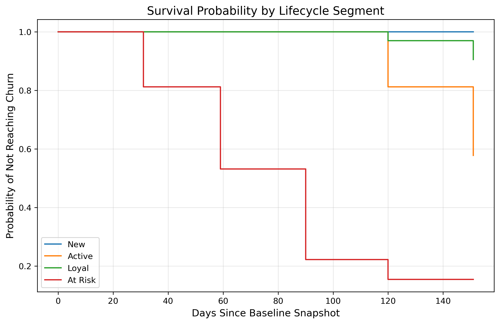
*Иллюстративный пример Kaplan–Meier survival curves для различных lifecycle-сегментов.*

*Данная визуализация демонстрирует возможный формат анализа времени до оттока и приведена исключительно в качестве примера дальнейшего развития проекта. Survival Analysis не входил в основной объем текущего исследования и рассматривается как перспективное направление расширения существующего retention framework.*

*Survival curves были построены на основе ежемесячных snapshots. Следовательно, время событий наблюдается только в даты снимков, что приводит к ступенчатой ​​функции выживаемости.*

## 14.2.2 Customer Lifetime Value Forecasting
### Бизнес-мотивация

В рамках проекта используется показатель Expected Future Revenue, который позволяет оценивать потенциальную ценность клиентов для целей retention prioritization.

Однако данный показатель отражает ожидаемую будущую выручку в рамках текущего аналитического подхода и не является полноценным долгосрочным прогнозом Customer Lifetime Value.

Для стратегического управления клиентской базой компании важно понимать:  
- какую совокупную выручку клиент способен принести в будущем;  
- какие сегменты обладают максимальным долгосрочным потенциалом;  
- насколько различается экономическая ценность разных типов пользователей.  
#
### Возможное решение

Следующим этапом развития системы может стать построение моделей Customer Lifetime Value Forecasting. Такие модели могут учитывать:
- историю покупок;
- динамику потребления;
- churn-risk;
- lifecycle stage;
- поведенческие тренды клиента.

Результатом является прогноз совокупной будущей ценности пользователя на протяжении всего оставшегося жизненного цикла.
#
### Потенциальная бизнес-ценность

CLV-модели позволяют:
- оптимизировать распределение маркетингового бюджета;
- определять максимально ценных клиентов;
- оценивать долгосрочную эффективность retention-стратегий;
- принимать решения на основе ожидаемой полной ценности клиента, а не только текущей выручки.

В сочетании с churn-моделями CLV-прогнозирование формирует основу для полноценного customer portfolio management.
#
### *Иллюстративный пример*
#### *Figure 70. Прогноз долгосрочной ценности клиентов по различным сегментам клиентской базы.*
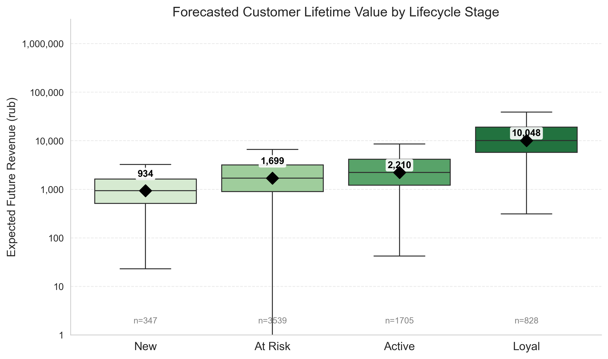

*Иллюстративный пример распределения прогнозируемой долгосрочной ценности клиентов по lifecycle-сегментам.*

*В рамках текущего проекта использовались показатели Expected Future Revenue и Expected Revenue Loss, предназначенные для оценки относительной экономической значимости клиентов при расчете Revenue-at-Risk и Retention Priority Score. Представленная визуализация демонстрирует возможное развитие данного подхода в направлении полноценного прогнозирования Customer Lifetime Value и не является частью основной аналитической модели проекта.*

## 14.2.3 Uplift Modeling
### Бизнес-мотивация

Текущий Retention Priority Framework позволяет определить:  
- кого компания может потерять;  
- сколько выручки находится под угрозой;  
- каких клиентов потенциально возможно вернуть.  

Однако даже высокая вероятность восстановления активности не означает, что именно CRM-интервенция станет причиной этого восстановления.
Некоторые клиенты могут вернуться самостоятельно без какого-либо воздействия.
Другие пользователи могут не реагировать на коммуникации независимо от уровня инвестиций.
Поэтому следующий уровень зрелости retention-аналитики связан с оценкой причинно-следственного эффекта маркетинговых воздействий.
#
### Возможное решение

Для решения данной задачи может использоваться Uplift Modeling. В отличие от классических predictive-моделей uplift-подход оценивает:    
- не вероятность события,   
- а дополнительную вероятность события, вызванную конкретной интервенцией.  

То есть модель отвечает на вопрос:
> Насколько изменится вероятность сохранения клиента именно благодаря CRM-коммуникации?
#
### Потенциальная бизнес-ценность

Использование uplift-моделей позволяет:
- исключать клиентов, которые вернутся самостоятельно;
- исключать клиентов, не реагирующих на коммуникации;
- концентрировать ресурсы на действительно управляемой аудитории;
- повышать ROI retention-кампаний;
- оптимизировать маркетинговые расходы.

В результате компания сможет перейти от прогнозирования риска к прогнозированию эффекта управленческих действий.
#
### *Иллюстративный пример*
#### *Концептуальная матрица retention-инвестиции* 

|                                  | **Низкая Expected Future Revenue** | **Высокая Expected Future Revenue** |
| -------------------------------- | ---------------------------------- | ----------------------------------- |
| **Низкая Recovery Probability**  | **Low Priority**                   | **Selective Retention**             |
| **Высокая Recovery Probability** | **Test Campaigns**                 | **Primary Target Segment**          |

*Иллюстративный пример концептуальной матрицы распределения retention-инвестиций на основе ожидаемой будущей ценности клиента (Expected Future Revenue) и вероятности успешной реактивации (Recovery Probability).*

*В качестве концептуальной архитектуры будущей системы можно использовать матрицу распределения retention-инвестиций.*

***Primary Target Segment***  
*Высокая Expected Future Revenue + высокая Recovery Probability.*    
*Наиболее ценные и наиболее "спасаемые" клиенты.*    
*Именно на данный сегмент должен направляться основной объем retention-бюджета.*  

***Selective Retention***  
*Высокая Expected Future Revenue + низкая Recovery Probability.*  
*Клиенты обладают высокой ценностью, однако вероятность успешного восстановления активности ограничена.*  
*Для данного сегмента целесообразно использовать выборочные персонализированные кампании и контролировать их ROI.*  

***Test Campaigns***  
*Низкая Expected Future Revenue + высокая Recovery Probability.*  
*Клиенты легко поддаются реактивации, однако обладают ограниченной экономической ценностью.*  
*Сегмент может использоваться для недорогих автоматизированных CRM-экспериментов.*  

***Low Priority***  
*Низкая Expected Future Revenue + низкая Recovery Probability.*  
*Клиенты одновременно обладают низкой ценностью и низким потенциалом восстановления.*  
*Retention-инвестиции для данного сегмента, как правило, обладают минимальной ожидаемой отдачей.*  

*Предложенная матрица демонстрирует возможный переход от текущей системы risk-based retention к более зрелому подходу, основанному на оценке инкрементального эффекта CRM-интервенций.*  

## 14.2.4 Causal Retention Analytics
### Бизнес-мотивация

В рамках текущего проекта были выявлены ключевые факторы оттока клиентов, рассчитаны churn probabilities и сформирована система приоритизации retention-инвестиций.

Однако построенные модели позволяют выявлять статистические закономерности, но не позволяют однозначно ответить на вопрос:  
> какие факторы действительно вызывают изменения клиентского поведения?

Например, анализ показал, что снижение Frequency и ухудшение Monetary Dynamics тесно связаны с ростом churn-risk. Тем не менее наличие статистической связи еще не означает наличие причинно-следственного эффекта.

Для принятия управленческих решений компании важно понимать:  
- какие изменения поведения действительно приводят к оттоку;  
- какие CRM-интервенции способны изменить траекторию клиента;  
- какие факторы являются причиной, а какие лишь индикаторами деградации.  
#
### Возможное решение

Следующим этапом развития аналитической системы может стать внедрение методов Causal Analytics.
В отличие от классических predictive-моделей причинно-следственный анализ позволяет оценивать влияние конкретных факторов и действий на будущие результаты клиента. Потенциальные направления анализа:  
- оценка влияния изменения частоты покупок на вероятность оттока;  
- анализ эффекта повторных коммуникаций;  
- оценка влияния программ лояльности на удержание клиентов;  
- измерение долгосрочного эффекта retention-кампаний.  

Для решения подобных задач могут использоваться:  
- propensity score matching;   
- causal forests;  
- difference-in-differences;  
- treatment effect estimation.  
#
### Потенциальная бизнес-ценность

Использование причинно-следственного подхода позволит:  
- перейти от анализа корреляций к анализу причин;  
- повысить эффективность retention-инвестиций;  
- измерять реальный эффект CRM-активностей;  
- снижать риск принятия решений на основе ложных зависимостей;  
- формировать более обоснованные стратегии удержания клиентов.  

В результате компания сможет понимать не только кто находится в зоне риска, но и какие действия способны изменить будущий исход.
#
### *Иллюстративный пример*
#### *Figure 71. Концептуальная модель перехода от корреляционного анализа факторов риска к оценке причинного влияния retention-интервенци*

Conceptual Causal Retention Framework

			Retention Intervention
			          ↓
			 Frequency Growth
			          ↓
			 Customer Health
			          ↓
			 Future Revenue
			 
*Иллюстративная схема причинно-следственных связей между retention-интервенциями, пользовательским поведением и бизнес-результатами. В рамках текущего проекта анализ ограничивается выявлением статистических зависимостей. Представленная схема демонстрирует возможное направление развития аналитической платформы в сторону оценки причинного эффекта CRM-воздействий.*

## 14.2.5 Next-Best-Action Recommendation System
### Бизнес-мотивация

Текущая аналитическая система позволяет определить:  
- вероятность оттока клиента;  
- ожидаемую будущую ценность;  
- потенциальный объем revenue-at-risk;  
- приоритет удержания. 

Однако после определения приоритетных клиентов остается открытым следующий вопрос:   
> какое именно действие следует предпринять для каждого пользователя?

На практике одинаковые retention-коммуникации редко обеспечивают максимальный результат для всей клиентской базы.

Различные группы клиентов могут требовать разных стратегий взаимодействия:
- персонализированных предложений;
- напоминаний о повторной покупке;
- программ лояльности;
- стимулирующих скидок;
- реактивационных кампаний.
#
### Возможное решение

Следующим этапом развития CRM Intelligence Framework может стать построение системы Next-Best-Action Recommendation. Такая система объединяет:  
- lifecycle stage;  
- churn probability;  
- customer value;  
- recovery potential;  
- историю поведения клиента.  

На основе совокупности факторов каждому пользователю автоматически назначается наиболее подходящее действие.

Пример логики рекомендаций:  

| Клиентский профиль                   | Рекомендуемое действие   |
| ------------------------------------ | ------------------------ |
| Loyal + высокий revenue              | программа лояльности     |
| Active + ухудшение Frequency         | превентивное удержание   |
| At Risk + высокий recovery potential | реактивационная кампания |
| At Risk + низкая ценность            | минимальные коммуникации |
| Churn + высокий потенциал возврата   | win-back стратегия       |

#
### Потенциальная бизнес-ценность

Next-Best-Action Framework позволяет:  
- автоматизировать принятие CRM-решений;  
- повысить персонализацию коммуникаций;  
- оптимизировать использование retention-бюджета;  
- улучшить клиентский опыт;  
- увеличить возврат на маркетинговые инвестиции.  

Фактически система превращает результаты аналитики в конкретные управленческие рекомендации для каждого клиента.
#
### Связь с текущим проектом

Построенный в рамках проекта Retention Priority Score уже формирует основу для подобной системы.  

Используемые компоненты:  
- Churn Probability;  
- Expected Future Revenue;  
- Recovery Probability;  
- Lifecycle Stage.  

представляют собой ключевые входные данные для будущего recommendation engine.

Таким образом, текущий проект может рассматриваться как первый шаг к созданию полноценной системы интеллектуального управления клиентским жизненным циклом.
#
### *Иллюстративный пример*
#### *Figure 72. Концептуальная схема автоматизированного выбора оптимального CRM-действия на основе customer health, churn-risk и customer value.*

*Вариант 1. Next-Best-Action Decision Framework*

										                  Customer
										                      │
										          ┌───────────┴───────────┐
										          │                       │
										      High Risk              Low Risk
										          │                       │
										          ▼                       ▼
										  Recovery High?           Loyalty Program
										          │
										     ┌────┴────┐
										     │         │
										    Yes        No
										     │          │
										Retention     Minimal
										 Offer       Investment


*Вариант 2. Decision Matrix*

| Customer State                      | Recommended Action    |
| ----------------------------------- | --------------------- |
| Loyal + Low Risk                    | Loyalty Program       |
| Active + Medium Risk                | Engagement Campaign   |
| At Risk + High Recovery Probability | Retention Offer       |
| At Risk + Low Recovery Probability  | Minimal Contact       |
| Churn + High Value                  | Reactivation Campaign |

*Иллюстративный пример автоматизированной системы выбора оптимального CRM-действия на основе customer health, churn-risk и ожидаемой экономической ценности клиента. В рамках текущего проекта подобная система не реализовывалась и представлена как потенциальное направление развития существующего lifecycle analytics framework.*


## Заключение раздела Future Work

Разработанная аналитическая система обеспечивает полный цикл анализа клиентской базы: от исследования жизненного цикла и удержания клиентов до прогнозирования оттока и приоритизации retention-инвестиций.

Дальнейшее развитие framework может быть направлено на пять взаимодополняющих направлений:  
1. Survival Analysis — прогнозирование времени до оттока клиентов;  
2. Customer Lifetime Value Forecasting — оценка долгосрочной экономической ценности клиентов;  
3. Uplift Modeling — измерение эффекта retention-интервенций;  
4. Causal Retention Analytics — выявление причинно-следственных факторов удержания;  
5. Next-Best-Action Recommendation System — автоматизация принятия CRM-решений.  

Совместное использование данных подходов позволит эволюционировать от прогнозирования клиентского поведения к полноценной интеллектуальной системе управления клиентским жизненным циклом, ориентированной на максимизацию долгосрочной ценности клиентской базы и эффективности retention-инвестиций.

# 15. Technical Stack

## 15.1 Analytics Environment

Проект реализован полностью в экосистеме Python и охватывает полный аналитический цикл: от подготовки транзакционных данных и построения lifecycle snapshots до разработки предиктивных моделей, интерпретации результатов и формирования бизнес-рекомендаций.

Анализ выполнялся в среде Jupyter Notebook, что обеспечило воспроизводимость расчетов, прозрачность аналитического процесса и возможность поэтапной валидации результатов на каждом уровне исследования.

Для управления версиями и публикации проекта использовались Git и GitHub, что позволило организовать структуру проекта в формате воспроизводимого аналитического исследования.

## 15.2 Data Processing

### Core Data Processing

**Python**

Основной язык анализа данных и разработки аналитических моделей.

**Pandas**

Использовался для обработки транзакционных данных, построения lifecycle snapshots, расчета пользовательских метрик, формирования когорт и подготовки аналитических датасетов для последующего моделирования.

**NumPy**

Использовался для численных вычислений, feature engineering, расчета производных показателей и подготовки признакового пространства для predictive analytics.
#
### Feature Engineering

В рамках проекта были сформированы пользовательские признаки нескольких уровней:

* RFM-показатели (Recency, Frequency, Monetary);
* transactional cadence metrics;
* behavioral trend indicators;
* growth metrics;
* lifecycle-stage features;
* revenue-at-risk indicators;
* retention prioritization metrics.

Дополнительно были построены последовательные monthly snapshots на основе скользящего шестимесячного окна наблюдения, что позволило перейти от статического анализа клиентской базы к исследованию динамики пользовательского поведения во времени.
#
### Version Control & Reproducibility

**Git**

Использовался для контроля версий и отслеживания изменений аналитического пайплайна.

**GitHub**

Использовался для хранения проекта, публикации результатов исследования и обеспечения воспроизводимости аналитической работы.

## 15.3 Predictive Modeling

Для построения предиктивных моделей использовались методы машинного обучения, ориентированные на решение задач прогнозирования пользовательского поведения и поддержки retention-стратегии.

| Tool                        | Purpose                                                                             |
| --------------------------- | ----------------------------------------------------------------------------------- |
| Scikit-learn                | Построение churn prediction и recovery scoring моделей                              |
| Random Forest Classifier    | Оценка вероятности оттока клиентов                                                  |
| Random Forest Classifier    | Оценка вероятности восстановления активности клиентов из сегмента At Risk           |
| Time-Based Train/Test Split | Предотвращение temporal leakage и моделирование production-сценария прогнозирования |
| SHAP                        | Интерпретация факторов риска и объяснение предсказаний модели                       |

### Predictive Analytics Components

В рамках проекта были реализованы следующие аналитические модули:

* Churn Prediction Model;
* SHAP-Based Feature Importance Analysis;
* Customer Risk Segmentation;
* Revenue-at-Risk Assessment;
* Recovery Potential Scoring;
* Retention Priority Score Framework.

Для оценки качества модели использовались стандартные метрики бинарной классификации:

* ROC-AUC;
* Precision;
* Recall;
* F1-score;
* Accuracy.

Полученные результаты подтвердили высокую способность модели выявлять клиентов с повышенной вероятностью перехода в стадии At Risk и Churn.

## 15.4 Visualization & Reporting

Для визуализации результатов исследования использовался набор инструментов, ориентированных на аналитическую отчетность и бизнес-интерпретацию данных.

| Tool                     | Purpose                                                  |
| ------------------------ | -------------------------------------------------------- |
| Matplotlib               | Базовые аналитические визуализации                       |
| Seaborn                  | Статистические графики и распределения                   |
| Plotly                   | Интерактивные бизнес-визуализации и executive dashboards |
| SHAP Visualization Tools | Интерпретация моделей машинного обучения                 |

### Key Visualization Categories

В рамках проекта были реализованы визуализации нескольких аналитических уровней:

#### Lifecycle Analytics

* Lifecycle Transition Matrix;
* Revenue Transition Matrix;
* Revenue Driver Decomposition;
* Revenue Waterfall Analysis.

#### Cohort Analytics

* Cohort Retention Curves;
* Revenue Retention Curves;
* Revenue per Retained User Dynamics;
* Cohort Lifetime Value Analysis;
* Cohort Variability Assessment.

#### Predictive Analytics

* ROC Curve;
* Probability Distribution Analysis;
* SHAP Summary Plot;
* Risk Segmentation Framework;
* Customer Value & Risk Matrix;
* Saveability Matrix.

#### Executive Monitoring

* Lifecycle KPI Dashboard;
* Revenue-at-Risk Monitoring;
* Lifecycle Stability Framework;
* Retention Prioritization Dashboard.

Все визуализации ориентированы на поддержку управленческих решений и связывают статистические результаты с бизнес-интерпретацией.

## 15.5 Analytical Techniques

Проект объединяет несколько уровней аналитических подходов, последовательно переходя от описательной аналитики к предиктивному моделированию и поддержке принятия решений.
#
### Descriptive Analytics

Использовалась для анализа текущей структуры клиентской базы и исследования исторических закономерностей поведения пользователей.

Методы:

* RFM Analysis;
* Lifecycle Segmentation;
* Revenue Flow Analysis;
* Revenue Driver Decomposition;
* Customer Migration Analysis.
#
### Cohort Analytics

Использовалась для оценки долгосрочного удержания клиентов и динамики customer value.

Методы:

* Cohort Retention Analysis;
* Retention Decay Analysis;
* Revenue Retention Analysis;
* Cohort LTV Analysis;
* Cohort Variability Assessment.
#
### Predictive Analytics

Использовалась для прогнозирования будущего поведения клиентов и оценки коммерческих рисков.

Методы:

* Churn Prediction Modeling;
* Recovery Scoring;
* Revenue-at-Risk Assessment;
* Retention Prioritization Framework;
* Customer Value Forecasting.
#
### Decision-Support Analytics

Использовалась для трансформации аналитических результатов в практические бизнес-рекомендации.

Методы:

* Customer Risk Segmentation;
* Retention Strategy Matrix;
* Saveability Analysis;
* Lifecycle KPI Framework;
* Customer Health Monitoring.

Таким образом, проект формирует сквозную аналитическую систему, объединяющую исследование жизненного цикла клиентов, когортный анализ, машинное обучение и механизмы поддержки управленческих решений в рамках единой retention-oriented аналитической архитектуры.

					Project Scale
					
					• 21,075 transactions
					• 5734 unique customers
					• 6 monthly lifecycle snapshots
					• 21,878 customer-snapshot observations
					• 4 analytical layers
					• 30+ business visualizations
					• End-to-end retention analytics framework
